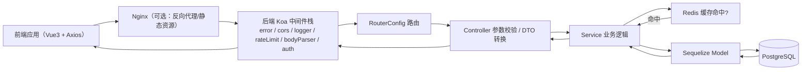
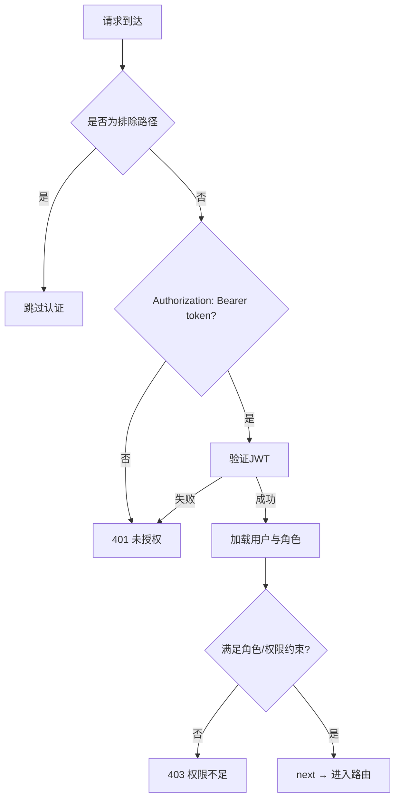
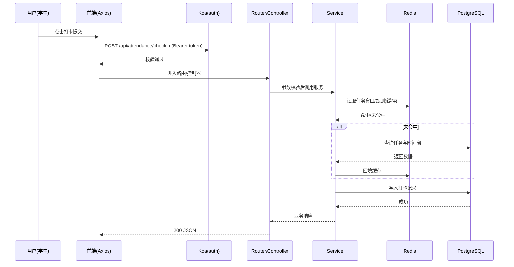

# 计算机学院综合服务平台(CSISP)

## 项目概述

计算机学院综合服务平台(CSISP)是一个基于Monorepo架构的教育管理系统，专注于学生考勤管理和作业管理的综合服务系统。平台为计算机学院的师生提供全方位教学管理与服务，旨在通过数字化手段提升教学管理效率，优化师生交互体验，实现教学活动的规范化、流程化和智能化。

## 核心功能模块

1. **用户管理模块**：
   - 多角色用户系统（管理员、学生、课代表、学生干部）
   - 基于RBAC的权限控制
   - 用户登录、信息管理、角色分配

2. **教师信息模块**：
   - 教师信息管理
   - 授课情况管理
   - 上课时间安排

3. **课程管理模块**：
   - 课程信息管理
   - 多教师/多时间段支持
   - 课程与班级、教师的关联管理
   - 自动生成选课信息

4. **考勤管理模块**：
   - 考勤任务发布
   - 学生签到打卡
   - 考勤记录统计分析

5. **作业管理模块**：
   - 作业发布与结束
   - 学生作业提交
   - 提交情况统计

6. **通知管理模块**：
   - 多级通知发布与删除
   - 通知阅读状态管理

## 技术架构

### 后端技术栈

- **框架**：Koa.js 2.x (Node.js)
- **语言**：TypeScript
- **数据库**：PostgreSQL + Redis
- **ORM**：Sequelize（动态ESM加载）
- **缓存**：Redis
- **认证**：JWT + Passport
- **构建工具**：esbuild
- **日志**：Winston
- **异常处理**：Koa-Error-Handler

### BFF 技术栈

- **框架**：Koa.js 2.x（ESM）
- **语言**：TypeScript
- **路由与分区**：统一前缀 `/api/bff/*`，按 Admin/Portal 分区
- **通用能力**：`@csisp/middlewares`（error/cors/logger/rateLimit/jwtAuth）
- **运行时校验**：`@csisp/validation`（Zod 适配器写入 `ctx.state`）
- **上游客户端**：`@csisp/upstream`（HTTP 客户端封装，统一错误与 `.json()`）
- **类型契约**：`@csisp/types`（对齐后端领域类型，BFF 聚合类型扩展）

### 前端技术栈

- **框架**：Vue 3 + Composition API
- **语言**：TypeScript
- **构建工具**：Vite
- **样式**：Sass
- **UI组件库**：Naive-UI
- **状态管理**：Pinia
- **路由**：Vue Router
- **HTTP客户端**：Axios
- **图表库**：ECharts

### 测试技术栈

- **框架**：Vitest
- **类型**：单元测试、集成测试

## 项目结构

CSISP采用Monorepo架构，使用pnpm工作区管理多个项目：

```
CSISP/
├── 📁 apps/                          # 应用层 - 可独立部署的应用
│   ├── 📁 backend/                   # 后端API服务
│   ├── 📁 bff/                        # BFF 聚合层（Koa 2 + TS + ESM）
│   ├── 📁 frontend-admin/            # 后台管理系统前端
│   └── 📁 frontend-portal/           # 门户前端（原 frontend-client）
├── 📁 packages/                      # 共享包层 - 可复用的代码模块
│   ├── 📁 types/                     # 共享类型定义
│   ├── 📁 middlewares/               # 通用中间件集合（error/cors/logger/rateLimit/jwtAuth）
│   ├── 📁 validation/                # 运行时校验适配器（Zod）
│   ├── 📁 upstream/                  # 上游服务客户端封装（HTTP / 预留 WS）
│   └── 📁 utils/                     # 共享工具函数
├── 📁 docs/                          # 文档层 - 项目文档和指南
│   └── 📁 src/                       # 文档源代码
│       ├── 📁 architecture/          # 架构设计文档
│       ├── 📁 bff/                   # BFF 架构详细设计文档
│       ├── 📁 backend/               # 后端开发文档
│       ├── 📁 business/              # 业务需求文档
│       ├── 📁 database/              # 数据库设计文档
│       └── 📁 frontend/              # 前端开发文档
├── 📁 tests/                         # 测试层 - 测试相关文件
├── 📄 package.json                   # Monorepo根配置
├── 📄 pnpm-workspace.yaml           # pnpm工作区配置
└── 📄 docker-compose.yml            # Docker容器编排配置
```

## 快速开始

### 环境准备

1. **Node.js**: 22+ 版本
2. **pnpm**: 最新稳定版本
3. **数据库**: PostgreSQL 15+ 和 Redis
4. **开发工具**: 推荐VSCode + TypeScript插件

### 安装与运行

```bash
# 安装项目依赖
pnpm install

# 启动开发服务器（所有应用）
pnpm dev

# 启动特定应用的开发服务器
pnpm dev:backend       # 仅启动后端
pnpm dev:admin         # 仅启动管理员前端
pnpm dev:portal        # 仅启动门户前端
pnpm dev:bff           # 仅启动 BFF 聚合层
```

### 数据库初始化

项目提供了初始化脚本，可根据不同操作系统选择对应的脚本：

```bash
# Mac系统
./apps/backend/scripts/init_mac.sh

# Linux系统
./apps/backend/scripts/init_linux.sh

# Windows系统
./apps/backend/scripts/init_windows.bat
```

## 架构特点

- **分层架构**: 清晰分离用户层、前端层、后端层、数据层
- **模块化**: 高内聚低耦合的模块划分，便于扩展和维护
- **安全性**: 严格的权限控制和认证机制
- **可维护性**: 完善的文档体系和清晰的代码结构
- **前后端分离**: 独立部署，灵活扩展

## 开发指南

### 文档说明

详细的项目文档位于 `docs/src/` 目录下，包括：

- **业务文档**: 详细的业务需求和功能描述
- **总体架构设计文档**: 系统架构和组件交互说明
- **技术架构设计文档**: 技术选型和实现细节
- **BFF 架构详细设计文档**: BFF 层路由分区、聚合编排、鉴权与限流方案（`/src/bff/BFF架构详细设计文档`）
- **数据库设计文档**: 数据库模型和关系说明
- **前后端开发文档**: 针对开发人员的具体实现指南

## 项目工作流

### 请求处理总览

平台采用前后端分离架构，所有业务请求遵循统一的处理链路：



关键特性：

- 认证与授权：使用 `JWT + Passport` 在 `auth` 中间件中校验，`ctx.state.user` 持有身份信息和角色
- 缓存策略：热点数据优先读写 `Redis`，未命中再回源数据库并回填缓存
- 类型与映射：前端 `camelCase` DTO 在服务层映射为数据库字段的 `snake_case`
- 错误与日志：统一错误处理中间件与结构化日志，保证可观测性

### 中间件链路与权限校验

后端中间件注册顺序：`error → cors → logger → rateLimit → bodyParser → auth → router`。



### 前端交互与拦截器

- 请求拦截：在发送前自动附加 `Authorization: Bearer <token>`
- 响应拦截：统一处理 `401/403/404/500`，错误消息提示与登录态恢复
- 模块划分：后台管理与前台应用复用统一 API 服务层与类型包

### 组件交互序列示例

以“学生打卡”为例展示端到端交互：



### 数据传输路径与规范

- 传输协议：`HTTP/HTTPS`，统一前缀 `'/api'`
- 身份凭证：`Authorization: Bearer <JWT>`，令牌有效期默认 1 小时
- 请求数据：前端 `DTO` 使用 `camelCase`；服务层统一映射到模型 `snake_case`
- 响应格式：`{ code, message, data, timestamp }`，分页含 `pagination{ page,pageSize,total,totalPages }`
- 缓存键设计：`user:${id}`、`course:${id}`、`attendance:${courseId}:${date}:stats` 等

### 错误处理与日志链路

- 错误分类：验证错误(400)、未授权(401)、权限不足(403)、未找到(404)、冲突(409)、服务器错误(500)
- 日志结构：请求开始/结束/错误标签，敏感字段自动脱敏；慢接口与查询单独记录

## 贡献指南

欢迎各位开发者参与项目贡献。请确保：

1. 遵循项目的代码规范和架构设计
2. 提交前运行类型检查和基本测试
3. 为新功能提供完整的文档说明
4. 提交PR时请详细描述变更内容和目的
