# 计算机学院综合服务平台(CSISP)系统架构设计文档

## 1. 文档概述

### 1.1 文档目的

本文档基于CSISP业务需求，从技术架构角度详细描述系统的总体设计、核心模块、技术选型、数据流向及交互关系，为系统开发、测试和维护提供技术指导。

### 1.2 业务背景

CSISP是计算机学院专注于学生考勤管理和作业管理的综合服务系统，支持管理员、学生、课代表和学生干部等多角色访问，实现课程管理、考勤打卡、作业发布与提交等核心功能。

### 1.3 设计原则

- **分层架构**：清晰分离用户层、前端层、后端层、数据层
- **模块化**：高内聚低耦合的模块划分
- **安全性**：严格的权限控制
- **可维护性**：代码结构清晰，文档齐全

---

## 2. 系统总体架构

### 2.1 架构分层

系统采用「前端应用 + BFF + backend-integrated + 数据层」的分层架构设计，各层职责明确，便于维护和扩展：

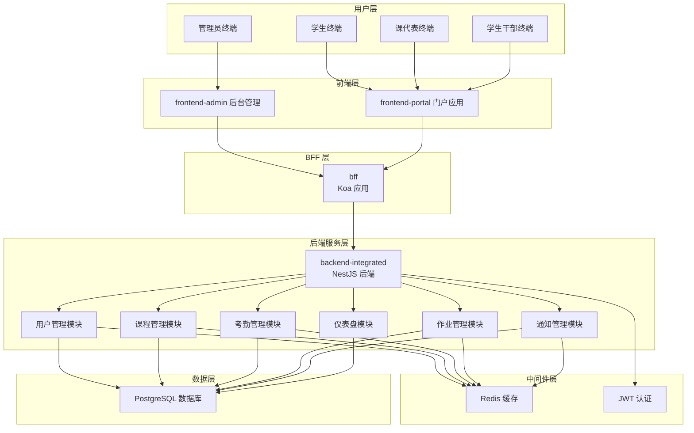

### 2.2 各层职责

| 层级       | 主要职责                     | 核心组件                                       |
| ---------- | ---------------------------- | ---------------------------------------------- |
| 用户层     | 系统的直接用户接口           | 管理员/学生/课代表/学生干部终端                |
| 前端层     | 提供用户交互界面             | `apps/frontend-admin`、`apps/frontend-portal`  |
| BFF 层     | 聚合后端接口，适配前端场景   | `apps/bff`（Koa + TypeScript）                 |
| 后端服务层 | 领域业务逻辑与 REST API 提供 | `apps/backend-integrated`（NestJS 模块化后端） |
| 中间件层   | 缓存、认证、授权与日志       | Redis（`@csisp/redis`）、JWT、`@csisp/logger`  |
| 数据层     | 结构化数据存储与检索         | PostgreSQL 15                                  |

---

## 3. 技术栈选型

### 3.1 backend-integrated 技术栈

| 技术/框架                   | 用途          | 选型理由                                  |
| --------------------------- | ------------- | ----------------------------------------- |
| NestJS                      | 后端服务框架  | 模块化、DI 体系完善，适合中大型业务系统   |
| TypeScript                  | 类型安全语言  | 增强可维护性、统一前后端类型              |
| PostgreSQL                  | 关系型数据库  | 稳定可靠，支持事务和复杂查询              |
| Redis                       | 缓存/会话存储 | 提高热点数据访问速度，降低数据库压力      |
| Sequelize                   | ORM 框架      | 与现有模型/迁移体系兼容，支持 TypeScript  |
| JWT                         | 令牌认证      | 轻量级身份验证，便于前后端分离            |
| @csisp/redis + @infra/redis | 缓存访问封装  | 统一 Redis 客户端的使用方式和命名空间管理 |

### 3.2 BFF 技术栈

| 技术/框架       | 用途         | 选型理由                              |
| --------------- | ------------ | ------------------------------------- |
| Koa 3.x         | Web 框架     | 轻量、组合中间件灵活，适合作为 BFF 层 |
| @koa/router     | 路由管理     | Koa 官方路由生态，简单易用            |
| TypeScript      | 类型安全语言 | 对齐整体技术栈，增强可维护性          |
| undici          | HTTP 客户端  | 现代 Node 原生 HTTP 客户端实现        |
| @csisp/upstream | 上游封装     | 统一后端调用、错误处理与链路追踪      |
| dotenv          | 配置管理     | 按环境加载 .env 配置                  |

### 3.3 前端中台技术栈

| 技术/框架  | 版本 | 用途         | 选型理由                              |
| ---------- | ---- | ------------ | ------------------------------------- |
| Vue 3      | 3.4  | 前端框架     | 响应式、组合式API、性能优异           |
| TypeScript | 5.2  | 类型安全语言 | 增强代码可维护性，减少运行时错误      |
| Vite       | 5.0  | 构建工具     | 快速构建，支持热更新                  |
| Naive-UI   | 2.38 | UI组件库     | 现代化设计，完整的组件支持            |
| Axios      | 1.6  | HTTP客户端   | 简单易用，支持拦截器和请求配置        |
| Vue Router | 4.3  | 路由管理     | Vue生态官方路由，支持TypeScript       |
| Pinia      | 2.1  | 状态管理     | Vue生态新一代状态管理，支持TypeScript |
| Sass       | 1.77 | 样式预处理器 | 增强CSS的可维护性和扩展性             |
| ECharts    | 5.5  | 图表库       | 强大的数据可视化能力                  |

### 3.4 文档技术栈

| 技术/框架 | 版本 | 用途     | 选型理由                        |
| --------- | ---- | -------- | ------------------------------- |
| VitePress | 1.1  | 文档框架 | Vite生态的文档框架，支持Vue组件 |

### 3.5 基础设施与质量保障

| 工具/配置               | 用途         | 说明                                                              |
| ----------------------- | ------------ | ----------------------------------------------------------------- |
| Docker + docker-compose | 本地基础设施 | 通过 `infra/database/docker-compose.db.yml` 启动 PostgreSQL/Redis |
| GitHub Actions          | CI/CD        | `.github/workflows/deploy-docs.yml`、`sync-env-variables.yml`     |
| ESLint                  | 代码检查     | 根 `eslint.config.ts`                                             |
| Prettier                | 代码格式化   | 根 `.prettierrc`                                                  |
| Stylelint               | 样式检查     | `stylelint.config.js`                                             |
| EditorConfig            | 编辑器配置   | 根 `.editorconfig`                                                |

---

## 4. 核心模块设计

### 4.1 用户管理模块

#### 4.1.1 功能职责

- 用户身份认证与授权
- 角色管理与权限分配
- 用户信息维护
- 课代表角色分配

#### 4.1.2 技术设计

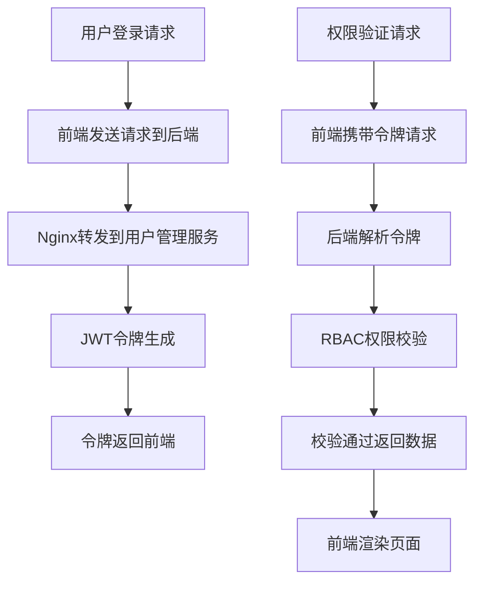

#### 4.1.3 关键表结构

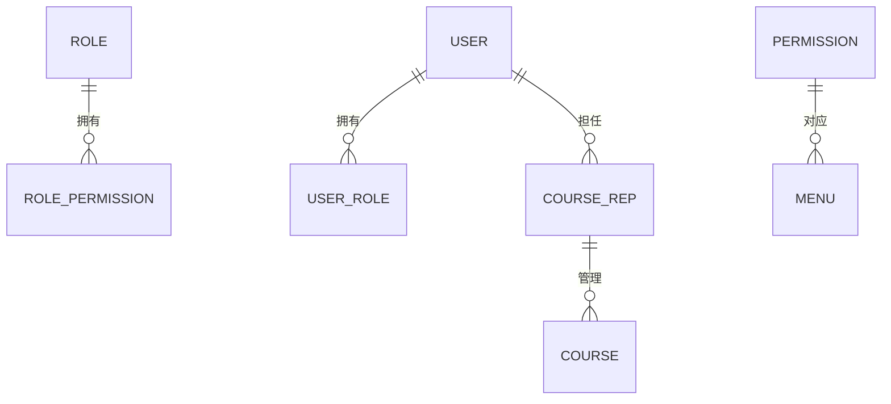

### 4.2 课程管理模块

#### 4.2.1 功能职责

- 课程信息维护
- 教师与课程关联
- 课程时间槽管理
- 课程班级划分

#### 4.2.2 技术设计

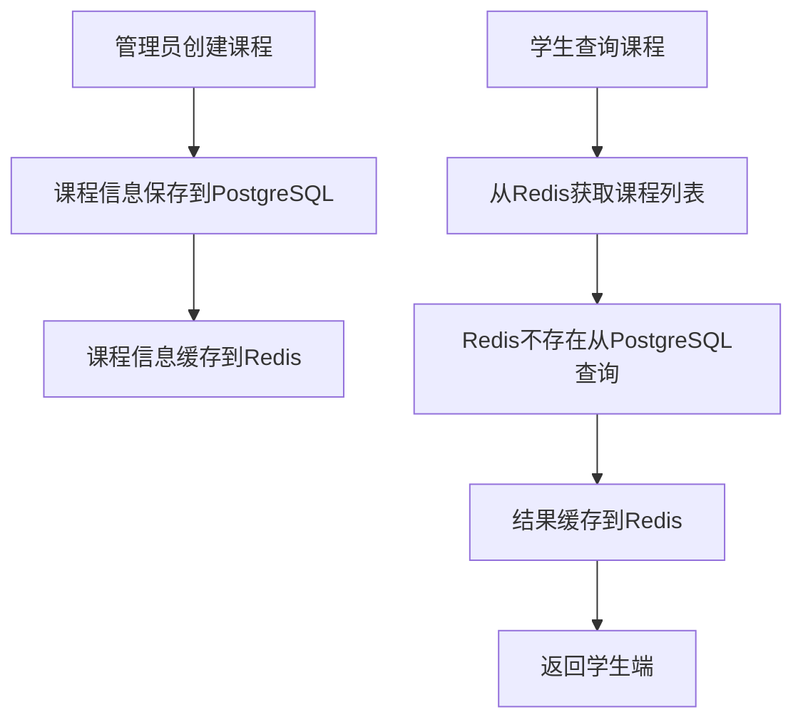

#### 4.2.3 数据结构

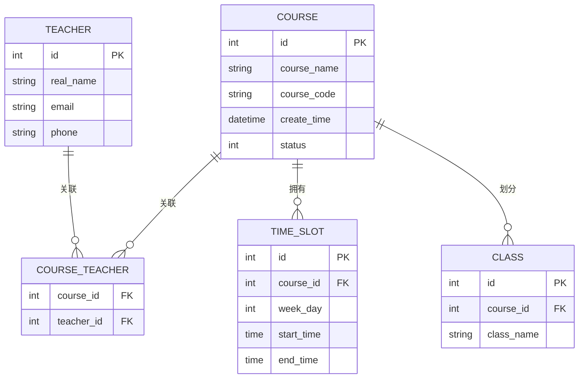

### 4.3 考勤管理模块

#### 4.3.1 功能职责

- 考勤任务发布
- 学生打卡
- 考勤记录统计
- 考勤异常处理

#### 4.3.2 技术设计

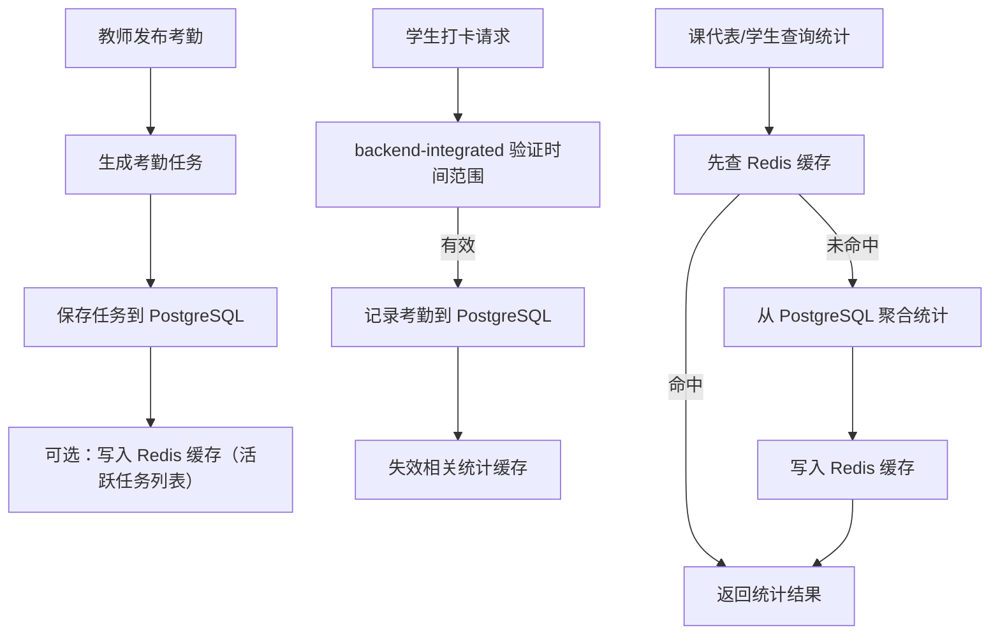

#### 4.3.3 数据结构

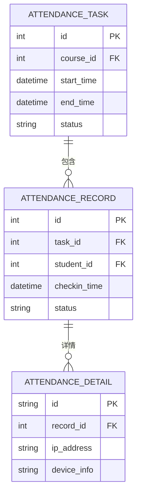

### 4.4 作业管理模块

#### 4.4.1 功能职责

- 作业发布
- 作业提交
- 作业批改与评分
- 提交情况统计

#### 4.4.2 技术设计

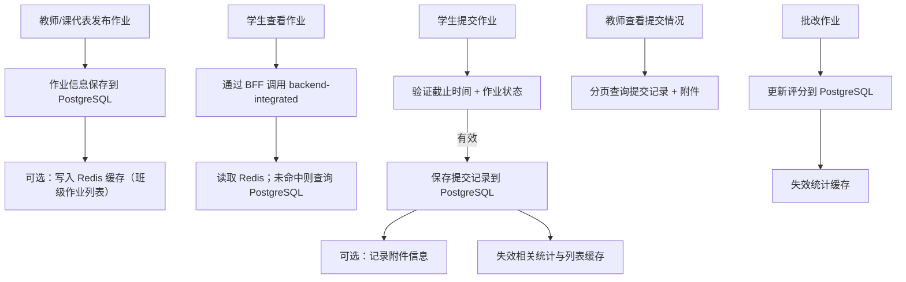

#### 4.4.3 数据结构

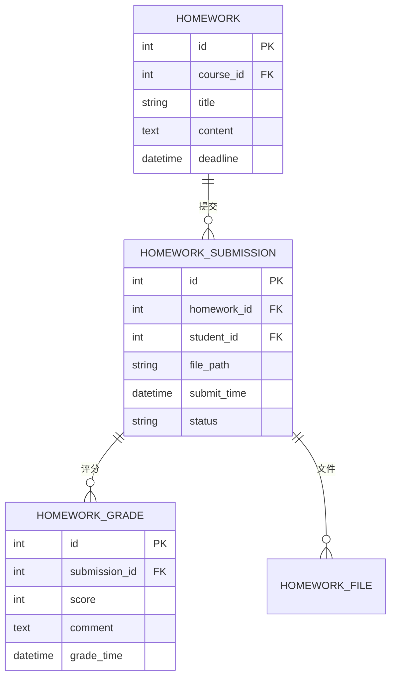

### 4.5 通知管理模块

#### 4.5.1 功能职责

- 通知发布
- 实时通知推送
- 阅读状态管理
- 通知历史查询

#### 4.5.2 技术设计

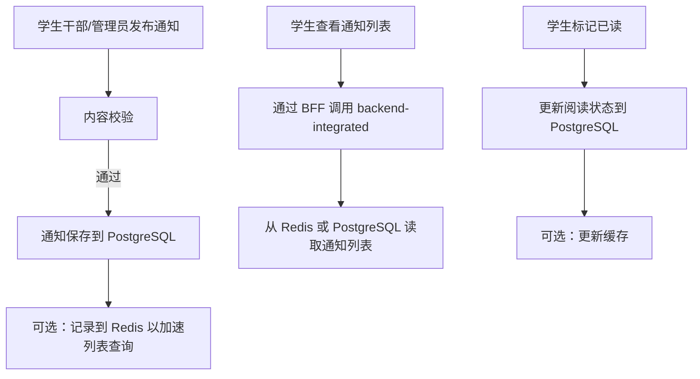

#### 4.5.3 推送机制

- WebSocket实时推送在线用户
- 仅推送给订阅相关课程的用户
- 支持作业发布和考勤任务通知

---

## 5. API设计规范

### 5.1 API设计原则

- RESTful风格
- 统一错误码和错误信息
- 输入参数验证
- 使用`/api`作为前缀

### 5.2 API示例

```bash
# 用户登录
POST /api/auth/login
{"username":"string","password":"string"}

# 查询课程列表
GET /api/courses?page=1&size=10

# 学生打卡
POST /api/attendance/checkin
{"courseId":"string"}

# 发布作业
POST /api/homework/publish
{"courseId":"string","title":"string","content":"string","deadline":"string"}
```

### 5.3 身份认证与授权

- 使用JWT令牌进行身份验证
- 令牌有效期：1小时
- 密码加密存储(BCrypt)
- 请求头携带`Authorization: Bearer <token>`

---

## 6. 数据存储设计

### 6.1 数据库设计

#### 6.1.1 核心数据库表

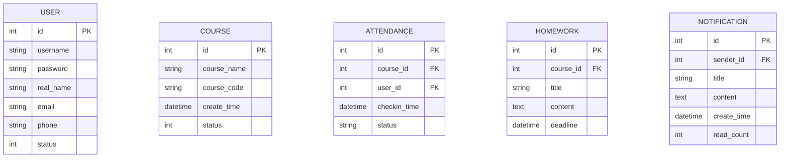

#### 6.1.2 缓存设计

- 缓存层：Redis（通过 `@csisp/redis`，在 backend-integrated 中经 `@infra/redis` 使用）
- 缓存对象：
  - 课程列表/详情
  - 考勤统计（学生/班级）与活跃任务
  - 作业列表/统计/提交情况
  - 仪表盘统计数据
- 缓存策略：Cache-Aside，写操作后删除相关 key；TTL 按数据类型控制（详情/分布 300s，列表 120s，统计 30–60s）。

### 6.2 非结构化数据存储

> 当前系统核心数据全部存储于 PostgreSQL，后续若接入对象存储或搜索引擎，将在数据库文档中补充说明。

- 作业附件：暂由后端保存元数据到数据库，文件存储策略视部署环境而定（本地磁盘或外部存储）。

---

## 7. 安全架构设计

### 7.1 身份认证

- JWT令牌认证
- 密码加密存储(BCrypt)

### 7.2 授权机制

- RBAC基于角色的访问控制
- 菜单和API权限控制

### 7.3 安全防护

- 输入参数校验
- SQL注入防护(MyBatis-Plus参数化查询)

---

## 8. 业务线流程设计

### 8.1 整体业务流程架构

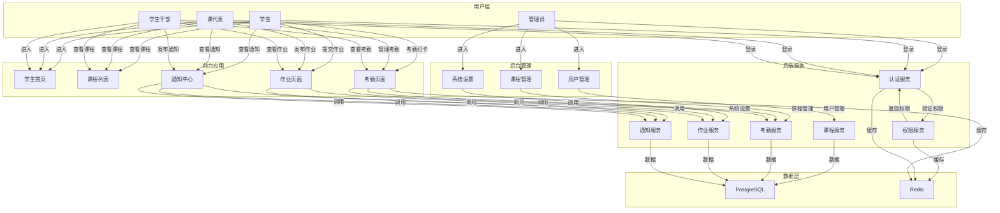

### 8.2 不同身份业务流程

#### 8.2.1 管理员业务流程

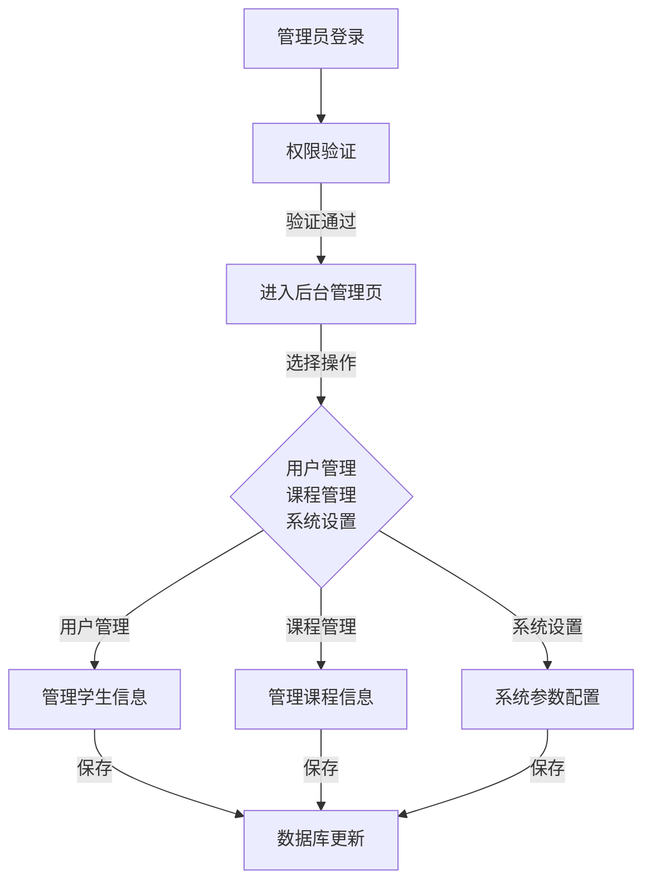

#### 8.2.2 学生业务流程

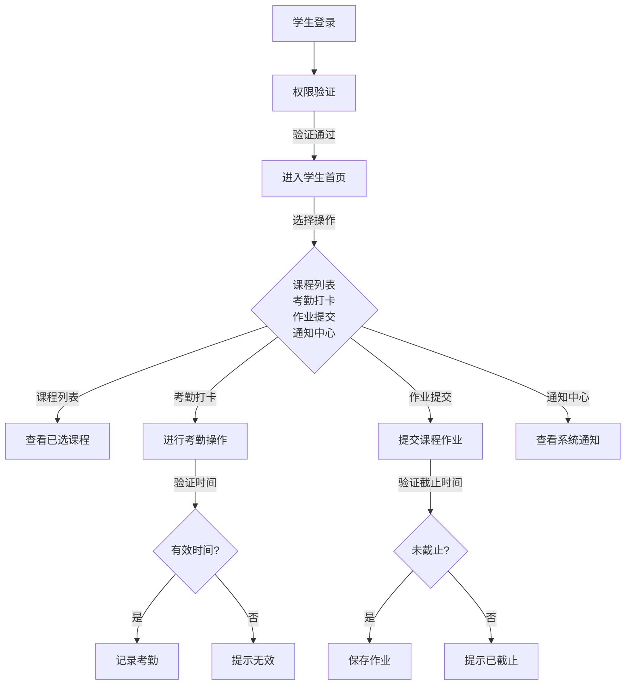

#### 8.2.3 课代表业务流程

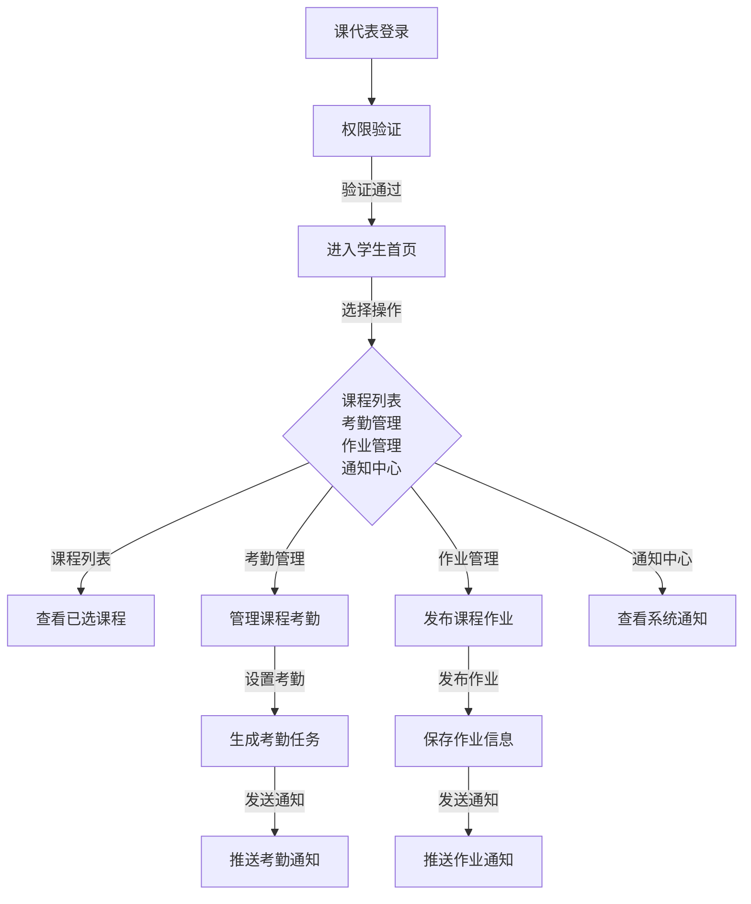

#### 8.2.4 学生干部业务流程

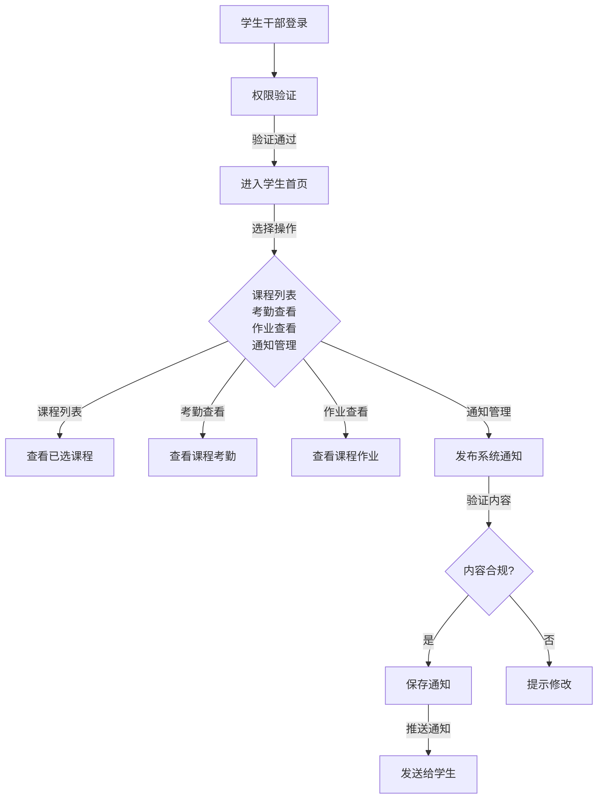

## 9. 总结

本文档基于CSISP业务需求，设计了一套完整的系统架构方案，涵盖了从前端到后端、从数据存储到安全防护的各个方面。该架构严格按照指定技术栈构建，采用了分层设计、模块化开发和微服务思想，确保了系统的高可用性、高扩展性和安全性，能够满足计算机学院的业务需求。

重点展示了不同身份用户登录后的业务流程，清晰地呈现了系统的业务线架构和用户操作流程。
