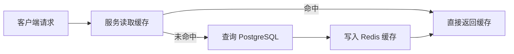
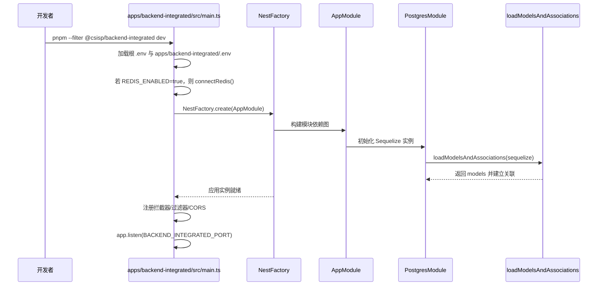
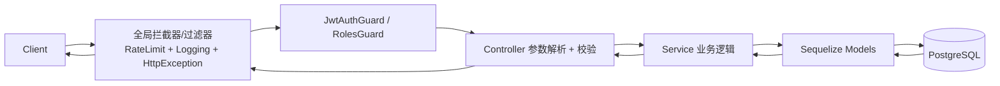

# CSISP 综合服务平台 - 技术架构文档

## 项目概述

CSISP（Computer Science Integrated Service Platform）是一个基于现代技术栈的 Monorepo 架构的教育管理系统。该系统为学校提供完整的教学管理解决方案，包括用户管理、课程管理、班级管理、考勤管理、作业管理等功能。

架构设计遵循模块化、可复用、可扩展的原则，支持前后端分离开发，为教师、学生和管理员提供不同的用户界面和功能体验。

## 技术栈选型

### backend-integrated 技术栈

- **框架**: NestJS
- **数据库**: PostgreSQL + Redis
- **语言**: TypeScript
- **构建工具**: tsx（开发）
- **ORM**: Sequelize（动态 ESM 加载，模型关联统一在 `infra/postgres` 中执行）
- **认证**: JWT（基于角色与权限编码）
- **缓存**: Redis（通过 `@csisp/redis`，在 backend-integrated 中经 `@infra/redis` 封装使用）
- **日志**: 结构化日志（`@csisp/logger` + pino，经 LoggingInterceptor / HttpExceptionFilter 输出 JSON）
- **异常处理**: Nest 全局异常过滤器（统一 `{ code, message }` 响应）

### BFF 技术栈

- **应用**: `apps/bff`（Koa 3.x + TypeScript）
- **框架**: Koa 3.x
- **路由**: `@koa/router`
- **请求解析**: `koa-bodyparser`
- **HTTP 客户端**: `undici`（通过 `@csisp/upstream` 封装，支持 pino 结构化上游日志）
- **配置**: `dotenv`
- **构建 / 运行**: tsx + esbuild

### 前端中台应用技术栈

- **框架**: Vue 3 + Composition API
- **构建工具**: Vite
- **语言**: TypeScript
- **状态管理**: Pinia
- **路由**: Vue Router
- **组件库**：Naive-UI
- **图表库**：ECharts（仪表盘等场景）

### 测试技术栈

- **框架**: Vitest（`apps/*` 与 `tests/` 统一使用）
- **类型**: 单元测试、集成测试

## 📁 目录结构详解

### 根目录结构

```
CSISP/
├── 📁 apps/                          # 应用层 - 可独立部署的应用
│   ├── 📁 backend-integrated/        # NestJS 集成后端（推荐接入点）
│   ├── 📁 bff/                       # BFF 聚合层（对接前端与后端）
│   ├── 📁 frontend-admin/            # 中台管理系统前端
│   └── 📁 frontend-portal/           # 门户（学生/教师）前端
├── 📁 packages/                      # 共享包层 - 可复用的代码模块
│   ├── 📁 types/                     # 共享类型定义（@csisp/types）
│   ├── 📁 redis/                     # Redis 客户端封装（@csisp/redis）
│   ├── 📁 upstream/                  # 上游 HTTP 客户端封装（@csisp/upstream）
│   ├── 📁 utils/                     # 工具函数（@csisp/utils）
│   └── 📁 db-schema/                 # 数据库迁移与模型定义（@csisp/db-schema）
├── 📁 docs/                          # 文档层 - 项目文档和指南
├── 📁 infra/                         # 基础设施脚本（如数据库 docker-compose）
├── 📁 tests/                         # 测试层 - 测试相关文件
├── 📄 package.json                   # Monorepo 根配置
├── 📄 pnpm-workspace.yaml            # pnpm 工作区配置
├── 📄 .gitignore                     # Git 忽略配置
└── 📄 .gitattributes                 # Git 属性配置
```

### 1. 应用层 (apps/)

#### 后端应用结构（backend-integrated）

**backend-integrated（apps/backend-integrated，NestJS）**

```
apps/backend-integrated/
├── 📁 src/
│   ├── 📄 main.ts                    # Nest 应用入口（加载 .env，初始化 Redis，启动 HTTP 服务）
│   ├── � app.module.ts              # 根模块，装配 PostgresModule 与业务模块
│   ├── 📁 infra/
│   │   ├── 📁 postgres/              # Sequelize 模型动态加载与关联（POSTGRES_MODELS）
│   │   └── 📁 redis/                 # Redis 基础设施封装（@infra/redis）
│   ├── 📁 common/
│   │   ├── 📁 guards/                # JwtAuthGuard / RolesGuard 等
│   │   ├── 📁 interceptors/          # LoggingInterceptor / RateLimitInterceptor
│   │   ├── 📁 filters/               # HttpExceptionFilter
│   │   └── 📁 pipes/                 # ParseIdPipe / PaginationPipe 等
│   └── � modules/
│       ├── 📁 user/                  # 用户模块（UserController + UserService）
│       ├── 📁 course/                # 课程模块
│       ├── � attendance/            # 考勤模块
│       ├── � homework/              # 作业模块
│       ├── 📁 dashboard/             # 仪表盘模块
│       └── � health/                # 健康检查模块（/api/health）
├── 📄 package.json
└── 📄 tsconfig.json
```

### 2. Redis 部署与命名规范

为简化运维与保证一致性，Redis 在不同环境按「一环境一实例」进行部署：

- Development：本地通过 `infra/database/docker-compose.db.yml` 启动 `postgres + redis`
- Staging：预发/联调环境使用独立 Redis 实例
- Production：生产环境使用独立 Redis 实例（可按需扩展为主从或集群）

应用侧通过 `@csisp/redis` 统一访问 Redis：

- 连接信息：从根 `.env` 读取 `REDIS_HOST/REDIS_PORT/REDIS_DB/REDIS_PASSWORD`
- 命名空间：`REDIS_NAMESPACE`，默认 `csisp`，在客户端内部作为全局前缀
- 逻辑隔离：
  - BFF：`csisp:bff:*`
  - Backend：`csisp:be:*`（在 backend-integrated 中通过 `@infra/redis` 使用）
  - 后续如需新增系统，可通过新的命名空间或前缀扩展

推荐的键设计示例：

```text
csisp:bff:dashboard:summary:<userId>      # BFF 学生仪表盘聚合缓存
csisp:be:course:detail:<courseId>         # 后端课程详情缓存
csisp:be:rate-limit:user:<userId>         # 用户级限流计数（未来可扩展）
```

缓存读写遵循「Cache-Aside」模式：



说明：

- 不以 Redis 作为权威数据源，所有持久业务数据仍由 PostgreSQL 承载
- 不建议用一个 Redis 实例承载 dev/staging/prod 的数据隔离，环境隔离应通过「不同实例 + 不同 `.env`」完成
- 命名空间与前缀主要用于区分系统与业务域，而非区分环境

### Backend 缓存与失效约定

- 键命名：`csisp:be:<domain>:<entity>[:<scope>]...`；分页键追加 `page/size`，筛选条件以 `key=value` 形式拼接。
- TTL：详情/分布 300s；列表 120s；统计/活跃 30–60s；角色/学号查询 600s。
- 失效：写操作后删除精确键（详情/统计）；列表分页以短 TTL 为主，必要时枚举常用页删除；可选事件广播通知 BFF 失效。
- 接入位置：backend-integrated 的 Service 层通过 `@infra/redis`（内部转发到 `@csisp/redis`）访问缓存。
- 降级：`REDIS_ENABLED=false` 时不启用缓存；Redis 异常不影响主业务路径。

#### 前端中台应用结构（Vite 脚手架创建）

```
apps/frontend-admin/
├── 📁 src/                           # 源代码目录
│   ├── 📁 components/                # 组件库
│   │   ├── 📁 common/                # 通用组件
│   │   ├── 📁 layout/                # 布局组件
│   │   ├── 📁 user/                  # 用户相关组件
│   │   ├── 📁 course/                # 课程相关组件
│   │   ├── 📁 class/                 # 班级相关组件
│   │   ├── 📁 attendance/            # 考勤相关组件
│   │   ├── 📁 homework/              # 作业相关组件
│   │   └── 📄 index.ts              # 组件导出文件
│   ├── 📁 layout/                    # 布局组件
│   │   ├── 📄 AdminLayout.vue       # 中台管理布局
│   │   └── 📄 index.ts              # 布局组件导出文件
│   ├── 📁 pages/                     # 页面组件
│   │   ├── 📁 dashboard/             # 仪表盘页面
│   │   ├── 📁 user-management/       # 用户管理页面
│   │   ├── 📁 class-management/      # 班级管理页面
│   │   ├── 📁 course-management/     # 课程管理页面
│   │   ├── 📁 attendance/            # 考勤管理页面
│   │   ├── 📁 homework/              # 作业管理页面
│   │   └── 📄 index.ts              # 页面组件导出文件
│   ├── 📁 stores/                    # 状态管理
│   │   ├── 📁 user/                  # 用户状态
│   │   ├── 📁 course/                # 课程状态
│   │   ├── 📁 class/                 # 班级状态
│   │   ├── 📁 attendance/            # 考勤状态
│   │   ├── 📁 homework/              # 作业状态
│   │   └── 📄 index.ts              # 状态管理导出文件
│   ├── 📁 utils/                     # 工具函数
│   │   ├── 📁 api/                   # API工具
│   │   ├── 📁 auth/                  # 认证工具
│   │   ├── 📁 validation/            # 验证工具
│   │   └── 📄 index.ts              # 工具函数导出文件
│   ├── 📁 assets/                    # 静态资源
│   │   ├── 📁 images/                # 图片资源
│   │   └── 📁 icons/                  # 图标资源
│   ├── 📁 styles/                    # 样式文件（与assets平级）
│   │   ├── 📄 variables.scss        # 变量定义
│   │   ├── 📄 mixins.scss           # 混合器
│   │   └── 📄 index.scss             # 样式入口文件
│   ├── 📁 types/                     # 类型定义
│   │   └── 📄 index.ts              # 类型定义导出文件
│   ├── 📄 main.ts                    # 应用入口
│   ├── 📄 router.ts                   # 路由配置
│   └── 📄 App.vue                    # 根组件
├── 📁 public/                        # 公共资源
├── 📄 package.json                   # 依赖管理
├── 📄 vite.config.ts                 # Vite 配置
├── 📄 tsconfig.json                  # TypeScript 配置
├── 📄 vitest.config.ts               # 测试配置
└── 📄 .env.example                   # 环境变量示例
```

### 2. 共享包层 (packages/)

> 核心共享能力通过 `packages/*` 暴露，供 backend-integrated、BFF 与前端复用。

```
packages/
├── 📁 types/         # @csisp/types：共享业务类型与 API/DTO 定义
├── 📁 redis/         # @csisp/redis：Redis 客户端封装
├── 📁 upstream/      # @csisp/upstream：HTTP 上游客户端封装
├── 📁 utils/         # @csisp/utils：通用工具函数
└── 📁 db-schema/     # @csisp/db-schema：数据库迁移与模型定义
```

### 3. 工具配置（根目录）

> 工具配置集中在仓库根目录，由各应用按需继承或扩展。

```
CSISP/
├── 📄 eslint.config.ts                # ESLint 9 扁平化配置
├── 📄 .prettierrc                     # Prettier 配置
├── 📄 .editorconfig                   # EditorConfig 配置
├── 📄 tsconfig.json                   # 根 TS 配置（被 apps/* 继承）
└── 📄 tsconfig.node.json              # Node 环境下的 TS 配置
```

### 4. 文档层 (docs/)

```
docs/
├── 📄 index.md                        # 文档首页
├── 📁 .vitepress/                     # VitePress 配置
│   └── 📄 config.ts
├── 📁 src/                            # 各子文档
│   ├── 📁 architecture/               # 架构文档（当前文件等）
│   ├── 📁 backend/                    # 后端设计文档
│   ├── 📁 bff/                        # BFF 设计文档
│   ├── 📁 business/                   # 业务流程与用例
│   ├── 📁 database/                   # 数据库与类型设计
│   └── 📁 frontend/                   # 前端中台设计
└── 📄 package.json                    # 文档站点依赖
```

### 5. CI/CD 层 (.github/)

```
.github/
├── 📁 workflows/
│   ├── 📄 deploy-docs.yml             # 文档站点构建与部署
│   └── 📄 sync-env-variables.yml      # 环境变量同步到云端
```

## 🔧 核心配置文件说明

### 1. 根目录配置

#### package.json (Monorepo 根配置)

```json
{
  "name": "csisp-monorepo",
  "version": "1.0.0",
  "private": true,
  "type": "module",
  "scripts": {
    "dev": "pnpm -r --parallel dev",
    "build": "pnpm -r build",
    "test": "pnpm -r test",
    "lint": "pnpm -r lint",
    "clean": "pnpm -r clean",
    "dev:admin": "pnpm --filter frontend-admin dev",
    "dev:client": "pnpm --filter frontend-client dev",
    "dev:backend": "pnpm --filter backend dev",
    "build:admin": "pnpm --filter frontend-admin build",
    "build:client": "pnpm --filter frontend-client build",
    "build:backend": "pnpm --filter backend build"
  },
  "packageManager": "pnpm@8.15.0",
  "workspaces": ["apps/*", "packages/*"],
  "devDependencies": {
    "@types/node": "^20.10.0",
    "typescript": "^5.3.0"
  }
}
```

#### pnpm-workspace.yaml

```yaml
packages:
  - 'apps/*'
  - 'packages/*'

hoist-pattern:
  - '*'

resolution-mode: 'highest'
```

### 2. 后端核心配置

#### esbuild.config.js

```javascript
import { build } from 'esbuild';

export default {
  entryPoints: ['app.ts'],
  bundle: true,
  platform: 'node',
  target: 'node20',
  outdir: 'dist',
  format: 'esm',
  sourcemap: true,
};
```

## 🧭 backend-integrated 启动与请求流程概览

> 详细的启动脚本与本地开发命令以各应用目录下的 README 与 package.json 为准，本节仅描述整体流程。




