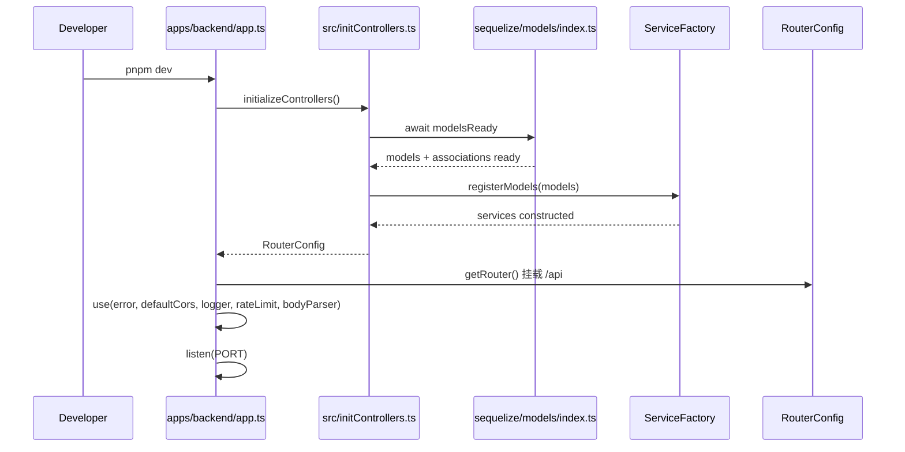

# 🏗️ CSISP 综合服务平台 - 技术架构文档

## 📋 项目概述

CSISP（Computer Science Integrated Service Platform）是一个基于现代技术栈的 Monorepo 架构的教育管理系统。该系统为学校提供完整的教学管理解决方案，包括用户管理、课程管理、班级管理、考勤管理、作业管理等功能。

架构设计遵循模块化、可复用、可扩展的原则，支持前后端分离开发，为教师、学生和管理员提供不同的用户界面和功能体验。

## 🎯 技术栈选型

### 后端技术栈

- **框架**: Koa 2.x
- **数据库**: PostgreSQL + Redis
- **语言**: TypeScript
- **构建工具**: esbuild
- **ORM**: Sequelize（动态 ESM 加载，模型关联统一在 index.ts 中执行）
- **认证**: JWT + Passport
- **缓存**: Redis
- **日志**: Winston
- **异常处理**: Koa-Error-Handler

### 前端技术栈

- **框架**: Vue 3 + Composition API
- **构建工具**: Vite
- **语言**: TypeScript
- **样式**: Sass
- **状态管理**: Pinia
- **路由**: Vue Router
- **HTTP 客户端**: Axios
- **组件库**：Naive-UI
- **图表库**：ECharts

### 测试技术栈

- **框架**: Vitest
- **类型**: 单元测试、集成测试

## 📁 目录结构详解

### 根目录结构

```
CSISP/
├── 📁 apps/                          # 应用层 - 可独立部署的应用
│   ├── 📁 backend/                   # 后端API服务
│   ├── 📁 frontend-admin/            # 后台管理系统前端
│   └── 📁 frontend-client/           # 前台用户系统前端
├── 📁 packages/                      # 共享包层 - 可复用的代码模块
│   ├── 📁 types/                     # 共享类型定义
│   └── 📁 utils/                     # 共享工具函数
├── 📁 tooling/                       # 工具配置层 - 开发工具和配置
├── 📁 docs/                          # 文档层 - 项目文档和指南
├── 📁 .github/                       # CI/CD 层 - 自动化流程
├── 📁 tests/                         # 测试层 - 测试相关文件
├── 📄 package.json                   # Monorepo根配置
├── 📄 pnpm-workspace.yaml           # pnpm工作区配置
├── 📄 .gitignore                     # Git忽略配置
└── 📄 .gitattributes                 # Git属性配置
```

### 1. 应用层 (apps/)

#### 后端应用结构（统一装配）

```
apps/backend/
├── 📁 src/                           # 源代码目录
│   ├── 📁 controllers/               # 控制器层
│   │   ├── 📁 user/                  # 用户控制器
│   │   ├── 📁 course/                # 课程控制器
│   │   ├── 📁 class/                 # 班级控制器
│   │   ├── 📁 attendance/            # 考勤控制器
│   │   ├── 📁 homework/              # 作业控制器
│   │   └── 📄 index.ts              # 控制器导出文件
│   ├── 📁 services/                  # 业务逻辑层
│   │   ├── 📁 user/                  # 用户服务
│   │   ├── 📁 course/                # 课程服务
│   │   ├── 📁 class/                 # 班级服务
│   │   ├── 📁 attendance/            # 考勤服务
│   │   ├── 📁 homework/              # 作业服务
│   │   └── 📄 index.ts              # 服务导出文件
│   ├── 📁 models/                    # 数据模型层
│   │   ├── 📁 user/                  # 用户模型
│   │   ├── 📁 course/                # 课程模型
│   │   ├── 📁 class/                 # 班级模型
│   │   ├── 📁 attendance/            # 考勤模型
│   │   ├── 📁 homework/              # 作业模型
│   │   └── 📄 index.ts              # 模型导出文件
│   ├── 📁 routes/                    # 路由定义层
│   │   ├── 📁 user/                  # 用户路由
│   │   ├── 📁 course/                # 课程路由
│   │   ├── 📁 class/                 # 班级路由
│   │   ├── 📁 attendance/            # 考勤路由
│   │   ├── 📁 homework/              # 作业路由
│   │   └── 📄 index.ts              # 路由导出文件
│   ├── 📁 middleware/                # 中间件层
│   │   ├── 📁 auth/                  # 认证中间件
│   │   ├── 📁 validation/            # 验证中间件
│   │   ├── 📁 error/                 # 错误处理中间件
│   │   └── 📄 index.ts              # 中间件导出文件
│   ├── 📁 utils/                     # 工具函数层
│   │   ├── 📁 database/              # 数据库工具
│   │   ├── 📁 auth/                  # 认证工具
│   │   ├── 📁 validation/            # 验证工具
│   │   └── 📄 index.ts              # 工具函数导出文件
│   └── 📁 types/                     # 类型定义
│       └── 📄 index.ts              # 类型定义导出文件
├── 📁 config/                        # 配置文件
│   ├── 📄 database.ts                # 数据库配置
│   ├── 📄 redis.ts                  # Redis配置
│   ├── 📄 auth.ts                   # 认证配置
│   └── 📄 app.ts                    # 应用配置
├── 📁 scripts/                       # 脚本文件
├── 📄 app.ts                         # 应用入口文件（initializeControllers + RouterConfig）
├── 📄 package.json                   # 依赖管理
├── 📄 tsconfig.json                  # TypeScript 配置
├── 📄 esbuild.config.js              # 构建配置
└── 📄 .env.example                   # 环境变量示例
```

#### 前端后台应用结构（Vite 脚手架创建）

```
apps/frontend-admin/
├── 📁 src/                           # 源代码目录
│   ├── 📁 components/                # 组件库
│   │   ├── 📁 common/                # 通用组件
│   │   ├── 📁 layout/                # 布局组件
│   │   ├── 📁 user/                  # 用户相关组件
│   │   ├── 📁 course/                # 课程相关组件
│   │   ├── 📁 class/                 # 班级相关组件
│   │   ├── 📁 attendance/            # 考勤相关组件
│   │   ├── 📁 homework/              # 作业相关组件
│   │   └── 📄 index.ts              # 组件导出文件
│   ├── 📁 layout/                    # 布局组件
│   │   ├── 📄 AdminLayout.vue       # 后台管理布局
│   │   └── 📄 index.ts              # 布局组件导出文件
│   ├── 📁 pages/                     # 页面组件
│   │   ├── 📁 dashboard/             # 仪表盘页面
│   │   ├── 📁 user-management/       # 用户管理页面
│   │   ├── 📁 class-management/      # 班级管理页面
│   │   ├── 📁 course-management/     # 课程管理页面
│   │   ├── 📁 attendance/            # 考勤管理页面
│   │   ├── 📁 homework/              # 作业管理页面
│   │   └── 📄 index.ts              # 页面组件导出文件
│   ├── 📁 stores/                    # 状态管理
│   │   ├── 📁 user/                  # 用户状态
│   │   ├── 📁 course/                # 课程状态
│   │   ├── 📁 class/                 # 班级状态
│   │   ├── 📁 attendance/            # 考勤状态
│   │   ├── 📁 homework/              # 作业状态
│   │   └── 📄 index.ts              # 状态管理导出文件
│   ├── 📁 utils/                     # 工具函数
│   │   ├── 📁 api/                   # API工具
│   │   ├── 📁 auth/                  # 认证工具
│   │   ├── 📁 validation/            # 验证工具
│   │   └── 📄 index.ts              # 工具函数导出文件
│   ├── 📁 assets/                    # 静态资源
│   │   ├── 📁 images/                # 图片资源
│   │   └── 📁 icons/                  # 图标资源
│   ├── 📁 styles/                    # 样式文件（与assets平级）
│   │   ├── 📄 variables.scss        # 变量定义
│   │   ├── 📄 mixins.scss           # 混合器
│   │   └── 📄 index.scss             # 样式入口文件
│   ├── 📁 types/                     # 类型定义
│   │   └── 📄 index.ts              # 类型定义导出文件
│   ├── 📄 main.ts                    # 应用入口
│   ├── 📄 router.ts                   # 路由配置
│   └── 📄 App.vue                    # 根组件
├── 📁 public/                        # 公共资源
├── 📄 package.json                   # 依赖管理
├── 📄 vite.config.ts                 # Vite 配置
├── 📄 tsconfig.json                  # TypeScript 配置
├── 📄 vitest.config.ts               # 测试配置
└── 📄 .env.example                   # 环境变量示例
```

#### 前端前台应用结构（Vite 脚手架创建）

```
apps/frontend-client/
├── 📁 src/                           # 源代码目录
│   ├── 📁 components/                # 组件库
│   │   ├── 📁 common/                # 通用组件
│   │   ├── 📁 layout/                # 布局组件
│   │   ├── 📁 user/                  # 用户相关组件
│   │   ├── 📁 course/                # 课程相关组件
│   │   ├── 📁 attendance/            # 考勤相关组件
│   │   ├── 📁 homework/              # 作业相关组件
│   │   └── 📄 index.ts              # 组件导出文件
│   ├── 📁 layout/                    # 布局组件
│   │   ├── 📄 ClientLayout.vue      # 前台用户布局
│   │   └── 📄 index.ts              # 布局组件导出文件
│   ├── 📁 pages/                     # 页面组件
│   │   ├── 📁 dashboard/             # 仪表盘页面
│   │   ├── 📁 courses/               # 课程列表页面
│   │   ├── 📁 attendance/            # 考勤记录页面
│   │   ├── 📁 homework/              # 作业页面
│   │   ├── 📁 notifications/         # 通知页面
│   │   └── 📄 index.ts              # 页面组件导出文件
│   ├── 📁 stores/                    # 状态管理
│   │   ├── 📁 user/                  # 用户状态
│   │   ├── 📁 course/                # 课程状态
│   │   ├── 📁 attendance/            # 考勤状态
│   │   ├── 📁 homework/              # 作业状态
│   │   └── 📄 index.ts              # 状态管理导出文件
│   ├── 📁 utils/                     # 工具函数
│   │   ├── 📁 api/                   # API工具
│   │   ├── 📁 auth/                  # 认证工具
│   │   ├── 📁 validation/            # 验证工具
│   │   └── 📄 index.ts              # 工具函数导出文件
│   ├── 📁 assets/                    # 静态资源
│   │   ├── 📁 images/                # 图片资源
│   │   └── 📁 icons/                  # 图标资源
│   ├── 📁 styles/                    # 样式文件（与assets平级）
│   │   ├── 📄 variables.scss        # 变量定义
│   │   ├── 📄 mixins.scss           # 混合器
│   │   └── 📄 index.scss             # 样式入口文件
│   ├── 📁 types/                     # 类型定义
│   │   └── 📄 index.ts              # 类型定义导出文件
│   ├── 📄 main.ts                    # 应用入口
│   ├── 📄 router.ts                   # 路由配置
│   └── 📄 App.vue                    # 根组件
├── 📁 public/                        # 公共资源
├── 📄 package.json                   # 依赖管理
├── 📄 vite.config.ts                 # Vite 配置
├── 📄 tsconfig.json                  # TypeScript 配置
├── 📄 vitest.config.ts               # 测试配置
└── 📄 .env.example                   # 环境变量示例
```

### 2. 共享包层 (packages/)

#### 类型定义包

```
packages/types/
├── 📁 src/
│   ├── 📁 api/                       # API类型定义
│   │   ├── 📄 user.ts               # 用户相关类型
│   │   ├── 📄 course.ts             # 课程相关类型
│   │   ├── 📄 class.ts              # 班级相关类型
│   │   ├── 📄 attendance.ts         # 考勤相关类型
│   │   ├── 📄 homework.ts            # 作业相关类型
│   │   └── 📄 index.ts              # API类型导出
│   ├── 📁 common/                   # 通用类型定义
│   │   ├── 📄 response.ts           # 响应类型
│   │   ├── 📄 pagination.ts         # 分页类型
│   │   └── 📄 index.ts              # 通用类型导出
│   └── 📄 index.ts                   # 类型定义导出文件
├── 📄 package.json                   # 包配置
└── 📄 tsconfig.json                  # TypeScript 配置
```

#### 工具函数包

```
packages/utils/
├── 📁 src/
│   ├── 📁 validation/               # 验证工具
│   │   ├── 📄 user.ts               # 用户验证
│   │   ├── 📄 course.ts             # 课程验证
│   │   ├── 📄 class.ts              # 班级验证
│   │   └── 📄 index.ts              # 验证工具导出
│   ├── 📁 date/                     # 日期工具
│   │   ├── 📄 format.ts             # 日期格式化
│   │   └── 📄 index.ts              # 日期工具导出
│   ├── 📁 string/                   # 字符串工具
│   │   ├── 📄 format.ts             # 字符串格式化
│   │   └── 📄 index.ts              # 字符串工具导出
│   └── 📄 index.ts                   # 工具函数导出文件
├── 📄 package.json                   # 包配置
└── 📄 tsconfig.json                  # TypeScript 配置
```

### 3. 工具配置层 (tooling/)

#### 统一配置目录

```
tooling/
├── 📄 eslint.config.js                # ESLint 9.x 扁平化配置
├── 📄 .prettierrc.js                  # Prettier 配置
├── 📄 .editorconfig                   # EditorConfig 配置
└── 📄 tsconfig.json                   # TypeScript 基础配置
```

### 4. 文档层 (docs/)

```
docs/
├── 📁 api/                            # API 文档
├── 📁 guide/                         # 使用指南
├── 📁 architecture/                  # 架构设计
└── 📄 README.md                       # 文档首页
```

### 5. CI/CD 层 (.github/)

```
.github/
├── 📁 workflows/                      # GitHub Actions
│   ├── 📄 ci.yml                      # 持续集成
│   └── 📄 cd.yml                      # 持续部署
└── 📄 pull-request-template.md        # PR 模板
```

### 6. 测试层 (tests/)

```
tests/
├── 📁 unit/                           # 单元测试
│   ├── 📁 backend/                    # 后端单元测试
│   │   └── 📄 example.test.ts         # 后端单元测试示例
│   ├── 📁 frontend-admin/             # 前端后台单元测试
│   │   └── 📄 example.test.ts         # 前端后台单元测试示例
│   └── 📁 frontend-client/            # 前端前台单元测试
│       └── 📄 example.test.ts         # 前端前台单元测试示例
├── 📁 integration/                    # 集成测试
│   └── 📄 example.test.ts             # 集成测试示例
└── 📄 vitest.config.ts                # Vitest 根配置
```

## 🔧 核心配置文件说明

### 1. 根目录配置

#### package.json (Monorepo 根配置)

```json
{
  "name": "csisp-monorepo",
  "version": "1.0.0",
  "private": true,
  "type": "module",
  "scripts": {
    "dev": "pnpm -r --parallel dev",
    "build": "pnpm -r build",
    "test": "pnpm -r test",
    "lint": "pnpm -r lint",
    "clean": "pnpm -r clean",
    "dev:admin": "pnpm --filter frontend-admin dev",
    "dev:client": "pnpm --filter frontend-client dev",
    "dev:backend": "pnpm --filter backend dev",
    "build:admin": "pnpm --filter frontend-admin build",
    "build:client": "pnpm --filter frontend-client build",
    "build:backend": "pnpm --filter backend build"
  },
  "packageManager": "pnpm@8.15.0",
  "workspaces": ["apps/*", "packages/*"],
  "devDependencies": {
    "@types/node": "^20.10.0",
    "typescript": "^5.3.0"
  }
}
```

#### pnpm-workspace.yaml

```yaml
packages:
  - 'apps/*'
  - 'packages/*'

hoist-pattern:
  - '*'

resolution-mode: 'highest'
```

### 2. 后端核心配置

#### esbuild.config.js

```javascript
import { build } from 'esbuild';

export default {
  entryPoints: ['app.ts'],
  bundle: true,
  platform: 'node',
  target: 'node20',
  outdir: 'dist',
  format: 'esm',
  sourcemap: true,
};
```

## 🧭 启动序列（Mermaid）



### 3. 前端核心配置

#### vite.config.ts

```typescript
import { defineConfig } from 'vite';
import vue from '@vitejs/plugin-vue';

export default defineConfig({
  plugins: [vue()],
  css: {
    preprocessorOptions: {
      scss: {
        additionalData: `@import "@/styles/variables.scss";`,
      },
    },
  },
});
```

#### vitest.config.ts

```typescript
import { defineConfig } from 'vitest/config';
import vue from '@vitejs/plugin-vue';

export default defineConfig({
  plugins: [vue()],
  test: {
    globals: true,
    environment: 'jsdom',
  },
});
```

## 🚀 开发工作流

### 1. 环境准备

```bash
# 安装依赖
pnpm install

# 启动开发环境
pnpm dev

# 运行测试
pnpm test

# 代码检查
pnpm lint
```

### 2. 代码规范

- 使用 ESLint + Prettier 统一代码风格
- 遵循 TypeScript 严格模式
- 使用 EditorConfig 统一编辑器配置

### 3. 测试策略

- 单元测试覆盖核心业务逻辑
- 集成测试验证 API 接口

## 🔒 安全考虑

### 1. 代码安全

- 依赖安全扫描
- 代码漏洞检测

### 2. 应用安全

- JWT 认证和授权
- 输入验证和过滤
- SQL 注入防护

## 📈 性能优化

### 1. 前端优化

- 代码分割和懒加载
- 图片和资源优化
- 缓存策略

### 2. 后端优化

- 数据库查询优化
- 缓存策略
- 连接池管理

## 🔄 维护和扩展

### 1. 版本管理

- 语义化版本控制
- 变更日志管理

### 2. 监控和日志

- 应用性能监控
- 错误追踪

## 🎯 总结

这个 CSISP Monorepo 架构设计具有以下优势：

1. **模块化程度高** - 清晰的职责分离，前后端完全分离
2. **可复用性强** - 共享包减少重复代码，类型定义统一
3. **开发效率高** - 统一的工具链和配置，支持并行开发
4. **部署灵活** - 支持独立部署前后端应用
5. **扩展性好** - 支持项目规模增长，易于添加新功能模块
6. **维护成本低** - 标准化的开发流程和代码规范

这个架构专为教育管理系统设计，可以根据具体教学需求进行定制和扩展。
