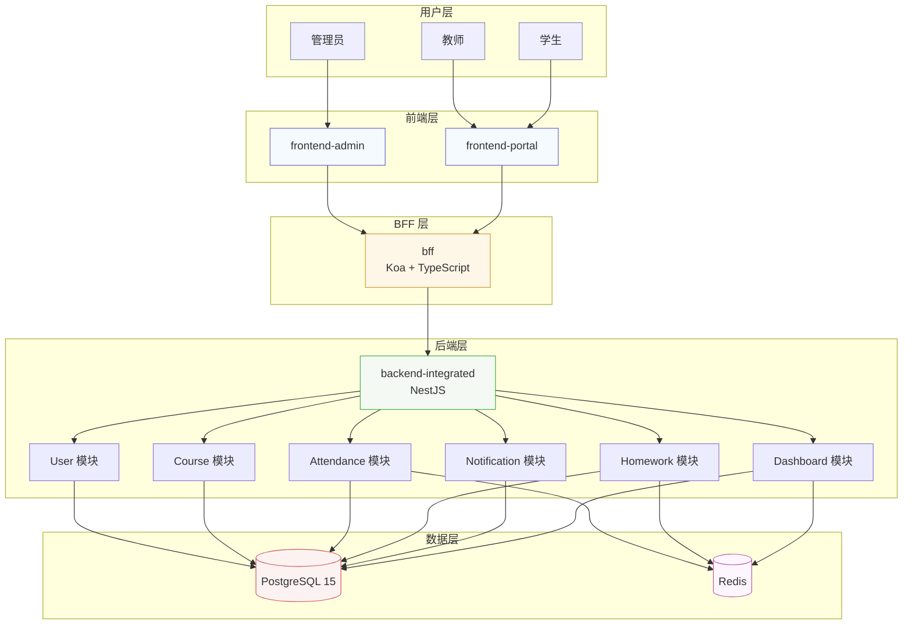
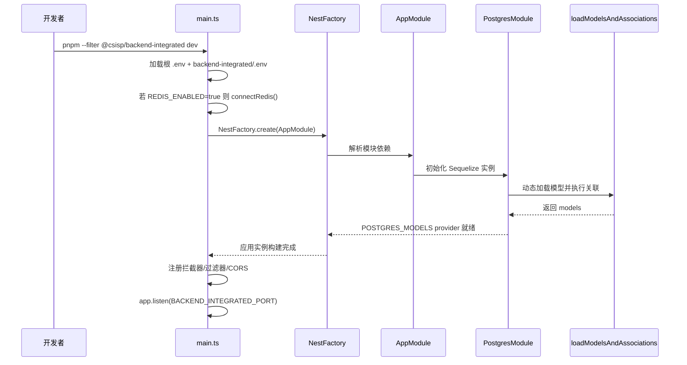
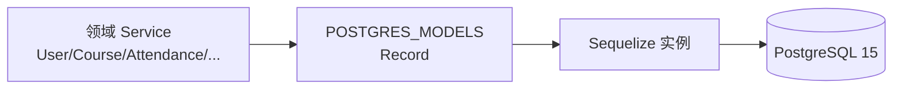
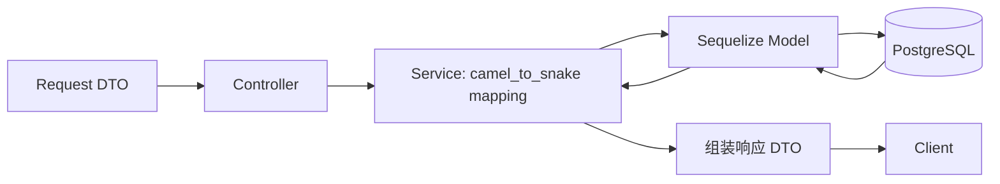

# backend-integrated 后端设计文档

> 本文档描述 `backend-integrated` 在 CSISP Monorepo 中的架构设计、模块划分、技术选型与关键实现约定，作为后端实现与维护的主参考文档。

---

## 1. 文档概述

### 1.1 项目背景

backend-integrated 是新一代后端实现：

- 使用 NestJS + TypeScript + Sequelize + PostgreSQL + Redis
- 通过统一的 RESTful API 对接 BFF（Koa）与前端应用

### 1.2 设计目标

- **单一后端事实源**：作为后端唯一权威实现，替代 legacy backend
- **模块化与可维护性**：按业务域划分 Nest 模块，代码结构清晰
- **接口稳定性**：对齐 `@csisp/types` 和数据库 schema，保证前后端类型一致
- **安全性**：JWT 认证 + 角色/资源归属校验，避免越权访问
- **性能与扩展性**：Redis 缓存 + 可扩展的 infra 层（Postgres/Redis）

### 1.3 适用范围

本文档主要面向：

- 负责 backend-integrated 开发与维护的后端工程师
- 实现 BFF 聚合逻辑的工程师
- 需要理解后端能力和数据模型的前端工程师

---

## 2. 整体架构与入口

### 2.1 与 Monorepo 其他项目的关系

仓库顶层结构（与本文相关部分）：

```text
CSISP/
├── apps/
│   ├── backend-integrated/   # Nest 后端（本文件描述对象）
│   ├── bff/                  # Koa BFF 层，聚合 backend-integrated
│   ├── frontend-admin/       # 管理端前端
│   └── frontend-portal/      # 门户（学生/教师）前端
├── packages/
│   ├── types/                # @csisp/types 共享业务类型
│   ├── db-schema/            # 数据库迁移与 schema 定义
│   ├── redis/                # @csisp/redis Redis 客户端封装
│   ├── upstream/             # @csisp/upstream HTTP 上游封装
│   └── utils/                # @csisp/utils 其他通用工具
└── infra/database/           # Postgres + Redis docker-compose 与脚本
```

整体调用关系：



### 2.2 backend-integrated 应用入口

入口文件：`apps/backend-integrated/src/main.ts`

职责：

- 加载环境变量（优先根 `.env`，再加载 backend-integrated 自身配置）
- 若 `REDIS_ENABLED=true`，通过 `@infra/redis` 初始化 Redis 连接
- 创建 Nest 应用实例并加载 `AppModule`
- 注册全局拦截器 / 过滤器 / CORS 配置
- 监听 `BACKEND_INTEGRATED_PORT` 端口，暴露 `/api` REST 接口

应用启动流程（简化）：



---

## 3. 项目结构与基础设施

### 3.1 源码目录结构

```text
apps/backend-integrated/
├── src/
│   ├── main.ts                # Nest 应用入口
│   ├── app.module.ts          # 根模块，聚合 infra 与业务模块
│   ├── config/
│   │   └── cors.config.ts     # CORS 配置
│   ├── infra/
│   │   ├── postgres/          # Sequelize + Postgres 装配
│   │   │   ├── postgres.module.ts
│   │   │   ├── postgres.providers.ts  # POSTGRES_SEQUELIZE / POSTGRES_MODELS
│   │   │   └── load-models.ts         # 动态加载 models + associate
│   │   └── redis/
│   │       ├── index.ts               # 从 @csisp/redis re-export API
│   │       ├── redis.providers.ts     # REDIS_CLIENT provider（预留）
│   │       └── redis.module.ts        # @Global RedisModule（预留）
│   ├── common/
│   │   ├── guards/
│   │   │   ├── jwt-auth.guard.ts      # 检验 JWT 并注入用户信息
│   │   │   └── roles.guard.ts         # 基于 @Roles() 校验角色
│   │   ├── decorators/
│   │   │   └── roles.decorator.ts
│   │   ├── interceptors/
│   │   │   ├── logging.interceptor.ts # 结构化请求日志
│   │   │   └── rate-limit.interceptor.ts
│   │   ├── filters/
│   │   │   └── http-exception.filter.ts
│   │   └── pipes/
│   │       ├── parse-id.pipe.ts       # 将 path 参数转为 number 并校验
│   │       └── pagination.pipe.ts     # 将 query 转为 PaginationParams
│   └── modules/
│       ├── user/
│       ├── course/
│       ├── attendance/
│       ├── homework/
│       ├── dashboard/
│       └── health/
└── package.json
```

### 3.2 Postgres 与 Sequelize 装配

backend-integrated 不直接使用 `sequelize-cli` 的 runtime 模型，而是：

- 在 `PostgresModule` 中创建单例 `Sequelize` 实例（从 `.env` 读取 DB 配置）
- 动态加载 `packages/db-schema` 对应的模型定义（ESM factories）
- 调用每个模型的 `associate(models)` 完成关联关系装配
- 通过 `POSTGRES_MODELS` provider 将 `models: Record<string, any>` 注入到各 Service

数据链路示意：



### 3.3 Redis 接入（@infra/redis）

Redis 客户端统一由 `packages/redis` 提供，backend-integrated 通过 `@infra/redis` 访问：

```ts
// apps/backend-integrated/src/infra/redis/index.ts
export { connect, get, set, del, ttl, publish, subscribe, healthCheck } from '@csisp/redis';
```

使用约定：

- 在 `main.ts` 中根据 `REDIS_ENABLED` 决定是否调用 `connect()` 初始化连接
- 业务 Service 不直接导入 `@csisp/redis`，而是从 `@infra/redis` 导入 `get/set/del`
- 缓存键规范与 TTL 与架构文档一致：
  - 键前缀：`csisp:be:...`（后端），
  - 例如考勤：`be:attendance:stats:student:${userId}`

---

## 4. 横切能力：认证、鉴权、校验与日志

### 4.1 认证与角色鉴权

backend-integrated 使用 Nest `Guards + Decorators` 实现认证与角色控制：

- `JwtAuthGuard`
  - 从 `Authorization: Bearer <token>` 中解析 JWT
  - 验证签名、过期时间等
  - 加载用户信息（通常从 `User` 模型）并放入 `request.user`
- `RolesGuard`
  - 搭配 `@Roles('admin', 'teacher')` 使用
  - 读取当前用户角色，校验是否包含所需角色

示例：

```ts
@UseGuards(JwtAuthGuard, RolesGuard)
@Roles('teacher')
@Post('tasks')
createAttendanceTask(/* ... */) {}
```

### 4.2 参数与分页校验

- `ParseIdPipe`
  - 用于 `@Param('id', ParseIdPipe) id: number`
  - 将字符串转为 number，并校验 > 0，否则抛出 400
- `PaginationPipe`
  - 用于 `@Query(PaginationPipe) pagination: PaginationParams`
  - 从 `?page=&size=` 生成 `PaginationParams`，设置默认值与上限

### 4.3 日志与限流

- `LoggingInterceptor`
  - 在请求前后记录结构化日志（method、url、status、duration、userId 等）
  - 输出至 `process.stdout/stderr`，便于集中收集
- `RateLimitInterceptor`
  - 使用 Redis 或内存实现基础限流策略
  - 默认可根据 IP / userId 做简单限流

### 4.4 异常处理

- `HttpExceptionFilter`
  - 捕获 `HttpException` 与未知异常
  - 统一输出形如 `ApiResponse` 的结构：`{ code, message, data? }`
  - 根据环境控制是否输出详细错误信息

---

## 5. 业务模块概览

backend-integrated 下的业务模块均位于 `src/modules/*`，每个模块包含：

- `*.module.ts`：模块元数据与依赖声明
- `*.controller.ts`：HTTP 控制器（路由）
- `*.service.ts`：领域服务（业务逻辑 + ORM + Redis）

下面按模块概述职责、典型路由与核心实现要点。

### 5.1 User 模块

**职责**：

- 用户注册、登录、信息维护
- 角色分配与查询（学生/教师/管理员等）
- 基于学号/工号等信息的查询

**典型路由（示意）**：

- `POST /api/users/login`：用户登录，返回 JWT 与基础信息
- `GET /api/users/me`：获取当前登录用户详细信息
- `GET /api/users`：分页查询用户列表（支持角色、学号等过滤）
- `POST /api/users`：创建用户（管理员）
- `PUT /api/users/:id`：更新用户信息

**实现要点**：

- Service 注入 `POSTGRES_MODELS`，访问 `User/Role/UserRole` 等模型
- 登录成功后可将部分用户信息写入 Redis（可选）以加速频繁读取
- 所有与用户相关字段需与 `@csisp/types` 与数据库 schema 对齐

### 5.2 Course 模块

**职责**：

- 课程基础信息管理（课程、学年/学期）
- 班级（Class）、子课程（SubCourse）、时间段（TimeSlot）管理
- 教师分配（CourseTeacher）
- 班级学生列表与树状时间安排查询

**典型路由（部分示意，具体以代码为准）**：

- `GET /api/courses`：按学年/学期/专业分页查询课程列表
- `GET /api/courses/:courseId`：课程详情（含教师/班级/时间段树）
- `POST /api/courses`：创建课程（管理员/教务）
- `POST /api/courses/:courseId/classes`：创建班级
- `POST /api/courses/:courseId/sub-courses`：创建子课程
- `POST /api/courses/:courseId/time-slots`：创建时间段（归属子课程）
- `POST /api/courses/:courseId/teachers`：分配授课教师
- `GET /api/classes/:classId/students`：班级学生列表

**实现要点**：

- 使用 `Course/Class/SubCourse/TimeSlot/CourseTeacher/UserClass` 等模型
- 多处读取前通过 Redis 缓存，如：课程详情、班级学生列表
- 写操作后应清理相关缓存 key，例如：
  - 创建/更新课程 → 删除 `be:course:detail:${courseId}` 及相关列表 key
  - 班级学生变更 → 删除 `be:course:class:students:${classId}`

### 5.3 Attendance 模块

**职责**：

- 按班级维度创建考勤任务（与课程、班级关联）
- 学生考勤打卡（正常/迟到/缺勤/请假）
- 学生/班级的考勤统计与记录查询
- 考勤导出（班级维度）

**典型路由（摘录）**：

- `POST /api/attendance/tasks`：创建考勤任务（教师，绑定 classId 等）
- `GET /api/attendance/tasks/class/:classId`：某班级考勤任务列表（分页）
- `GET /api/attendance/tasks/active`：当前用户可见的进行中考勤任务
- `POST /api/attendance/records/checkin`：学生打卡
- `GET /api/attendance/stats/student/:userId`：学生考勤统计（可带 classId）
- `GET /api/attendance/stats/class/:classId`：班级考勤统计（教师）
- `GET /api/attendance/records/student/:userId`：学生考勤记录列表
- `GET /api/attendance/records/export?classId=`：导出班级考勤数据

**缓存与失效示例**：

- 学生统计：
  - key：`be:attendance:stats:student:${userId}` 或 `...:student:${userId}:class:${classId}`
  - 读路径：先 Redis → 未命中再聚合数据库，写回缓存
  - 写路径（打卡/修改记录）：删除对应学生与班级的统计 key

### 5.4 Homework 模块

**职责**：

- 班级作业创建、更新、删除
- 学生作业提交（支持附件元数据）
- 作业提交列表与统计
- 作业批改与评分

**典型路由（摘录）**：

- `POST /api/homework`：发布作业（班级维度）
- `GET /api/homework/class/:classId`：班级作业列表
- `POST /api/homework/:homeworkId/submissions`：学生提交作业
- `GET /api/homework/:homeworkId/submissions`：提交列表（教师视角，分页）
- `GET /api/homework/:homeworkId/stats`：提交情况统计
- `PUT /api/homework-submissions/:submissionId/grade`：评分与评语

**缓存示例**：

- 学生作业 summary：

```ts
const cacheKey = classId
  ? `be:homework:submissions:student:${userId}:class:${classId}`
  : `be:homework:submissions:student:${userId}`;

if (process.env.REDIS_ENABLED === 'true') {
  const cached = await get(cacheKey);
  if (cached) return JSON.parse(cached);
}

// 查询数据库并聚合后写回缓存
```

### 5.5 Notification 模块

**职责**：

- 通知创建（课程通知/系统通知）
- 列表与详情查询
- 阅读状态管理（已读/未读统计）

**典型路由（示意）**：

- `POST /api/notifications`：创建通知
- `GET /api/notifications`：当前用户通知列表（支持 unreadOnly）
- `POST /api/notifications/:id/read`：标记已读

**实现要点**：

- 使用 `Notification/NotificationRead` 模型
- 可使用 Redis 缓存用户未读数量或列表摘要

### 5.6 Dashboard 模块

**职责**：

- 管理员仪表盘：用户/课程/班级/考勤/作业/通知等全局统计
- 未来可扩展学生/教师仪表盘接口

**典型路由**：

- `GET /api/dashboard/stats`：顶卡统计
- `GET /api/dashboard/user-growth`：用户增长趋势
- `GET /api/dashboard/course-distribution`：课程学期/专业分布
- `GET /api/dashboard/recent-activities`：最近活动（考勤、作业、通知等）

**缓存策略**：

- 统计接口均使用 Redis 做短 TTL 缓存（例如 30~60s），键以 `be:dashboard:*` 为前缀

### 5.7 Health 模块

**职责**：

- 提供应用与数据库健康检测

**典型路由（示意）**：

- `GET /api/health/app`：应用运行态（如版本号、uptime）
- `GET /api/health/db`：数据库连接健康检查（当前已实现）

---

## 6. 数据与类型对齐

### 6.1 类型来源

backend-integrated 所有对外 DTO 与响应结构，都应对齐 `@csisp/types`：

- `packages/types/src/api/*.ts`：各领域接口的入参/出参
- `packages/types/src/common/*.ts`：分页、通用响应 `ApiResponse`、`PaginationResponse` 等

### 6.2 实体与字段映射

- Sequelize 模型字段遵循数据库命名（`snake_case`）
- DTO 与前端字段遵循 `camelCase`
- Service 层负责显式映射，例如：
  - `real_name` → `realName`
  - `student_id` → `studentId`
  - `enrollment_year` → `enrollmentYear`

推荐的字段流转：



---

## 7. 安全策略

### 7.1 认证与授权

- 统一通过 JWT 认证获取当前用户
- 使用 `JwtAuthGuard` + `RolesGuard` + `@Roles()` 控制接口访问
- 尽量避免通过 body/query 传入用户 ID 来定位“当前用户”，而是从 `request.user` 读取

### 7.2 资源归属校验

- 在 Service 层封装“资源归属”检查，例如：
  - 班级是否隶属于当前教师
  - 作业是否属于指定班级
  - 考勤任务是否属于特定课程/班级
- 对涉及敏感操作（如创建班级、分配教师、批量更新考勤记录等），应在文档中标出并在代码中实现校验

### 7.3 输入校验

- 控制器层通过 DTO + Pipe 校验基础类型
- 复杂业务校验（如时间区间合法性、学年/学期范围）在 Service 层实现

---

## 8. 性能与缓存约定

backend-integrated 的缓存策略与《技术架构文档》中 Redis 部分一致：

- 键前缀：`csisp:be:<domain>:...`
- TTL：
  - 详情/分布：约 300s
  - 列表：约 120s
  - 统计：30–60s
- 写操作：尽量删除精确 key（而非“全量 flush”）

示例：

- 学生考勤统计
  - key：`csisp:be:attendance:stats:student:${userId}:class:${classId}`
- 班级作业列表
  - key：`csisp:be:homework:list:class:${classId}:page=${page}|size=${size}`
- 仪表盘顶卡
  - key：`csisp:be:dashboard:stats`

---

## 9. 部署与运维摘要

### 9.1 环境变量

关键环境变量（示例，以 `.env.example` 为准）：

- 数据库：`DB_HOST/DB_PORT/DB_NAME/DB_USER/DB_PASSWORD`
- Redis：`REDIS_HOST/REDIS_PORT/REDIS_DB/REDIS_PASSWORD/REDIS_ENABLED`
- 端口：`BACKEND_INTEGRATED_PORT`
- JWT：`JWT_SECRET/JWT_EXPIRES_IN`

### 9.2 健康检查

- 建议在部署层（Kubernetes / Docker Compose / 其他）使用：
  - `GET /api/health/app` 作为 liveness probe
  - `GET /api/health/db` 作为 readiness/依赖检查的一部分
