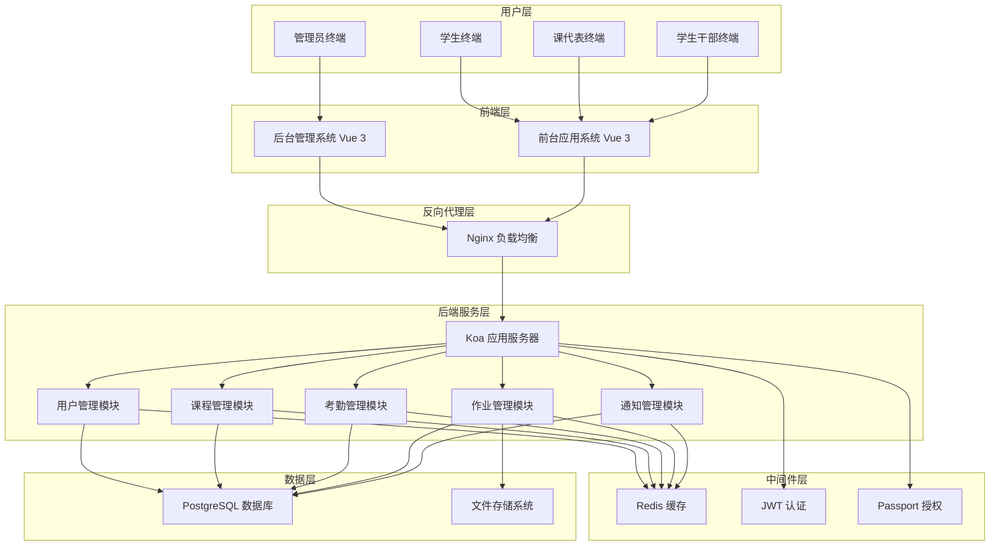
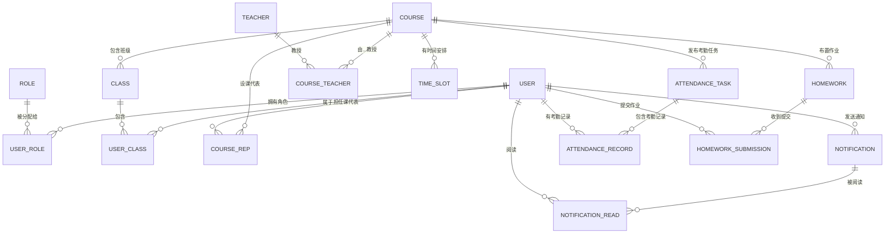
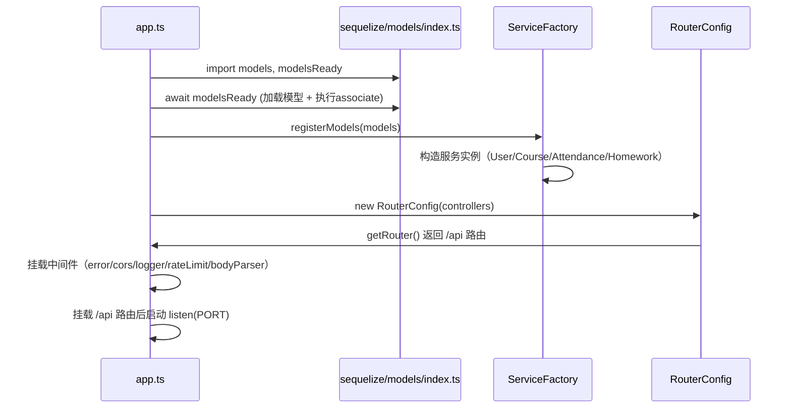
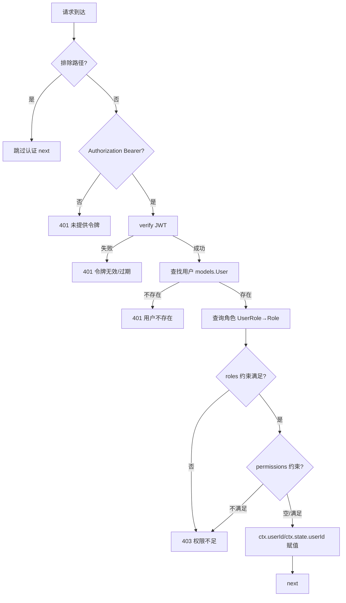
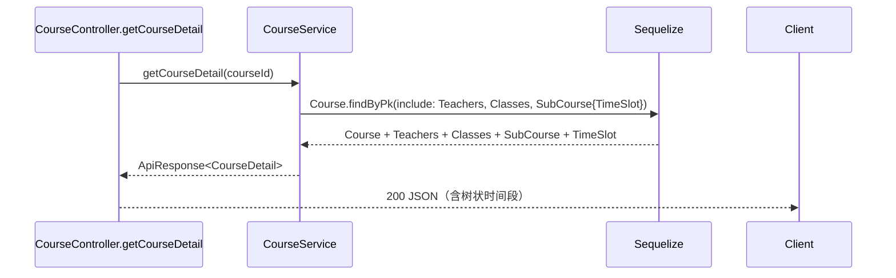

# CSISP 计算机学院综合服务平台 - 后端设计文档

## 1. 文档概述

### 1.1 项目背景

CSISP（Computer Science Integrated Service Platform）是计算机学院专注于学生考勤管理和作业管理的综合服务系统。系统支持管理员、学生、课代表和学生干部等多角色访问，实现课程管理、考勤打卡、作业发布与提交等核心功能。

### 1.2 设计目标

- **高可用性**：确保系统7×24小时稳定运行
- **高性能**：支持高并发用户访问
- **安全性**：完善的权限控制和数据保护
- **可扩展性**：支持业务规模增长和功能扩展
- **可维护性**：清晰的代码结构和文档支持

### 1.3 技术栈

- **后端框架**：Koa 2.x + TypeScript（统一路由装配 `RouterConfig`）
- **数据库**：PostgreSQL + Redis
- **ORM**：Sequelize（新增 CourseTeacher/SubCourse/HomeworkFile 模型与关联）
- **认证授权**：JWT（角色代码 + 业务权限校验）
- **缓存**：Redis
- **构建工具**：esbuild
- **日志系统**：Winston

---

## 2. 系统架构设计

### 2.1 整体架构



### 2.2 分层架构说明

#### 2.2.1 用户层

- **管理员**：通过后台管理系统进行系统管理
- **学生**：通过前台应用系统进行日常操作
- **课代表**：通过前台应用系统管理课程作业和考勤
- **学生干部**：通过前台应用系统发布通知

#### 2.2.2 前端层

- **后台管理系统**：基于Vue 3 + TypeScript + Naive-UI
- **前台应用系统**：基于Vue 3 + TypeScript + Naive-UI

#### 2.2.3 后端服务层

- **Koa应用服务器**：轻量级Node.js框架，支持中间件扩展；入口采用 `initializeControllers()` + `RouterConfig`
- **模块化设计**：按业务功能划分独立模块；服务层通过 `ServiceFactory` 注入 ORM 模型

#### 2.2.4 数据层

- **PostgreSQL**：关系型数据存储，支持事务和复杂查询
- **Redis**：缓存热点数据，提高系统性能
- **文件存储**：作业文件等非结构化数据存储

---

## 3. 模块划分与职责

### 3.1 用户管理模块

#### 3.1.1 功能职责

- 用户注册、登录、注销
- 用户信息管理（增删改查）
- 角色权限分配（RBAC模型）
- 课代表角色分配
- 密码加密与重置

#### 3.1.2 核心接口

```typescript
interface UserService {
  // 用户认证
  login(username: string, password: string): Promise<LoginResult>;
  logout(token: string): Promise<void>;
  refreshToken(refreshToken: string): Promise<TokenResult>;

  // 用户管理
  createUser(userData: CreateUserDto): Promise<User>;
  updateUser(userId: number, userData: UpdateUserDto): Promise<User>;
  deleteUser(userId: number): Promise<void>;
  getUserById(userId: number): Promise<User>;
  getUserList(params: UserQueryParams): Promise<UserListResult>;

  // 角色管理
  assignRole(userId: number, roleId: number): Promise<void>;
  removeRole(userId: number, roleId: number): Promise<void>;
  assignCourseRep(userId: number, courseId: number): Promise<void>;
}
```

#### 3.1.3 数据库表设计

```sql
-- 用户表
CREATE TABLE "user" (
    "id" SERIAL PRIMARY KEY,
    "username" VARCHAR(255) UNIQUE NOT NULL,
    "password" VARCHAR(255) NOT NULL,
    "student_id" VARCHAR(11) UNIQUE NOT NULL,
    "enrollment_year" INT NOT NULL CHECK ("enrollment_year" BETWEEN 2000 AND 3000),
    "major" VARCHAR(100) NOT NULL,
    "real_name" VARCHAR(255) NOT NULL,
    "email" VARCHAR(255) UNIQUE NOT NULL,
    "phone" VARCHAR(20) UNIQUE NOT NULL,
    "status" INT DEFAULT 1,
    "created_at" TIMESTAMP WITH TIME ZONE DEFAULT CURRENT_TIMESTAMP,
    "updated_at" TIMESTAMP WITH TIME ZONE DEFAULT CURRENT_TIMESTAMP
);

-- 角色表
CREATE TABLE "role" (
    id SERIAL PRIMARY KEY,
    name VARCHAR(50) UNIQUE NOT NULL,
    description TEXT,
    created_at TIMESTAMP WITH TIME ZONE DEFAULT CURRENT_TIMESTAMP,
    updated_at TIMESTAMP WITH TIME ZONE DEFAULT CURRENT_TIMESTAMP
);

-- 用户角色关联表
CREATE TABLE "user_role" (
    user_id INT NOT NULL REFERENCES "user"(id) ON DELETE CASCADE,
    role_id INT NOT NULL REFERENCES "role"(id) ON DELETE CASCADE,
    PRIMARY KEY (user_id, role_id)
);
```

### 3.2 课程管理模块

#### 3.2.1 功能职责

- 课程信息管理（创建、修改、删除）
- 教师与课程关联管理
- 课程时间槽管理
- 课程班级划分
- 学生选课管理

#### 3.2.2 核心接口

```typescript
interface CourseService {
  // 课程管理
  createCourse(courseData: CreateCourseDto): Promise<Course>;
  updateCourse(courseId: number, courseData: UpdateCourseDto): Promise<Course>;
  deleteCourse(courseId: number): Promise<void>;
  getCourseById(courseId: number): Promise<Course>;
  getCourseList(params: CourseQueryParams): Promise<CourseListResult>;

  // 教师管理
  assignTeacher(courseId: number, teacherId: number): Promise<void>;
  removeTeacher(courseId: number, teacherId: number): Promise<void>;

  // 班级管理
  createClass(courseId: number, classData: CreateClassDto): Promise<Class>;
  assignStudentToClass(studentId: number, classId: number): Promise<void>;
  getClassStudents(classId: number): Promise<StudentListResult>;

  // 时间槽管理
  createTimeSlot(courseId: number, timeSlotData: CreateTimeSlotDto): Promise<TimeSlot>;
  updateTimeSlot(timeSlotId: number, timeSlotData: UpdateTimeSlotDto): Promise<TimeSlot>;
}
```

#### 3.2.3 数据库表设计

```sql
-- 课程表
CREATE TABLE "course" (
    "id" SERIAL PRIMARY KEY,
    "course_name" VARCHAR(255) NOT NULL,
    "course_code" VARCHAR(50) NOT NULL, -- 课程代码
    "semester" INT NOT NULL CHECK ("semester" BETWEEN 1 AND 8), -- 学期标识(1-8)
    "academic_year" INT NOT NULL, -- 学年(如2023)
    "available_majors" JSON NOT NULL, -- 可选择的专业列表
    "status" INT DEFAULT 1,
    "created_at" TIMESTAMP WITH TIME ZONE DEFAULT CURRENT_TIMESTAMP,
    "updated_at" TIMESTAMP WITH TIME ZONE DEFAULT CURRENT_TIMESTAMP
);

-- 为课程表添加唯一约束：同一课程代码在同一学年同一学期只能开设一次
ALTER TABLE "course" ADD CONSTRAINT "course_code_semester_year_unique" UNIQUE ("course_code", "semester", "academic_year");

-- 教师表
CREATE TABLE "teacher" (
    "id" SERIAL PRIMARY KEY,
    "user_id" INT REFERENCES "user"(id),
    "teacher_id" VARCHAR(11) UNIQUE NOT NULL, -- 教师工号
    "real_name" VARCHAR(255) NOT NULL,
    "email" VARCHAR(255) UNIQUE NOT NULL,
    "phone" VARCHAR(20) UNIQUE NOT NULL,
    "department" VARCHAR(255) NOT NULL, -- 所属部门
    "title" VARCHAR(100) NOT NULL, -- 职称
    "status" INT DEFAULT 1, -- 状态标识：1-在职，0-离职
    "created_at" TIMESTAMP WITH TIME ZONE DEFAULT CURRENT_TIMESTAMP,
    "updated_at" TIMESTAMP WITH TIME ZONE DEFAULT CURRENT_TIMESTAMP
);

-- 课程教师关联表（Course↔Teacher 多对多）
CREATE TABLE "course_teacher" (
    course_id INT NOT NULL REFERENCES "course"(id) ON DELETE CASCADE,
    teacher_id INT NOT NULL REFERENCES "teacher"(id) ON DELETE CASCADE,
    PRIMARY KEY (course_id, teacher_id)
);

-- 班级表
CREATE TABLE "class" (
    "id" SERIAL PRIMARY KEY,
    "class_name" VARCHAR(255) NOT NULL, -- 班级名称
    "class_code" VARCHAR(50) NOT NULL, -- 班级代码
    "teacher_id" INT REFERENCES "teacher"(id), -- 授课教师ID
    "course_id" INT REFERENCES "course"(id), -- 所属课程ID
    "semester" INT NOT NULL CHECK ("semester" BETWEEN 1 AND 8), -- 学期标识(1-8)
    "academic_year" INT NOT NULL, -- 学年(如2023)
    "max_students" INT DEFAULT 50, -- 最大学生数
    "status" INT DEFAULT 1,
    "created_at" TIMESTAMP WITH TIME ZONE DEFAULT CURRENT_TIMESTAMP,
    "updated_at" TIMESTAMP WITH TIME ZONE DEFAULT CURRENT_TIMESTAMP
);

-- 为班级表添加唯一约束：同一教师在同一学年同一学期不能重复开设同一课程的班级
ALTER TABLE "class" ADD CONSTRAINT "teacher_course_semester_year_unique" UNIQUE ("teacher_id", "course_id", "semester", "academic_year");

-- 用户班级关联表
CREATE TABLE "user_class" (
    "id" SERIAL PRIMARY KEY,
    "user_id" INT NOT NULL REFERENCES "user"(id) ON DELETE CASCADE,
    "class_id" INT NOT NULL REFERENCES "class"(id) ON DELETE CASCADE,
    "join_time" TIMESTAMP WITH TIME ZONE DEFAULT CURRENT_TIMESTAMP,
    "status" INT DEFAULT 1,
    UNIQUE ("user_id", "class_id")
);
```

### 3.3 考勤管理模块

#### 3.3.1 功能职责

- 考勤任务发布与管理
- 学生考勤打卡
- 考勤记录统计与分析
- 考勤异常处理
- 考勤数据导出

#### 3.3.2 核心接口

```typescript
interface AttendanceService {
  // 考勤任务管理
  createAttendanceTask(taskData: CreateAttendanceTaskDto): Promise<AttendanceTask>;
  updateAttendanceTask(taskId: number, taskData: UpdateAttendanceTaskDto): Promise<AttendanceTask>;
  deleteAttendanceTask(taskId: number): Promise<void>;
  getAttendanceTaskById(taskId: number): Promise<AttendanceTask>;
  getCourseAttendanceTasks(courseId: number): Promise<AttendanceTaskListResult>;

  // 考勤打卡
  checkIn(taskId: number, studentId: number, checkInData: CheckInDto): Promise<AttendanceRecord>;
  getAttendanceRecord(taskId: number, studentId: number): Promise<AttendanceRecord>;

  // 考勤统计
  getCourseAttendanceStats(courseId: number, dateRange: DateRangeDto): Promise<AttendanceStats>;
  getStudentAttendanceStats(studentId: number, courseId: number): Promise<StudentAttendanceStats>;

  // 异常处理
  markAbsence(taskId: number, studentId: number, reason: string): Promise<void>;
  approveAbsence(recordId: number, approverId: number): Promise<void>;
}
```

#### 3.3.3 数据库表设计

```sql
-- 考勤任务表
CREATE TABLE "attendance_task" (
    id SERIAL PRIMARY KEY,
    class_id INT NOT NULL REFERENCES "class"(id) ON DELETE CASCADE,
    start_time TIMESTAMP WITH TIME ZONE NOT NULL,
    end_time TIMESTAMP WITH TIME ZONE NOT NULL CHECK (end_time > start_time),
    status INT DEFAULT 1,
    created_at TIMESTAMP WITH TIME ZONE DEFAULT CURRENT_TIMESTAMP,
    updated_at TIMESTAMP WITH TIME ZONE DEFAULT CURRENT_TIMESTAMP
);

-- 考勤记录表
CREATE TABLE "attendance_record" (
    id SERIAL PRIMARY KEY,
    attendance_task_id INT NOT NULL REFERENCES "attendance_task"(id) ON DELETE CASCADE,
    user_id INT NOT NULL REFERENCES "user"(id) ON DELETE CASCADE,
    checkin_time TIMESTAMP WITH TIME ZONE NOT NULL,
    status VARCHAR(50) NOT NULL DEFAULT 'present',
    ip_address VARCHAR(50),
    device_info TEXT,
    created_at TIMESTAMP WITH TIME ZONE DEFAULT CURRENT_TIMESTAMP,
    updated_at TIMESTAMP WITH TIME ZONE DEFAULT CURRENT_TIMESTAMP,
    UNIQUE (task_id, user_id)
);
```

### 3.4 作业管理模块

#### 3.4.1 功能职责

- 作业发布与编辑
- 作业提交与状态管理
- 提交情况统计
- 文件上传与管理

#### 3.4.2 核心接口

```typescript
interface HomeworkService {
  // 作业管理
  createHomework(homeworkData: CreateHomeworkDto): Promise<Homework>;
  updateHomework(homeworkId: number, homeworkData: UpdateHomeworkDto): Promise<Homework>;
  deleteHomework(homeworkId: number): Promise<void>;
  getHomeworkById(homeworkId: number): Promise<Homework>;
  getCourseHomeworks(courseId: number): Promise<HomeworkListResult>;

  // 作业提交
  submitHomework(
    homeworkId: number,
    studentId: number,
    submissionData: SubmitHomeworkDto
  ): Promise<HomeworkSubmission>;
  getHomeworkSubmission(homeworkId: number, studentId: number): Promise<HomeworkSubmission>;
  updateSubmission(
    submissionId: number,
    submissionData: UpdateSubmissionDto
  ): Promise<HomeworkSubmission>;

  // 统计功能
  getHomeworkStats(homeworkId: number): Promise<HomeworkStats>;
  getCourseHomeworkStats(courseId: number): Promise<CourseHomeworkStats>;
}
```

#### 3.4.3 数据库表设计

```sql
-- 作业表
CREATE TABLE "homework" (
    id SERIAL PRIMARY KEY,
    class_id INT NOT NULL REFERENCES "class"(id) ON DELETE CASCADE,
    title VARCHAR(255) NOT NULL,
    content TEXT NOT NULL,
    deadline TIMESTAMP WITH TIME ZONE NOT NULL,
    status INT DEFAULT 1,
    created_at TIMESTAMP WITH TIME ZONE DEFAULT CURRENT_TIMESTAMP,
    updated_at TIMESTAMP WITH TIME ZONE DEFAULT CURRENT_TIMESTAMP
);

-- 作业提交表
CREATE TABLE "homework_submission" (
    id SERIAL PRIMARY KEY,
    homework_id INT NOT NULL REFERENCES "homework"(id) ON DELETE CASCADE,
    user_id INT NOT NULL REFERENCES "user"(id) ON DELETE CASCADE,
    file_path VARCHAR(255),
    submit_time TIMESTAMP WITH TIME ZONE NOT NULL,
    status VARCHAR(50) NOT NULL DEFAULT 'submitted', -- submitted, late, not_submitted
    created_at TIMESTAMP WITH TIME ZONE DEFAULT CURRENT_TIMESTAMP,
    updated_at TIMESTAMP WITH TIME ZONE DEFAULT CURRENT_TIMESTAMP,
    UNIQUE (homework_id, user_id)
);
```

### 3.5 通知管理模块

#### 3.5.1 功能职责

- 通知发布与编辑
- 实时通知推送
- 阅读状态管理
- 通知历史查询
- 通知分类管理

#### 3.5.2 核心接口

```typescript
interface NotificationService {
  // 通知管理
  createNotification(notificationData: CreateNotificationDto): Promise<Notification>;
  updateNotification(
    notificationId: number,
    notificationData: UpdateNotificationDto
  ): Promise<Notification>;
  deleteNotification(notificationId: number): Promise<void>;
  getNotificationById(notificationId: number): Promise<Notification>;
  getNotificationList(params: NotificationQueryParams): Promise<NotificationListResult>;

  // 阅读状态管理
  markAsRead(notificationId: number, userId: number): Promise<void>;
  getUnreadNotifications(userId: number): Promise<NotificationListResult>;
  getReadStatus(notificationId: number): Promise<ReadStatusResult>;

  // 推送功能
  pushNotification(notificationId: number): Promise<void>;
  broadcastNotification(notificationData: BroadcastNotificationDto): Promise<void>;
}
```

#### 3.5.3 数据库表设计

```sql
-- 通知表
CREATE TABLE "notification" (
    id SERIAL PRIMARY KEY,
    sender_id INT NOT NULL REFERENCES "user"(id) ON DELETE CASCADE,
    title VARCHAR(255) NOT NULL,
    content TEXT NOT NULL,
    read_count INT DEFAULT 0,
    status INT DEFAULT 1,
    created_at TIMESTAMP WITH TIME ZONE DEFAULT CURRENT_TIMESTAMP,
    updated_at TIMESTAMP WITH TIME ZONE DEFAULT CURRENT_TIMESTAMP
);

-- 通知阅读关联表
CREATE TABLE "notification_read" (
    notification_id INT NOT NULL REFERENCES "notification"(id) ON DELETE CASCADE,
    user_id INT NOT NULL REFERENCES "user"(id) ON DELETE CASCADE,
    read_time TIMESTAMP WITH TIME ZONE NOT NULL DEFAULT CURRENT_TIMESTAMP,
    PRIMARY KEY (notification_id, user_id)
);
```

---

## 4. API接口设计

### 4.1 API设计规范

#### 4.1.1 RESTful API设计原则

- 使用HTTP方法表示操作类型（GET、POST、PUT、DELETE）
- 使用复数名词表示资源集合
- 使用嵌套路径表示资源关系
- 统一错误码和响应格式

#### 4.1.2 统一响应格式

```typescript
interface ApiResponse<T> {
  code: number; // 状态码
  message: string; // 消息描述
  data: T; // 响应数据
  timestamp: string; // 时间戳
}

interface PaginatedResponse<T> extends ApiResponse<T[]> {
  pagination: {
    page: number; // 当前页码
    pageSize: number; // 每页数量
    total: number; // 总记录数
    totalPages: number; // 总页数
  };
}
```

### 4.2 认证授权API

#### 4.2.1 用户认证

```http
# 用户登录
POST /api/auth/login
Content-Type: application/json

{
  "username": "student001",
  "password": "password123"
}

# 响应
{
  "code": 200,
  "message": "登录成功",
  "data": {
    "token": "eyJhbGciOiJIUzI1NiIsInR5cCI6IkpXVCJ9...",
    "refreshToken": "eyJhbGciOiJIUzI1NiIsInR5cCI6IkpXVCJ9...",
    "expiresIn": 3600,
    "user": {
      "id": 1,
      "username": "student001",
      "realName": "张三",
      "roles": ["student"]
    }
  },
  "timestamp": "2025-01-15T10:30:00Z"
}

# 刷新令牌
POST /api/auth/refresh
Content-Type: application/json

{
  "refreshToken": "eyJhbGciOiJIUzI1NiIsInR5cCI6IkpXVCJ9..."
}

# 用户注销
POST /api/auth/logout
Authorization: Bearer {token}
```

### 4.3 用户管理API

#### 4.3.1 用户信息管理

```http
# 获取用户列表
GET /api/users?page=1&pageSize=10&role=student
Authorization: Bearer {token}

# 创建用户
POST /api/users
Authorization: Bearer {token}
Content-Type: application/json

{
  "username": "newstudent",
  "password": "password123",
  "realName": "李四",
  "email": "lisi@example.com",
  "phone": "13800138001"
}

# 更新用户信息
PUT /api/users/1
Authorization: Bearer {token}
Content-Type: application/json

{
  "realName": "李四（更新）",
  "email": "lisi_updated@example.com"
}

# 分配角色
POST /api/users/1/roles
Authorization: Bearer {token}
Content-Type: application/json

{
  "roleId": 2
}
```

### 4.4 课程管理API

#### 4.4.1 课程信息管理

```http
# 获取课程列表
GET /api/courses?page=1&pageSize=10&status=active
Authorization: Bearer {token}

# 创建课程
POST /api/courses
Authorization: Bearer {token}
Content-Type: application/json

{
  "courseName": "数据结构",
  "courseCode": "CS201",
  "description": "数据结构与算法基础课程"
}

# 分配教师
POST /api/courses/1/teachers
Authorization: Bearer {token}
Content-Type: application/json

{
  "teacherId": 1
}

# 创建班级
POST /api/courses/1/classes
Authorization: Bearer {token}
Content-Type: application/json

{
  "className": "数据结构-01班"
}
```

### 4.5 考勤管理API

#### 4.5.1 考勤任务管理

```http
# 创建考勤任务
POST /api/courses/1/attendance-tasks
Authorization: Bearer {token}
Content-Type: application/json

{
  "startTime": "2025-01-15T09:00:00Z",
  "endTime": "2025-01-15T09:15:00Z",
  "location": "教学楼A101"
}

# 学生打卡（班级维度）
POST /api/attendance/checkin
Authorization: Bearer {token}
Content-Type: application/json

{
  "taskId": 1,
  "remark": "打卡",
  "status": "normal"
}

# 获取考勤统计
GET /api/courses/1/attendance/stats?startDate=2025-01-01&endDate=2025-01-31
Authorization: Bearer {token}
```

### 4.6 作业管理API

#### 4.6.1 作业发布与提交

```http
# 发布作业
POST /api/courses/1/homeworks
Authorization: Bearer {token}
Content-Type: application/json

{
  "title": "链表操作练习",
  "content": "实现单链表的插入、删除和查找操作",
  "deadline": "2025-01-20T23:59:59Z"
}

# 提交作业（支持附件）
POST /api/homeworks/1/submissions
Authorization: Bearer {token}
Content-Type: multipart/form-data

file: [作业文件]
meta: { "fileName": "xxx.pdf" }

# 批改作业
POST /api/homework-submissions/1/grade
Authorization: Bearer {token}
Content-Type: application/json

{
  "score": 85,
  "comment": "代码结构清晰，但时间复杂度可以优化"
}
```

### 4.7 通知管理API

#### 4.7.1 通知发布与管理

```http
# 发布通知
POST /api/notifications
Authorization: Bearer {token}
Content-Type: application/json

{
  "title": "期末考试安排",
  "content": "期末考试将于1月25日举行，请同学们做好准备",
  "targetType": "all"
}

# 获取通知列表
GET /api/notifications?page=1&pageSize=20&unreadOnly=true
Authorization: Bearer {token}

# 标记已读
POST /api/notifications/1/read
Authorization: Bearer {token}
```

---

## 5. 数据库结构设计与操作实现

### 5.1 核心数据表关系图



### 5.2 数据库操作实现详解

#### 5.2.1 基本功能实现（CRUD + JOIN）

**1) 创建数据表 - 使用Sequelize ORM**

```typescript
// 用户模型定义
class User extends Model {
  public id!: number;
  public username!: string;
  public password!: string;
  public real_name!: string;
  public email!: string;
  public phone!: string;
  public status!: number;
}

User.init(
  {
    id: { type: DataTypes.INTEGER, autoIncrement: true, primaryKey: true },
    username: { type: DataTypes.STRING, allowNull: false, unique: true },
    password: { type: DataTypes.STRING, allowNull: false },
    real_name: { type: DataTypes.STRING, allowNull: false },
    email: { type: DataTypes.STRING, allowNull: false, unique: true },
    phone: { type: DataTypes.STRING, allowNull: false, unique: true },
    status: { type: DataTypes.INTEGER, defaultValue: 1 },
  },
  {
    sequelize,
    tableName: 'user',
    timestamps: true,
    createdAt: 'created_at',
    updatedAt: 'updated_at',
  }
);
```

**2) 插入数据**

```typescript
const createUser = async (userData: CreateUserDto): Promise<User> => {
  return await User.create({
    username: userData.username,
    password: await bcrypt.hash(userData.password, 12),
    real_name: userData.realName,
    email: userData.email,
    phone: userData.phone,
  });
};
```

**3) 查询数据**

```typescript
const getUserById = async (id: number): Promise<User | null> => {
  return await User.findByPk(id);
};

const getUsersByRole = async (roleName: string): Promise<User[]> => {
  return await User.findAll({
    include: [
      {
        model: Role,
        where: { name: roleName },
        through: { attributes: [] },
      },
    ],
  });
};
```

**4) 修改数据**

```typescript
const updateUser = async (id: number, updateData: UpdateUserDto): Promise<User> => {
  const user = await User.findByPk(id);
  if (!user) throw new Error('用户不存在');
  return await user.update(updateData);
};
```

**5) 删除数据**

```typescript
const deleteUser = async (id: number): Promise<void> => {
  const user = await User.findByPk(id);
  if (!user) throw new Error('用户不存在');
  await user.destroy();
};
```

**6) 跨数据表操作（JOIN）**

```typescript
const getCourseWithDetails = async (courseId: number): Promise<any> => {
  return await Course.findByPk(courseId, {
    include: [
      { model: Teacher, through: { attributes: [] } },
      {
        model: Class,
        include: [{ model: User, through: { attributes: [] } }],
      },
      { model: Homework },
    ],
  });
};
```

#### 5.2.2 额外功能实现

**1) 事务支持**

```typescript
const createCourseWithTeachers = async (
  courseData: CreateCourseDto,
  teacherIds: number[]
): Promise<Course> => {
  const transaction = await sequelize.transaction();

  try {
    const course = await Course.create(courseData, { transaction });

    const courseTeacherPromises = teacherIds.map(teacherId =>
      CourseTeacher.create({ course_id: course.id, teacher_id: teacherId }, { transaction })
    );

    await Promise.all(courseTeacherPromises);
    await transaction.commit();
    return course;
  } catch (error) {
    await transaction.rollback();
    throw error;
  }
};
```

**2) 索引支持**

```sql
-- 性能优化索引
CREATE INDEX idx_user_username ON "user"(username);
CREATE INDEX idx_course_code ON course(course_code);
CREATE INDEX idx_attendance_task_time ON attendance_task(start_time, end_time);
CREATE INDEX idx_homework_deadline ON homework(deadline);
CREATE INDEX idx_notification_created_at ON notification(created_at);
```

**3) 多用户并发访问性能监控**

```typescript
class DatabasePerformanceMonitor {
  private performanceMetrics: any[] = [];

  async recordQueryPerformance(query: string, duration: number): Promise<void> {
    this.performanceMetrics.push({ query, duration, timestamp: new Date() });
    if (this.performanceMetrics.length > 1000) {
      this.performanceMetrics = this.performanceMetrics.slice(-1000);
    }
  }

  getPerformanceReport(): any {
    const totalQueries = this.performanceMetrics.length;
    const avgDuration =
      this.performanceMetrics.reduce((sum, m) => sum + m.duration, 0) / totalQueries;

    return {
      totalQueries,
      avgDuration: avgDuration.toFixed(2),
      maxDuration: Math.max(...this.performanceMetrics.map(m => m.duration)).toFixed(2),
      recentQueries: this.performanceMetrics.slice(-10),
    };
  }
}
```

#### 5.2.3 数据库建模工具应用

**Sequelize CLI 自动化建模**

```bash
# 初始化项目结构
npx sequelize-cli init

# 生成模型文件
npx sequelize-cli model:generate --name User --attributes username:string,password:string,real_name:string,email:string,phone:string,status:integer

# 执行迁移
npx sequelize-cli db:migrate

# 生成种子数据
npx sequelize-cli db:seed:all
```

**数据库逆向工程**

```typescript
const generateModelsFromDatabase = async (): Promise<void> => {
  const { SequelizeAuto } = require('sequelize-auto');

  const auto = new SequelizeAuto({
    host: process.env.DB_HOST,
    database: process.env.DB_NAME,
    username: process.env.DB_USER,
    password: process.env.DB_PASSWORD,
    dialect: 'postgres',
    directory: './src/models/generated',
  });

  await auto.run();
};
```

### 5.2 索引优化策略

#### 5.2.1 查询优化索引

```sql
-- 用户表索引
CREATE INDEX idx_user_username ON "user"(username);
CREATE INDEX idx_user_email ON "user"(email);
CREATE INDEX idx_user_status ON "user"(status);

-- 课程表索引
CREATE INDEX idx_course_code ON "course"(course_code);
CREATE INDEX idx_course_status ON "course"(status);

-- 考勤相关索引
CREATE INDEX idx_attendance_task_course_time ON "attendance_task"(course_id, start_time, end_time);
CREATE INDEX idx_attendance_record_task_user ON "attendance_record"(task_id, user_id);

-- 作业相关索引
CREATE INDEX idx_homework_course_deadline ON "homework"(course_id, deadline);
CREATE INDEX idx_homework_submission_homework_user ON "homework_submission"(homework_id, user_id);

-- 通知相关索引
CREATE INDEX idx_notification_created_at ON "notification"(created_at);
CREATE INDEX idx_notification_read_user ON "notification_read"(user_id, read_time);
```

#### 5.2.2 复合索引策略

- 对于频繁的联合查询，创建复合索引
- 索引字段顺序：等值查询字段在前，范围查询字段在后
- 避免过度索引，定期分析索引使用情况

### 5.3 数据完整性约束

#### 5.3.1 外键约束

```sql
-- 确保数据关联完整性
ALTER TABLE "user_role" ADD CONSTRAINT fk_user_role_user
  FOREIGN KEY (user_id) REFERENCES "user"(id) ON DELETE CASCADE;

ALTER TABLE "user_class" ADD CONSTRAINT fk_user_class_class
  FOREIGN KEY (class_id) REFERENCES "class"(id) ON DELETE CASCADE;

ALTER TABLE "attendance_record" ADD CONSTRAINT fk_attendance_record_task
  FOREIGN KEY (task_id) REFERENCES "attendance_task"(id) ON DELETE CASCADE;
```

#### 5.3.2 检查约束

```sql
-- 数据有效性检查
ALTER TABLE "user" ADD CONSTRAINT chk_user_status
  CHECK (status IN (0, 1));

ALTER TABLE "attendance_task" ADD CONSTRAINT chk_attendance_task_time
  CHECK (end_time > start_time);

ALTER TABLE "homework_grade" ADD CONSTRAINT chk_homework_grade_score
  CHECK (score BETWEEN 0 AND 100);
```

---

## 6. 安全策略设计

### 6.1 身份认证安全

#### 6.1.1 JWT令牌安全

```typescript
// JWT配置
const jwtConfig = {
  secret: process.env.JWT_SECRET || 'default-secret-key',
  expiresIn: '1h', // 访问令牌有效期
  refreshExpiresIn: '7d', // 刷新令牌有效期
  issuer: 'csisp-backend', // 签发者
  audience: 'csisp-users', // 接收者
  algorithm: 'HS256', // 加密算法
};

// 令牌生成
const generateToken = (payload: TokenPayload): string => {
  return jwt.sign(payload, jwtConfig.secret, {
    expiresIn: jwtConfig.expiresIn,
    issuer: jwtConfig.issuer,
    audience: jwtConfig.audience,
    algorithm: jwtConfig.algorithm,
  });
};

// 令牌验证
const verifyToken = (token: string): TokenPayload => {
  return jwt.verify(token, jwtConfig.secret, {
    issuer: jwtConfig.issuer,
    audience: jwtConfig.audience,
    algorithms: [jwtConfig.algorithm],
  }) as TokenPayload;
};
```

#### 6.1.2 密码安全

```typescript
// 密码加密
const hashPassword = async (password: string): Promise<string> => {
  const saltRounds = 12;
  return await bcrypt.hash(password, saltRounds);
};

// 密码验证
const verifyPassword = async (password: string, hash: string): Promise<boolean> => {
  return await bcrypt.compare(password, hash);
};

// 密码强度验证
const validatePasswordStrength = (password: string): boolean => {
  const minLength = 8;
  const hasUpperCase = /[A-Z]/.test(password);
  const hasLowerCase = /[a-z]/.test(password);
  const hasNumbers = /\d/.test(password);
  const hasSpecialChar = /[!@#$%^&*(),.?":{}|<>]/.test(password);

  return (
    password.length >= minLength && hasUpperCase && hasLowerCase && hasNumbers && hasSpecialChar
  );
};
```

### 6.2 权限控制安全

#### 6.2.1 RBAC权限模型

```typescript
// 权限定义
enum Permission {
  // 用户管理权限
  USER_READ = 'user:read',
  USER_CREATE = 'user:create',
  USER_UPDATE = 'user:update',
  USER_DELETE = 'user:delete',

  // 课程管理权限
  COURSE_READ = 'course:read',
  COURSE_CREATE = 'course:create',
  COURSE_UPDATE = 'course:update',
  COURSE_DELETE = 'course:delete',

  // 考勤管理权限
  ATTENDANCE_READ = 'attendance:read',
  ATTENDANCE_CREATE = 'attendance:create',
  ATTENDANCE_UPDATE = 'attendance:update',

  // 作业管理权限
  HOMEWORK_READ = 'homework:read',
  HOMEWORK_CREATE = 'homework:create',
  HOMEWORK_UPDATE = 'homework:update',
  HOMEWORK_DELETE = 'homework:delete',

  // 通知管理权限
  NOTIFICATION_READ = 'notification:read',
  NOTIFICATION_CREATE = 'notification:create',
  NOTIFICATION_UPDATE = 'notification:update',
  NOTIFICATION_DELETE = 'notification:delete',
}

// 角色权限映射
const rolePermissions: Record<string, Permission[]> = {
  admin: [
    Permission.USER_READ,
    Permission.USER_CREATE,
    Permission.USER_UPDATE,
    Permission.USER_DELETE,
    Permission.COURSE_READ,
    Permission.COURSE_CREATE,
    Permission.COURSE_UPDATE,
    Permission.COURSE_DELETE,
    Permission.ATTENDANCE_READ,
    Permission.ATTENDANCE_CREATE,
    Permission.ATTENDANCE_UPDATE,
    Permission.HOMEWORK_READ,
    Permission.HOMEWORK_CREATE,
    Permission.HOMEWORK_UPDATE,
    Permission.HOMEWORK_DELETE,
    Permission.NOTIFICATION_READ,
    Permission.NOTIFICATION_CREATE,
    Permission.NOTIFICATION_UPDATE,
    Permission.NOTIFICATION_DELETE,
  ],
  student: [Permission.ATTENDANCE_CREATE, Permission.HOMEWORK_CREATE, Permission.NOTIFICATION_READ],
  course_rep: [
    Permission.ATTENDANCE_READ,
    Permission.HOMEWORK_CREATE,
    Permission.HOMEWORK_READ,
    Permission.NOTIFICATION_READ,
  ],
  student_cadre: [Permission.NOTIFICATION_CREATE, Permission.NOTIFICATION_READ],
};
```

#### 6.2.2 权限中间件

```typescript
// 权限检查中间件
const requirePermission = (permission: Permission) => {
  return async (ctx: Context, next: Next) => {
    const user = ctx.state.user;
    if (!user) {
      ctx.throw(401, '未授权访问');
    }

    const userPermissions = await getUserPermissions(user.id);
    if (!userPermissions.includes(permission)) {
      ctx.throw(403, '权限不足');
    }

    await next();
  };
};

// 角色检查中间件
const requireRole = (role: string) => {
  return async (ctx: Context, next: Next) => {
    const user = ctx.state.user;
    if (!user) {
      ctx.throw(401, '未授权访问');
    }

    const userRoles = await getUserRoles(user.id);
    if (!userRoles.includes(role)) {
      ctx.throw(403, '角色权限不足');
    }

    await next();
  };
};
```

### 6.3 数据安全

#### 6.3.1 输入验证

```typescript
// 使用Joi进行输入验证
const userCreateSchema = Joi.object({
  username: Joi.string().alphanum().min(3).max(30).required(),
  password: Joi.string()
    .min(8)
    .pattern(/^(?=.*[a-z])(?=.*[A-Z])(?=.*\d)(?=.*[@$!%*?&])[A-Za-z\d@$!%*?&]/)
    .required(),
  realName: Joi.string().max(100).required(),
  email: Joi.string().email().required(),
  phone: Joi.string()
    .pattern(/^1[3-9]\d{9}$/)
    .required(),
});

const validateInput = (schema: Joi.ObjectSchema, data: any) => {
  const { error, value } = schema.validate(data);
  if (error) {
    throw new ValidationError(error.details[0].message);
  }
  return value;
};
```

#### 6.3.2 SQL注入防护

```typescript
// 使用参数化查询
const getUserByUsername = async (username: string): Promise<User | null> => {
  return await User.findOne({
    where: { username },
    attributes: { exclude: ['password'] },
  });
};

// 使用Sequelize的查询构建器
const searchUsers = async (keyword: string, page: number, pageSize: number) => {
  return await User.findAndCountAll({
    where: {
      [Op.or]: [
        { username: { [Op.like]: `%${keyword}%` } },
        { realName: { [Op.like]: `%${keyword}%` } },
        { email: { [Op.like]: `%${keyword}%` } },
      ],
    },
    limit: pageSize,
    offset: (page - 1) * pageSize,
    order: [['createdAt', 'DESC']],
  });
};
```

---

## 7. 性能优化方案

### 7.1 缓存策略

#### 7.1.1 Redis缓存配置

```typescript
// Redis配置
const redisConfig = {
  host: process.env.REDIS_HOST || 'localhost',
  port: parseInt(process.env.REDIS_PORT || '6379'),
  password: process.env.REDIS_PASSWORD,
  db: parseInt(process.env.REDIS_DB || '0'),
  keyPrefix: 'csisp:',
};

// 缓存服务
class CacheService {
  private redis: Redis;

  constructor() {
    this.redis = new Redis(redisConfig);
  }

  // 设置缓存
  async set(key: string, value: any, ttl?: number): Promise<void> {
    const serializedValue = JSON.stringify(value);
    if (ttl) {
      await this.redis.setex(key, ttl, serializedValue);
    } else {
      await this.redis.set(key, serializedValue);
    }
  }

  // 获取缓存
  async get<T>(key: string): Promise<T | null> {
    const value = await this.redis.get(key);
    return value ? JSON.parse(value) : null;
  }

  // 删除缓存
  async del(key: string): Promise<void> {
    await this.redis.del(key);
  }

  // 批量删除
  async delPattern(pattern: string): Promise<void> {
    const keys = await this.redis.keys(pattern);
    if (keys.length > 0) {
      await this.redis.del(...keys);
    }
  }
}
```

#### 7.1.2 缓存策略设计

```typescript
// 缓存键设计
const CacheKeys = {
  // 用户相关
  user: (id: number) => `user:${id}`,
  userPermissions: (id: number) => `user:${id}:permissions`,
  userCourses: (id: number) => `user:${id}:courses`,

  // 课程相关
  course: (id: number) => `course:${id}`,
  courseStudents: (id: number) => `course:${id}:students`,
  courseTeachers: (id: number) => `course:${id}:teachers`,

  // 考勤相关
  attendanceStats: (courseId: number, date: string) => `attendance:${courseId}:${date}:stats`,

  // 作业相关
  homeworkStats: (homeworkId: number) => `homework:${homeworkId}:stats`,

  // 通知相关
  unreadNotifications: (userId: number) => `user:${userId}:notifications:unread`,
};

// 缓存时间配置
const CacheTTL = {
  short: 300, // 5分钟
  medium: 1800, // 30分钟
  long: 3600, // 1小时
  veryLong: 86400, // 24小时
};
```

### 7.2 数据库优化

#### 7.2.1 查询优化

```typescript
// 分页查询优化
const getPaginatedData = async (
  model: any,
  where: any,
  page: number,
  pageSize: number,
  include?: any[]
) => {
  const offset = (page - 1) * pageSize;

  return await model.findAndCountAll({
    where,
    include,
    limit: pageSize,
    offset,
    order: [['createdAt', 'DESC']],
    distinct: true, // 避免count时重复数据
  });
};

// 关联查询优化
const getCourseWithDetails = async (courseId: number) => {
  return await Course.findByPk(courseId, {
    include: [
      {
        model: Teacher,
        through: { attributes: [] }, // 不返回中间表字段
        attributes: ['id', 'realName', 'email'],
      },
      {
        model: Class,
        attributes: ['id', 'className'],
        include: [
          {
            model: User,
            through: { attributes: [] },
            attributes: ['id', 'realName', 'email'],
          },
        ],
      },
    ],
  });
};
```

#### 7.2.2 连接池优化

```typescript
// Sequelize连接池配置
const sequelize = new Sequelize({
  dialect: 'postgres',
  host: process.env.DB_HOST,
  port: parseInt(process.env.DB_PORT || '5432'),
  database: process.env.DB_NAME,
  username: process.env.DB_USER,
  password: process.env.DB_PASSWORD,

  // 连接池配置
  pool: {
    max: 20, // 最大连接数
    min: 5, // 最小连接数
    acquire: 30000, // 获取连接超时时间(ms)
    idle: 10000, // 连接空闲时间(ms)
  },

  // 其他配置
  logging: process.env.NODE_ENV === 'development' ? console.log : false,
  benchmark: true,
});
```

### 7.3 性能监控

#### 7.3.1 接口性能监控

```typescript
// 性能监控中间件
const performanceMonitor = async (ctx: Context, next: Next) => {
  const start = Date.now();

  try {
    await next();
  } finally {
    const duration = Date.now() - start;

    // 记录慢查询
    if (duration > 1000) {
      // 超过1秒视为慢查询
      logger.warn(`Slow API: ${ctx.method} ${ctx.url} - ${duration}ms`);
    }

    // 记录性能指标
    metrics.recordApiCall({
      method: ctx.method,
      path: ctx.path,
      status: ctx.status,
      duration,
      timestamp: new Date(),
    });
  }
};
```

#### 7.3.2 数据库性能监控

```sql
-- 启用查询统计
CREATE EXTENSION IF NOT EXISTS pg_stat_statements;

-- 查看慢查询
SELECT
  query,
  calls,
  total_time,
  mean_time,
  rows
FROM pg_stat_statements
WHERE mean_time > 100  -- 超过100ms
ORDER BY mean_time DESC
LIMIT 10;

-- 查看索引使用情况
SELECT
  schemaname,
  tablename,
  indexname,
  idx_scan,
  idx_tup_read,
  idx_tup_fetch
FROM pg_stat_user_indexes
ORDER BY idx_scan DESC;
```

---

## 8. 扩展性设计

### 8.1 微服务架构准备

#### 8.1.1 服务拆分策略

```typescript
// 服务边界定义
interface ServiceBoundaries {
  // 用户服务
  userService: {
    userManagement: boolean;
    authentication: boolean;
    authorization: boolean;
  };

  // 课程服务
  courseService: {
    courseManagement: boolean;
    classManagement: boolean;
    teacherManagement: boolean;
  };

  // 考勤服务
  attendanceService: {
    taskManagement: boolean;
    checkIn: boolean;
    statistics: boolean;
  };

  // 作业服务
  homeworkService: {
    homeworkManagement: boolean;
    submission: boolean;
    grading: boolean;
  };

  // 通知服务
  notificationService: {
    notificationManagement: boolean;
    pushService: boolean;
  };
}
```

#### 8.1.2 API网关设计

```typescript
// 网关路由配置
const gatewayRoutes = {
  '/api/auth/*': 'http://user-service:3001',
  '/api/users/*': 'http://user-service:3001',
  '/api/courses/*': 'http://course-service:3002',
  '/api/attendance/*': 'http://attendance-service:3003',
  '/api/homeworks/*': 'http://homework-service:3004',
  '/api/notifications/*': 'http://notification-service:3005',
};

// 服务发现配置
const serviceDiscovery = {
  userService: {
    instances: [
      { host: 'user-service-1', port: 3001 },
      { host: 'user-service-2', port: 3001 },
    ],
    healthCheck: '/health',
  },
};
```

### 8.2 数据库扩展方案

#### 8.2.1 读写分离

```typescript
// 读写分离配置
const sequelizeConfig = {
  write: {
    host: process.env.DB_WRITE_HOST,
    username: process.env.DB_WRITE_USER,
    password: process.env.DB_WRITE_PASSWORD,
  },
  read: [
    {
      host: process.env.DB_READ_HOST_1,
      username: process.env.DB_READ_USER,
      password: process.env.DB_READ_PASSWORD,
    },
    {
      host: process.env.DB_READ_HOST_2,
      username: process.env.DB_READ_USER,
      password: process.env.DB_READ_PASSWORD,
    },
  ],
};

// 查询路由
const routeQuery = (query: string): 'write' | 'read' => {
  const writeOperations = ['INSERT', 'UPDATE', 'DELETE', 'CREATE', 'ALTER'];
  const isWrite = writeOperations.some(op => query.toUpperCase().includes(op));
  return isWrite ? 'write' : 'read';
};
```

#### 8.2.2 分库分表策略

```typescript
// 按业务分库
const databaseSharding = {
  user: 'csisp_user',
  course: 'csisp_course',
  attendance: 'csisp_attendance',
  homework: 'csisp_homework',
  notification: 'csisp_notification',
};

// 按时间分表（考勤记录）
const getAttendanceTable = (year: number, month: number): string => {
  return `attendance_record_${year}_${month.toString().padStart(2, '0')}`;
};

// 动态表名映射
const tableMappings = {
  attendance_record: (record: AttendanceRecord) => {
    const date = new Date(record.checkin_time);
    return getAttendanceTable(date.getFullYear(), date.getMonth() + 1);
  },
};
```

### 8.3 消息队列集成

#### 8.3.1 异步处理设计

```typescript
// 消息队列配置
interface MessageQueueConfig {
  host: string;
  port: number;
  username?: string;
  password?: string;
  queues: {
    notification: string;
    attendance: string;
    homework: string;
    email: string;
  };
}

// 消息类型定义
interface QueueMessage {
  type: string;
  payload: any;
  timestamp: Date;
  retryCount?: number;
}

// 消息处理器
class MessageProcessor {
  async processNotification(message: QueueMessage): Promise<void> {
    const { payload } = message;

    // 处理通知推送
    await this.pushNotification(payload);

    // 记录处理日志
    await this.logMessageProcessing(message);
  }

  async processAttendance(message: QueueMessage): Promise<void> {
    const { payload } = message;

    // 处理考勤统计
    await this.calculateAttendanceStats(payload);

    // 更新缓存
    await this.updateAttendanceCache(payload);
  }
}
```

---

## 9. 部署与运维

### 9.1 容器化部署

#### 9.1.1 Docker配置

```dockerfile
# Dockerfile
FROM node:18-alpine

WORKDIR /app

# 安装依赖
COPY package*.json ./
RUN npm ci --only=production

# 复制源码
COPY dist/ ./dist/
COPY config/ ./config/

# 设置环境变量
ENV NODE_ENV=production
ENV PORT=3000

# 暴露端口
EXPOSE 3000

# 启动应用
CMD ["node", "dist/app.js"]
```

#### 9.1.2 Docker Compose配置

```yaml
# docker-compose.yml
version: '3.8'

services:
  backend:
    build: .
    ports:
      - '3000:3000'
    environment:
      - NODE_ENV=production
      - DB_HOST=postgres
      - REDIS_HOST=redis
    depends_on:
      - postgres
      - redis
    restart: unless-stopped

  postgres:
    image: postgres:15
    environment:
      - POSTGRES_DB=csisp
      - POSTGRES_USER=postgres
      - POSTGRES_PASSWORD=password
    volumes:
      - postgres_data:/var/lib/postgresql/data
    restart: unless-stopped

  redis:
    image: redis:7-alpine
    volumes:
      - redis_data:/data
    restart: unless-stopped

volumes:
  postgres_data:
  redis_data:
```

### 9.2 监控与日志

#### 9.2.1 应用日志配置

```typescript
// Winston日志配置
const logger = winston.createLogger({
  level: process.env.LOG_LEVEL || 'info',
  format: winston.format.combine(
    winston.format.timestamp(),
    winston.format.errors({ stack: true }),
    winston.format.json()
  ),
  transports: [
    // 文件传输
    new winston.transports.File({
      filename: 'logs/error.log',
      level: 'error',
      maxsize: 10485760, // 10MB
      maxFiles: 5,
    }),
    new winston.transports.File({
      filename: 'logs/combined.log',
      maxsize: 10485760,
      maxFiles: 5,
    }),

    // 控制台输出（开发环境）
    ...(process.env.NODE_ENV === 'development'
      ? [
          new winston.transports.Console({
            format: winston.format.combine(winston.format.colorize(), winston.format.simple()),
          }),
        ]
      : []),
  ],
});
```

#### 9.2.2 健康检查端点

```typescript
// 健康检查接口
router.get('/health', async ctx => {
  // 检查数据库连接
  try {
    await sequelize.authenticate();
    ctx.body = {
      status: 'healthy',
      timestamp: new Date().toISOString(),
      services: {
        database: 'connected',
        redis: 'connected',
      },
    };
  } catch (error) {
    ctx.status = 503;
    ctx.body = {
      status: 'unhealthy',
      timestamp: new Date().toISOString(),
      error: error.message,
    };
  }
});

// 就绪检查接口
router.get('/ready', async ctx => {
  // 检查服务是否就绪
  const checks = await Promise.allSettled([checkDatabase(), checkRedis(), checkExternalServices()]);

  const allReady = checks.every(check => check.status === 'fulfilled');

  if (allReady) {
    ctx.body = { status: 'ready' };
  } else {
    ctx.status = 503;
    ctx.body = {
      status: 'not ready',
      failures: checks
        .filter(check => check.status === 'rejected')
        .map(check => (check as PromiseRejectedResult).reason),
    };
  }
});
```

### 9.3 备份与恢复

#### 9.3.1 数据库备份策略

```bash
#!/bin/bash
# backup.sh

# 备份目录
BACKUP_DIR="/backup/$(date +%Y%m%d)"
mkdir -p $BACKUP_DIR

# 数据库备份
pg_dump -h $DB_HOST -U $DB_USER -d $DB_NAME > $BACKUP_DIR/csisp_backup.sql

# 压缩备份文件
gzip $BACKUP_DIR/csisp_backup.sql

# 保留最近7天的备份
find /backup -type d -mtime +7 -exec rm -rf {} \;
```

#### 9.3.2 自动备份配置

```yaml
# Kubernetes CronJob
apiVersion: batch/v1
kind: CronJob
metadata:
  name: database-backup
spec:
  schedule: '0 2 * * *' # 每天凌晨2点
  jobTemplate:
    spec:
      template:
        spec:
          containers:
            - name: backup
              image: postgres:15
              command:
                - /bin/bash
                - -c
                - |
                  pg_dump -h $DB_HOST -U $DB_USER -d $DB_NAME | gzip > /backup/backup-$(date +%Y%m%d).sql.gz
              env:
                - name: DB_HOST
                  valueFrom:
                    secretKeyRef:
                      name: db-secret
                      key: host
                - name: DB_USER
                  valueFrom:
                    secretKeyRef:
                      name: db-secret
                      key: username
                - name: DB_PASSWORD
                  valueFrom:
                    secretKeyRef:
                      name: db-secret
                      key: password
              volumeMounts:
                - name: backup-volume
                  mountPath: /backup
          restartPolicy: OnFailure
          volumes:
            - name: backup-volume
              persistentVolumeClaim:
                claimName: backup-pvc
```

---

## 10. 总结

本文档详细设计了CSISP计算机学院综合服务平台的后端架构，涵盖了系统架构、模块划分、API设计、数据库结构、安全策略、性能优化和扩展性设计等核心内容。

### 10.1 设计亮点

1. **模块化架构**：清晰的业务模块划分，便于维护和扩展
2. **安全性设计**：完善的认证授权机制和数据保护策略
3. **性能优化**：多层次的缓存策略和数据库优化方案
4. **扩展性准备**：为微服务架构和水平扩展做好准备
5. **运维友好**：完整的监控、日志和备份方案

### 10.2 技术优势

- **现代化技术栈**：采用Koa 2.x + TypeScript + PostgreSQL技术组合
- **类型安全**：全面的TypeScript类型定义，减少运行时错误
- **高性能**：Redis缓存、连接池优化、查询优化等多重性能保障
- **可维护性**：清晰的代码结构、完整的文档支持

### 10.3 后续工作

1. **代码实现**：按照本文档设计进行具体代码开发
2. **测试验证**：进行单元测试、集成测试和性能测试
3. **部署上线**：按照部署方案进行生产环境部署
4. **监控优化**：持续监控系统性能，进行优化调整

本文档为CSISP后端开发提供了完整的技术指导，确保系统能够满足计算机学院的业务需求，同时具备良好的可维护性和扩展性。

---

**文档版本**: 1.0  
**发布日期**: 2025-01-15  
**更新日期**: 2025-01-15  
**设计人**: 后端架构组  
**审核人**: 技术委员会

---

## 附：关键流程图（Mermaid）

### 启动与装配（initializeControllers + modelsReady）



### 认证与权限（jwtAuth）



### 考勤打卡（班级维度）

```mermaid
flowchart TD
  A[学生发起打卡] --> B[jwtAuth 获取 userId]
  B --> C[校验 taskId/status/remark]
  C --> D[写入 AttendanceRecord(attendance_task_id,user_id)]
  D --> E{状态统计}
  E --> F[normal/late/absent/leave 聚合]
  F --> G[返回 ApiResponse]
```

### 作业提交（含附件）

```mermaid
flowchart TD
  A[提交作业请求 multipart] --> B[解析文件与表单]
  B --> C[写入 HomeworkSubmission]
  C --> D{是否有附件?}
  D -- 否 --> E[返回 Submission]
  D -- 是 --> F[写入 HomeworkFile(submission_id, file_name, file_path...)]
  F --> E
```

### 课程详情（含子课程与时间段）



-- 子课程表（课程的开课单元，与时间段形成树）
CREATE TABLE "sub_course" (
id SERIAL PRIMARY KEY,
course_id INT NOT NULL REFERENCES "course"(id) ON DELETE CASCADE,
sub_course_code VARCHAR(50) UNIQUE NOT NULL,
teacher_id INT NOT NULL REFERENCES "teacher"(id) ON DELETE SET NULL,
academic_year INT NOT NULL,
status INT DEFAULT 1,
created_at TIMESTAMP WITH TIME ZONE DEFAULT CURRENT_TIMESTAMP,
updated_at TIMESTAMP WITH TIME ZONE DEFAULT CURRENT_TIMESTAMP
);

-- 时间段表（归属子课程）
CREATE TABLE "time_slot" (
id SERIAL PRIMARY KEY,
sub_course_id INT NOT NULL REFERENCES "sub_course"(id) ON DELETE CASCADE,
weekday INT NOT NULL CHECK (weekday BETWEEN 1 AND 7),
start_time VARCHAR(20) NOT NULL,
end_time VARCHAR(20) NOT NULL,
location VARCHAR(255) NOT NULL,
status INT DEFAULT 1,
created_at TIMESTAMP WITH TIME ZONE DEFAULT CURRENT_TIMESTAMP,
updated_at TIMESTAMP WITH TIME ZONE DEFAULT CURRENT_TIMESTAMP
);
-- 作业附件表（提交记录一对多文件）
CREATE TABLE "homework_file" (
id SERIAL PRIMARY KEY,
submission_id INT NOT NULL REFERENCES "homework_submission"(id) ON DELETE CASCADE,
file_name VARCHAR(255) NOT NULL,
file_path VARCHAR(255) NOT NULL,
file_size INT,
file_type VARCHAR(100),
upload_time TIMESTAMP WITH TIME ZONE DEFAULT CURRENT_TIMESTAMP,
created_at TIMESTAMP WITH TIME ZONE DEFAULT CURRENT_TIMESTAMP,
updated_at TIMESTAMP WITH TIME ZONE DEFAULT CURRENT_TIMESTAMP
);
