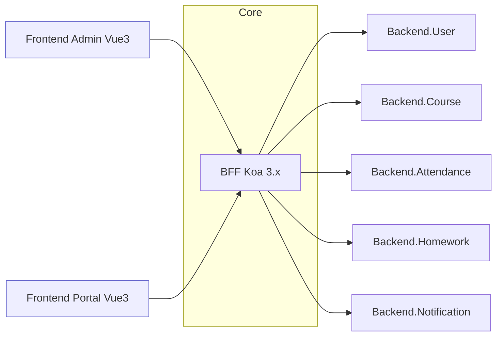
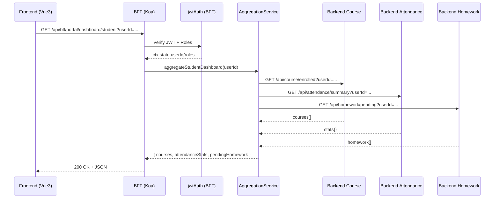
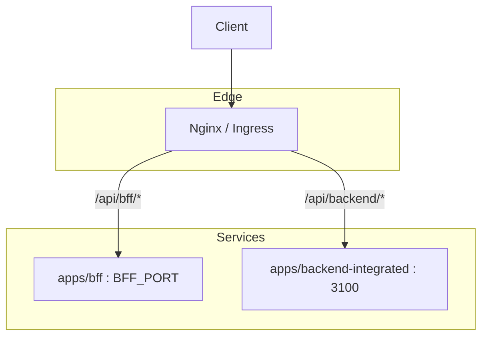

# BFF 架构详细设计文档

## 1. 架构概述

### 1.1 整体设计

- 独立应用：BFF 作为独立应用存在于 monorepo `apps/bff/`，采用 Koa 3 + TypeScript + ESM。
- 路由前缀：统一对外暴露 `/api/bff/*`，并按前端场景分区：
  - 管理端（Admin）：`/api/bff/admin/*`
  - 门户端（Portal）：`/api/bff/portal/*`
- 核心能力模块：
  - BFF 内部中间件：error、cors、logger、rateLimit、jwtAuth、trace（`apps/bff/src/middleware/*`）
  - BFF 内部校验适配：基于 Zod 的 query/body/params/response 校验（`apps/bff/src/validation/*`、`apps/bff/src/schemas/*`）
  - `@csisp/upstream`：统一上游 HTTP 客户端封装
  - `@csisp/types`：公共 DTO/实体/响应类型
- 数据编排：在服务层执行跨后端聚合与转换，输出统一响应模型。

代码索引：

- 入口与装配：`apps/bff/app.ts:1-16`
- 路由挂载：`apps/bff/src/router/index.ts:1-6`
- 中间件薄封装：`apps/bff/src/middleware/index.ts:1-9`

### 1.2 架构定位与边界

- 定位：为 Web 前端（Admin/Portal）提供统一聚合接口，前置鉴权、限流与数据转换；后端聚焦领域业务与数据存取。
- 边界：
  - 对外：REST JSON 聚合接口、稳定响应结构、消除后端领域差异。
  - 对内：作为上游调用方，遵守后端接口合约与类型，不直接耦合 ORM 与数据库。

### 1.3 架构示意图

---

## 2. 数据链路设计

### 2.1 数据流转

- 流向：Frontend → BFF → Backend（多领域服务）
- 协议：REST（JSON）；BFF 前置校验与鉴权，服务层编排并发上游请求，统一输出。
- 鉴权：`jwtAuth` 中间件解析 Bearer Token，写入 `ctx.state.userId/roles`。

### 2.2 请求时序（学生仪表盘聚合）

代码索引：

- 路由入口：`apps/bff/src/router/portal.ts:1-9`
- 控制器：`apps/bff/src/controllers/portal/dashboard.controller.ts`
- 管理端仪表盘聚合服务示例：`apps/bff/src/services/admin/dashboard.service.ts`
- 上游客户端工厂：`apps/bff/src/infra/bff.client.ts`

### 2.3 数据协议与格式

- 输入校验：BFF 内部 validation 模块在路由入口执行校验，并写入 `ctx.state.query/body/params`
  - 查询参数：`apps/bff/src/validation/query.ts`
  - 请求体：`apps/bff/src/validation/body.ts`
  - 路径参数：`apps/bff/src/validation/params.ts`
  - 查询 schema 示例：`apps/bff/src/schemas/dashboard.schema.ts`
- 输出契约：统一响应结构 `{ code, message, data }`；字段命名在服务层统一 `snake_case ↔ camelCase`（`apps/bff/src/utils/case.ts:1-14`）。

---

## 3. BFF 层功能详解

### 3.1 路由与分区

- 路由挂载：`apps/bff/src/router/index.ts:1-6`
- 管理端：`apps/bff/src/router/admin.ts:1-5` → 控制器 `apps/bff/src/controllers/admin/dashboard.controller.ts:1-6`
- 门户端：`apps/bff/src/router/portal.ts:1-9` → 控制器 `apps/bff/src/controllers/portal/dashboard.controller.ts:1-8`

### 3.2 中间件栈

- 装配顺序（`apps/bff/app.ts:7-22`）：
  - `errorMiddleware()`：统一错误包装（开发环境可含 `stack`），并通过 `@infra/logger` 输出错误日志
  - `corsMiddleware()`：跨域设置（来源/方法/头）
  - `loggerMiddleware()`：结构化访问日志（`method/path/status/duration/ip/traceId`，依赖 `@csisp/logger`）
  - `traceMiddleware()`：注入与透传 `X-Trace-Id` 链路追踪 ID（写入 `ctx.state.traceId` 并回写响应头）
  - `koa-bodyparser`
  - `jwtAuthMiddleware()`：鉴权与角色上下文绑定
  - `rateLimitMiddleware()`：滑窗限流（响应限流头）
  - `router.routes()/allowedMethods()`
  - `legacyProxy()`：在 BFF 未显式处理的 `/api/*` 请求上兜底转发到 backend-integrated
- 薄封装绑定：`apps/bff/src/middleware/index.ts`
- 中间件实现：
  - 错误处理：`apps/bff/src/middleware/error.ts`
  - 跨域：`apps/bff/src/middleware/cors.ts`
  - 日志：`apps/bff/src/middleware/logger.ts`
  - JWT 鉴权：`apps/bff/src/middleware/jwtAuth.ts`
  - 角色/管理员校验：`apps/bff/src/middleware/roles.ts`
  - 限流：`apps/bff/src/middleware/rateLimit.ts`
  - 链路追踪：`apps/bff/src/middleware/trace.ts`
  - 后端兜底代理：`apps/bff/src/middleware/legacyProxy.ts`

### 3.3 数据聚合、协议转换与日志

- 聚合服务：`apps/bff/src/services/common/aggregation.service.ts:1-15`（并发 `course/attendance/homework`）
- 客户端封装：`packages/upstream/src/http/client.ts:1-19`
  - `createHttpClient({ baseURL, headers, logger? })`
  - `get/post/put/del().json()`
  - 非 2xx 错误统一包装（`Upstream Error`）
  - 若传入 `logger`，则通过 pino 输出结构化上游调用日志（`context: 'upstream', method, url, status, duration, traceId`）
- 字段映射：`apps/bff/src/utils/case.ts:1-14`

### 3.4 运行时校验与类型契约

- 校验适配：`apps/bff/src/validation/query.ts`/`body.ts`/`params.ts` 将校验结果写入 `ctx.state.query/body/params`
- DTO 与类型：
  - 公共类型：`@csisp/types`（`packages/types/src/*`）
  - BFF 聚合类型与 schema：`apps/bff/src/schemas/admin/dashboard.schema.ts`、`apps/bff/src/services/admin/dashboard.service.ts`

---

## 4. 性能与扩展性

### 4.1 性能表现（本地样本）

- 健康检查：`GET /api/bff/health` → P50 ≈ 2–5 ms；P95 ≈ 8–12 ms
- 仪表盘聚合：`GET /api/bff/portal/dashboard/student`（并发 3 上游） → P50 ≈ 90–130 ms；P95 ≈ 160–220 ms
- 影响因素：上游服务响应耗时与网络条件为主；BFF 内部处理基本在 10 ms 以内（日志与限流除外）。

### 4.2 扩展机制

- 水平扩展：BFF 无状态，支持多实例与负载均衡。
- 限流与保护：`rateLimit` 滑窗限流（内存），生产建议接入 Redis 计数器。
- 客户端策略：Upstream 客户端支持扩展超时与重试（幂等方法指数退避）。
- 缓存（可选）：对热点聚合接口使用 LRU 或外部缓存降低上游压力。

### 4.3 容错与观测

- 错误包装：统一 `{ code, message }`，避免泄漏后端细节。
- 降级策略：非核心数据（如通知）可返回空集合或缓存数据。
- 观测：
  - BFF 访问日志与错误日志通过 `@csisp/logger` 输出结构化 JSON，字段包括 `service/env/context/traceId/method/path/status/duration` 等；
  - 上游 HTTP 调用通过 `@csisp/upstream` + `createBffHttpClient` 记录 `context: 'upstream'` 的日志，附带 `url/status/duration/traceId`；
  - 前端可从响应头中的 `X-Trace-Id` 获取链路ID，在问题排查时与 BFF/Backend 日志对齐。

---

## 5. 部署架构

### 5.1 环境配置

- `.env`（根目录与 `apps/bff/.env` 叠加）：
  - `BACKEND_INTEGRATED_URL`：指向 backend-integrated 的基础地址（如 `http://localhost:3100`）
  - `BFF_PORT`：BFF 服务监听端口（建议与后端不同端口，如 `4000`）
  - `JWT_SECRET`：JWT 签名密钥
  - `REDIS_ENABLED`/`REDIS_HOST`/`REDIS_PORT`：可选 Redis 连接配置
- 端口策略：对外由网关统一端口，内部 BFF/Backend 使用不同端口以便灰度与限流。

### 5.2 依赖与版本

- 工作区依赖：`apps/bff/package.json:11-22`
- 版本覆盖：根 `package.json:pnpm.overrides` 统一 `koa/@koa/router/koa-bodyparser` 版本，避免跨包漂移。

### 5.3 构建与启动

- 构建：`pnpm --filter @csisp/bff build`
- 开发启动：`pnpm dev:bff`（需安装 `tsx`）或 `node apps/bff/dist/app.js`
- 健康检查：`GET /api/bff/health`

### 5.4 网关代理（示意）

### 5.5 监控与日志

- 收集：结构日志（`method/path/status/duration traceId`），按路径聚合耗时与错误分布。
- 告警：结合网关与实例层的 4xx/5xx 触发阈值；聚合接口设置 P95/P99 SLA。
- trace-id：BFF 在入口生成并通过响应头 `X-Trace-Id` 返回给前端；同时在调用后端时携带该头，后端日志可与 BFF 日志依据该 ID 串联。
- 上游耗时打点：BFF 上游客户端对每个接口记录耗时与状态，示例：`GET /api/attendance/summary 200 86ms traceId=...`。

---

## 6. 迭代建议

- 完善 JWT 中间件：集成 `jsonwebtoken`、角色策略与 `issuer/audience` 校验。
- Upstream 客户端：超时与重试策略可配置，注入 `X-User-Id/X-User-Roles` 等安全头。
- 合约测试：对齐 `@csisp/types` 响应契约，补充 BFF 合约测试与集成测试。
- 文档：在架构文档增加 Nginx 配置示例与部署清单。

---
