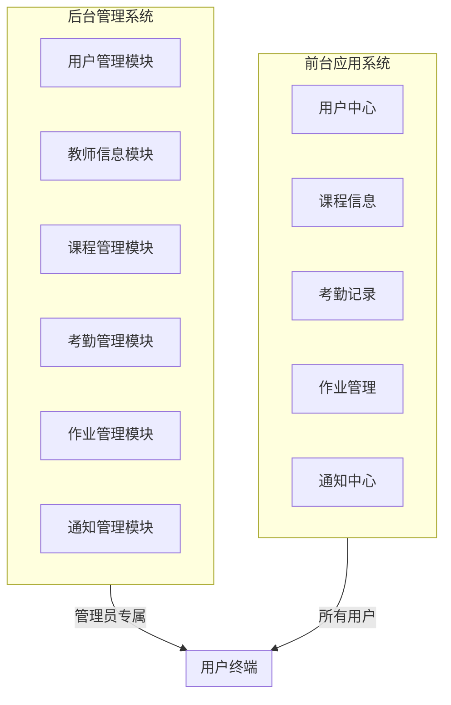
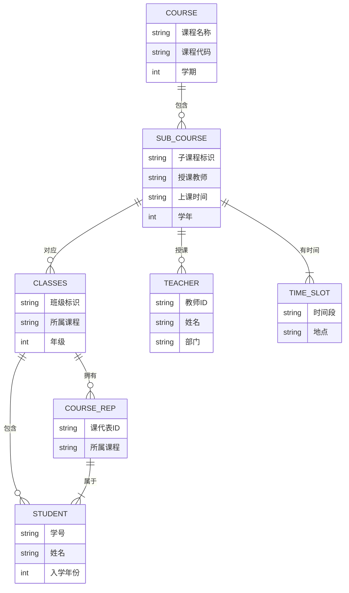
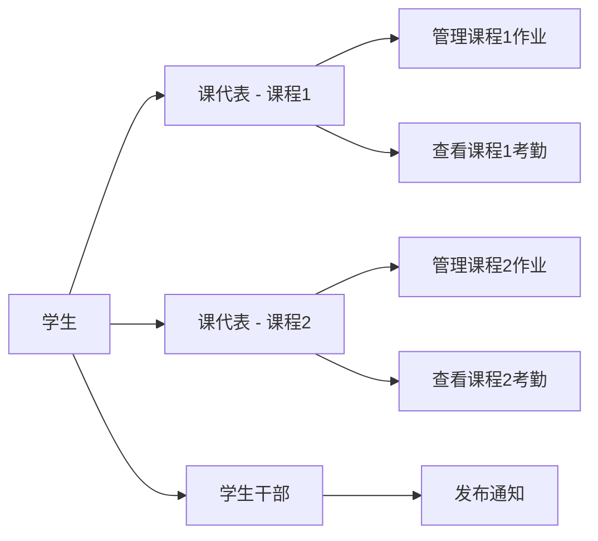
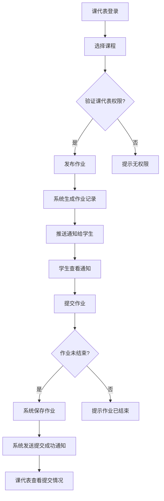
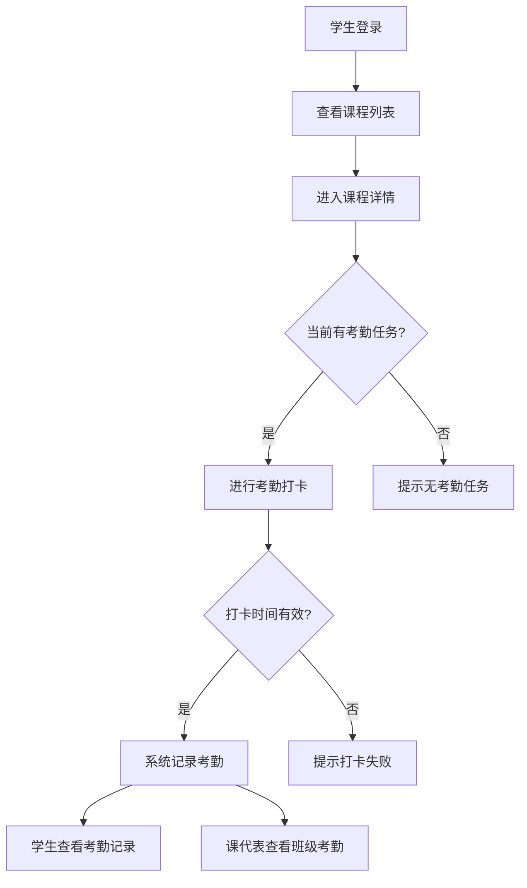
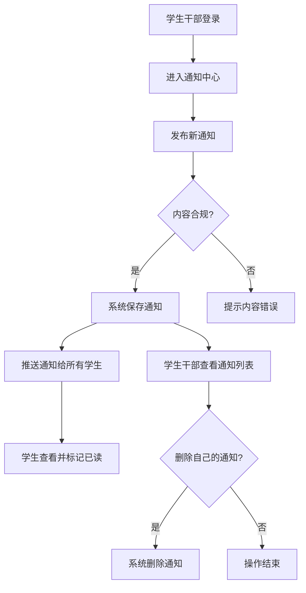
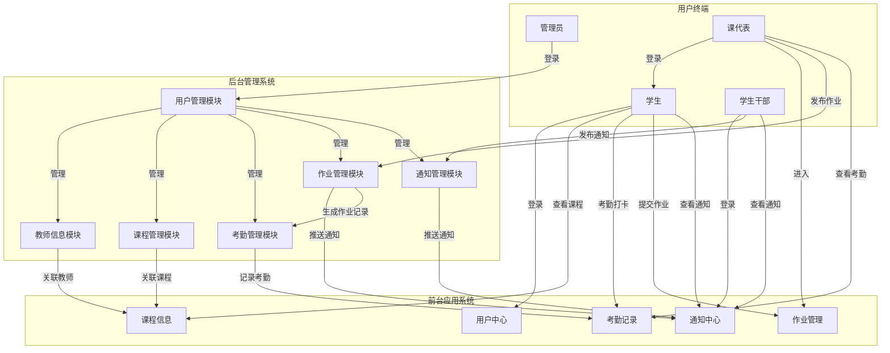

# 计算机学院综合服务平台(CSISP)业务文档

## 1. 项目概述

计算机学院综合服务平台(CSISP)是一个专注于学生考勤管理和作业管理的综合服务系统，旨在为计算机学院的学生、课代表、学生干部、管理员等提供高效的数字化服务。平台自动生成选课信息，支持灵活的权限控制和课程-班级关联模型，核心关注考勤情况与作业情况。

## 2. 平台整体业务架构

### 2.1 核心功能模块

1. **用户管理模块**：用户登录、信息管理、角色分配
2. **教师信息模块**：教师信息管理（授课、上课时间等）
3. **课程管理模块**：课程信息管理、多教师/多时间段支持
4. **考勤管理模块**：学生考勤记录、考勤情况统计
5. **作业管理模块**：作业发布/结束、提交情况统计
6. **通知管理模块**：通知发布/删除、通知阅读状态管理

### 2.2 系统层级结构

## 3. 用户角色与权限体系

### 3.1 角色定义

平台采用RBAC(基于角色的访问控制)模型，定义了以下角色：

| 角色     | 登录权限 | 核心职责                     |
| -------- | -------- | ---------------------------- |
| 管理员   | 仅后台   | 系统全面管理、信息审核与编辑 |
| 学生     | 仅前台   | 考勤打卡、作业提交、信息查看 |
| 课代表   | 仅前台   | 课程作业管理、考勤情况统计   |
| 学生干部 | 仅前台   | 发布/删除通知、信息查看      |

### 3.2 详细权限分配

#### 3.2.1 管理员

- **权限范围**：系统所有功能的完全控制权
- **可执行操作**：
  - 查看/编辑所有学生信息
  - 查看/编辑所有课程信息
  - 查看/编辑所有教师信息
  - 查看/编辑所有考勤记录
  - 查看/编辑所有作业信息
  - 查看/编辑所有通知
  - 分配课代表角色

#### 3.2.2 学生

- **权限范围**：个人相关信息与操作
- **可执行操作**：
  - 查看个人基本信息
  - 查看已选课程列表
  - 上课考勤打卡
  - 查看个人考勤记录
  - 查看并已读通知
  - 提交作业
  - 查看个人作业提交情况

#### 3.2.3 课代表

- **权限范围**：所属课程的作业与考勤管理
- **可执行操作**：
  - 继承学生所有权限
  - 发布课程作业
  - 结束课程作业
  - 查看课程内所有学生作业提交情况
  - 查看课程内所有学生考勤情况

#### 3.2.4 学生干部

- **权限范围**：通知管理与个人信息操作
- **可执行操作**：
  - 继承学生所有权限
  - 发布通知
  - 删除自己发布的通知

## 4. 核心业务概念说明

### 4.1 课程-班级模型

平台采用"课程即班级"的模型，无固定行政班级概念，同时支持学期和年级管理：

### 4.3 学期与年级管理

#### 4.3.1 学期定义

- **学期字段**：标识课程所属的学期（1-8，对应大学四年八个学期）
- **学期时间安排**：
  - 第一学期：9月1日 - 次年1月31日
  - 第二学期：2月1日 - 8月31日

#### 4.3.2 年级标识

- **入学年份**：使用2023、2024、2025等数字标识学生入学年份
- **在读时段**：每个年级对应四年的学习周期
  - 2023级：2023.9.1 - 2027.7.1
  - 2024级：2024.9.1 - 2028.7.1
  - 2025级：2025.9.1 - 2029.7.1

#### 4.3.3 学年判断逻辑

- **当前学期计算**：根据当前日期自动判断学生所在学期
- **学期对应关系**：
  - 大一上学期：第1学期（9月-1月）
  - 大一下学期：第2学期（2月-8月）
  - 大二上学期：第3学期（9月-1月）
  - 大二下学期：第4学期（2月-8月）
  - 大三上学期：第5学期（9月-1月）
  - 大三下学期：第6学期（2月-8月）
  - 大四上学期：第7学期（9月-1月）
  - 大四下学期：第8学期（2月-8月）

#### 4.3.4 业务应用场景

- **课程安排**：根据学期筛选对应课程
- **学生管理**：按年级分组管理学生
- **考勤统计**：按学期统计学生考勤情况
- **作业管理**：按学期组织作业发布和提交

### 4.2 多角色学生模型

一个学生可以同时拥有学生、课代表、学生干部等多种角色：

## 5. 核心业务场景

### 5.1 学生核心业务

- 上课考勤打卡
- 查看个人考勤记录
- 提交作业
- 查看个人作业提交情况
- 查看并已读通知
- 查看已选课程列表

### 5.2 课代表核心业务

- 发布课程作业
- 结束课程作业
- 查看班级作业提交情况
- 查看班级考勤情况

### 5.3 学生干部核心业务

- 发布通知
- 删除自己发布的通知

### 5.4 管理员核心业务

- 查看/编辑所有学生信息
- 查看/编辑所有课程信息
- 查看/编辑所有教师信息
- 查看/编辑所有考勤记录
- 查看/编辑所有作业信息
- 查看/编辑所有通知
- 分配课代表角色

## 6. 关键业务流程说明

> 下述流程在实现上均通过 `traceId` 与统一结构化日志进行打点，便于跨前端/BFF/后端的链路追踪与排错。

### 6.1 作业发布与提交流程

### 6.2 考勤管理流程

### 6.3 通知发布流程

## 7. 完整业务线流程图

## 8. 业务规则与约束

### 8.1 课程与班级规则

- 每门课程自动生成一个或多个班级（基于教师/时间段）
- 班级与课程一一对应，无固定行政班级

### 8.2 课代表规则

- 课代表必须源自对应课程的学生
- 一个学生可担任多门课程的课代表
- 课代表权限仅针对其所属课程

### 8.3 作业规则

- 作业必须绑定到具体课程
- 作业有明确的开始和结束时间
- 作业结束后学生无法再提交

### 8.4 考勤规则

- 考勤必须绑定到具体课程的具体时间段
- 考勤打卡有时间范围限制

### 8.5 通知规则

- 学生干部只能删除自己发布的通知
- 通知阅读状态自动记录

## 9. 异常处理与权限冲突解决方案

### 9.1 权限异常

- **场景**：用户尝试执行超出其权限的操作
- **处理方式**：系统提示"您没有权限执行此操作"
- **解决方案**：联系管理员确认权限或申请权限调整

### 9.2 数据有效性异常

- **场景**：用户在无效时间内提交作业或考勤
- **处理方式**：系统提示"操作时间已过期"
- **解决方案**：用户需在规定时间内重新操作

### 9.3 资源冲突异常

- **场景**：多个课代表同时修改同一课程的作业
- **处理方式**：系统采用乐观锁机制，仅允许第一个操作成功
- **解决方案**：用户稍候重试

### 9.4 角色冲突处理

- **场景**：同一学生担任多门课程的课代表
- **处理方式**：系统自动区分不同课程的权限
- **解决方案**：用户在操作前需明确选择所属课程

## 10. 文档使用说明

### 10.1 业务培训

- 新用户可通过文档了解平台基本功能
- 管理员可通过权限管理章节学习权限配置
- 课代表可通过作业/考勤章节学习管理流程

### 10.2 日常运营

- 系统管理员可参考异常处理章节解决常见问题
- 业务人员可通过流程说明章节优化业务操作

### 10.3 系统维护

- 技术团队可通过业务规则章节理解系统逻辑

# 附录

## A. 术语表

- **CSISP**: Computer Science Integrated Service Platform (计算机学院综合服务平台)
- **RBAC**: Role-Based Access Control (基于角色的访问控制)

## B. 联系信息

- 系统管理员: admin@cs.edu.cn
- 技术支持: techsupport@cs.edu.cn
- 业务咨询: business@cs.edu.cn

---

**文档版本**: 2.1
**发布日期**: 2025-04-12
**更新日期**: 2025-04-12
