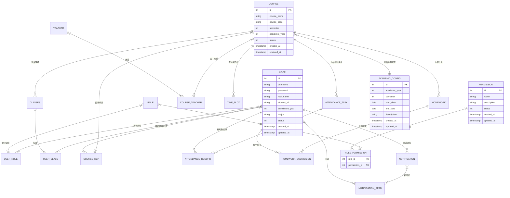

# 计算机学院综合服务平台(CSISP)数据库设计文档

## 1. 文档概述

### 1.1 文档目的

本文档基于CSISP业务需求、总体架构和技术架构文档，设计了一套完整的数据库解决方案。该方案采用PostgreSQL作为数据库，Sequelize作为ORM框架，严格遵循业务流程和技术规范，确保系统的高可用性、可扩展性和安全性。

### 1.2 技术选型

| 技术/工具     | 版本 | 用途                          |
| ------------- | ---- | ----------------------------- |
| PostgreSQL    | 15   | 关系型数据库                  |
| Sequelize     | 6.x  | ORM框架（Node.js/TypeScript） |
| Sequelize CLI | 6.x  | 数据库建模与代码生成工具      |

---

## 2. 数据库设计原则

1. **业务驱动**：严格遵循业务文档中的业务流程和数据模型
2. **规范化设计**：符合第三范式(3NF)，减少数据冗余
3. **安全性**：实现角色权限控制、数据加密存储
4. **性能优化**：合理设计索引，优化查询性能
5. **可扩展性**：支持业务规模增长和功能扩展
6. **并发支持**：利用PostgreSQL的MVCC特性支持多用户并发访问

---

## 3. 实体-关系图(ERD)



---

## 4. 数据表设计

### 4.1 核心数据表SQL定义

```sql
-- 创建用户表
CREATE TABLE IF NOT EXISTS "user" (
    "id" SERIAL PRIMARY KEY,
    "username" VARCHAR(255) UNIQUE NOT NULL,
    "password" VARCHAR(255) NOT NULL,
    "student_id" VARCHAR(11) UNIQUE NOT NULL,
    "enrollment_year" INT NOT NULL CHECK ("enrollment_year" BETWEEN 2000 AND 3000),
    "major" VARCHAR(100) NOT NULL,
    "status" INT DEFAULT 1,
    "created_at" TIMESTAMP WITH TIME ZONE DEFAULT CURRENT_TIMESTAMP,
    "updated_at" TIMESTAMP WITH TIME ZONE DEFAULT CURRENT_TIMESTAMP
);

-- 创建角色表
CREATE TABLE IF NOT EXISTS "role" (
    "id" SERIAL PRIMARY KEY,
    "name" VARCHAR(50) UNIQUE NOT NULL,
    "description" TEXT,
    "created_at" TIMESTAMP WITH TIME ZONE DEFAULT CURRENT_TIMESTAMP,
    "updated_at" TIMESTAMP WITH TIME ZONE DEFAULT CURRENT_TIMESTAMP
);

-- 创建用户角色关联表(N-M)
CREATE TABLE IF NOT EXISTS "user_role" (
    "user_id" INT NOT NULL REFERENCES "user"("id") ON DELETE CASCADE,
    "role_id" INT NOT NULL REFERENCES "role"("id") ON DELETE CASCADE,
    PRIMARY KEY ("user_id", "role_id")
);

-- 创建课程表
CREATE TABLE IF NOT EXISTS "course" (
    "id" SERIAL PRIMARY KEY,
    "course_name" VARCHAR(255) NOT NULL,
    "course_code" VARCHAR(50) NOT NULL, -- 课程代码
    "semester" INT NOT NULL CHECK ("semester" BETWEEN 1 AND 8), -- 学期标识(1-8)
    "academic_year" INT NOT NULL, -- 学年(如2023)
    "available_majors" JSON NOT NULL, -- 可选择的专业列表
    "status" INT DEFAULT 1,
    "created_at" TIMESTAMP WITH TIME ZONE DEFAULT CURRENT_TIMESTAMP,
    "updated_at" TIMESTAMP WITH TIME ZONE DEFAULT CURRENT_TIMESTAMP
);

-- 为课程表添加唯一约束：同一课程代码在同一学年同一学期只能开设一次
ALTER TABLE "course" ADD CONSTRAINT "course_code_semester_year_unique" UNIQUE ("course_code", "semester", "academic_year");

-- 创建教师表
CREATE TABLE IF NOT EXISTS "teacher" (
    "id" SERIAL PRIMARY KEY,
    "real_name" VARCHAR(255) NOT NULL,
    "email" VARCHAR(255) UNIQUE NOT NULL,
    "department" VARCHAR(255) NOT NULL,
    "status" INT DEFAULT 1,
    "created_at" TIMESTAMP WITH TIME ZONE DEFAULT CURRENT_TIMESTAMP,
    "updated_at" TIMESTAMP WITH TIME ZONE DEFAULT CURRENT_TIMESTAMP
);

-- 创建课程教师关联表(N-M)
CREATE TABLE IF NOT EXISTS "course_teacher" (
    "course_id" INT NOT NULL REFERENCES "course"("id") ON DELETE CASCADE,
    "teacher_id" INT NOT NULL REFERENCES "teacher"("id") ON DELETE CASCADE,
    PRIMARY KEY ("course_id", "teacher_id")
);

-- 创建班级表
CREATE TABLE IF NOT EXISTS "class" (
    "id" SERIAL PRIMARY KEY,
    "course_id" INT NOT NULL REFERENCES "course"("id") ON DELETE CASCADE,
    "class_name" VARCHAR(255) NOT NULL,
    "status" INT DEFAULT 1,
    "created_at" TIMESTAMP WITH TIME ZONE DEFAULT CURRENT_TIMESTAMP,
    "updated_at" TIMESTAMP WITH TIME ZONE DEFAULT CURRENT_TIMESTAMP,
    UNIQUE ("course_id", "class_name")
);

-- 创建用户班级关联表(N-M)
CREATE TABLE IF NOT EXISTS "user_class" (
    "user_id" INT NOT NULL REFERENCES "user"("id") ON DELETE CASCADE,
    "class_id" INT NOT NULL REFERENCES "class"("id") ON DELETE CASCADE,
    PRIMARY KEY ("user_id", "class_id")
);

-- 创建课代表表
CREATE TABLE IF NOT EXISTS "course_rep" (
    "user_id" INT NOT NULL REFERENCES "user"("id") ON DELETE CASCADE,
    "course_id" INT NOT NULL REFERENCES "course"("id") ON DELETE CASCADE,
    PRIMARY KEY ("user_id", "course_id")
);

-- 创建时间槽表
CREATE TABLE IF NOT EXISTS "time_slot" (
    "id" SERIAL PRIMARY KEY,
    "course_id" INT NOT NULL REFERENCES "course"("id") ON DELETE CASCADE,
    "week_day" INT NOT NULL CHECK ("week_day" BETWEEN 1 AND 7),
    "start_time" TIME NOT NULL,
    "end_time" TIME NOT NULL CHECK ("end_time" > "start_time"),
    "location" VARCHAR(255),
    "created_at" TIMESTAMP WITH TIME ZONE DEFAULT CURRENT_TIMESTAMP,
    "updated_at" TIMESTAMP WITH TIME ZONE DEFAULT CURRENT_TIMESTAMP
);

-- 创建考勤任务表
CREATE TABLE IF NOT EXISTS "attendance_task" (
    "id" SERIAL PRIMARY KEY,
    "course_id" INT NOT NULL REFERENCES "course"("id") ON DELETE CASCADE,
    "start_time" TIMESTAMP WITH TIME ZONE NOT NULL,
    "end_time" TIMESTAMP WITH TIME ZONE NOT NULL CHECK ("end_time" > "start_time"),
    "status" INT DEFAULT 1,
    "created_at" TIMESTAMP WITH TIME ZONE DEFAULT CURRENT_TIMESTAMP,
    "updated_at" TIMESTAMP WITH TIME ZONE DEFAULT CURRENT_TIMESTAMP
);

-- 创建考勤记录表
CREATE TABLE IF NOT EXISTS "attendance_record" (
    "id" SERIAL PRIMARY KEY,
    "task_id" INT NOT NULL REFERENCES "attendance_task"("id") ON DELETE CASCADE,
    "user_id" INT NOT NULL REFERENCES "user"("id") ON DELETE CASCADE,
    "checkin_time" TIMESTAMP WITH TIME ZONE NOT NULL,
    "status" VARCHAR(50) NOT NULL DEFAULT 'present',
    "ip_address" VARCHAR(50),
    "device_info" TEXT,
    "created_at" TIMESTAMP WITH TIME ZONE DEFAULT CURRENT_TIMESTAMP,
    "updated_at" TIMESTAMP WITH TIME ZONE DEFAULT CURRENT_TIMESTAMP,
    UNIQUE ("task_id", "user_id")
);

-- 创建学年学期配置表（用于存储学期时间配置）
CREATE TABLE IF NOT EXISTS "academic_config" (
    "id" SERIAL PRIMARY KEY,
    "academic_year" INT NOT NULL, -- 学年
    "semester" INT NOT NULL CHECK ("semester" BETWEEN 1 AND 2), -- 学期(1-2)
    "start_date" DATE NOT NULL, -- 学期开始日期
    "end_date" DATE NOT NULL CHECK ("end_date" > "start_date"), -- 学期结束日期
    "description" VARCHAR(255), -- 学期描述
    "created_at" TIMESTAMP WITH TIME ZONE DEFAULT CURRENT_TIMESTAMP,
    "updated_at" TIMESTAMP WITH TIME ZONE DEFAULT CURRENT_TIMESTAMP,
    UNIQUE ("academic_year", "semester")
);

-- 插入默认的学期配置数据
INSERT INTO "academic_config" ("academic_year", "semester", "start_date", "end_date", "description") VALUES
(2023, 1, '2023-09-01', '2024-01-31', '2023-2024学年第一学期'),
(2023, 2, '2024-02-01', '2024-08-31', '2023-2024学年第二学期'),
(2024, 1, '2024-09-01', '2025-01-31', '2024-2025学年第一学期'),
(2024, 2, '2025-02-01', '2025-08-31', '2024-2025学年第二学期'),
(2025, 1, '2025-09-01', '2026-01-31', '2025-2026学年第一学期'),
(2025, 2, '2026-02-01', '2026-08-31', '2025-2026学年第二学期');

-- 创建作业表
CREATE TABLE IF NOT EXISTS "homework" (
    "id" SERIAL PRIMARY KEY,
    "course_id" INT NOT NULL REFERENCES "course"("id") ON DELETE CASCADE,
    "title" VARCHAR(255) NOT NULL,
    "content" TEXT NOT NULL,
    "deadline" TIMESTAMP WITH TIME ZONE NOT NULL,
    "status" INT DEFAULT 1,
    "created_at" TIMESTAMP WITH TIME ZONE DEFAULT CURRENT_TIMESTAMP,
    "updated_at" TIMESTAMP WITH TIME ZONE DEFAULT CURRENT_TIMESTAMP
);

-- 创建作业提交表
CREATE TABLE IF NOT EXISTS "homework_submission" (
    "id" SERIAL PRIMARY KEY,
    "homework_id" INT NOT NULL REFERENCES "homework"("id") ON DELETE CASCADE,
    "user_id" INT NOT NULL REFERENCES "user"("id") ON DELETE CASCADE,
    "file_path" VARCHAR(255) NOT NULL,
    "submit_time" TIMESTAMP WITH TIME ZONE NOT NULL,
    "status" VARCHAR(50) NOT NULL DEFAULT 'submitted', -- submitted, late, not_submitted
    "created_at" TIMESTAMP WITH TIME ZONE DEFAULT CURRENT_TIMESTAMP,
    "updated_at" TIMESTAMP WITH TIME ZONE DEFAULT CURRENT_TIMESTAMP,
    UNIQUE ("homework_id", "user_id")
);

-- 创建通知表
CREATE TABLE IF NOT EXISTS "notification" (
    "id" SERIAL PRIMARY KEY,
    "sender_id" INT NOT NULL REFERENCES "user"("id") ON DELETE CASCADE,
    "title" VARCHAR(255) NOT NULL,
    "content" TEXT NOT NULL,
    "read_count" INT DEFAULT 0,
    "status" INT DEFAULT 1,
    "created_at" TIMESTAMP WITH TIME ZONE DEFAULT CURRENT_TIMESTAMP,
    "updated_at" TIMESTAMP WITH TIME ZONE DEFAULT CURRENT_TIMESTAMP
);

-- 创建通知阅读关联表(N-M)
CREATE TABLE IF NOT EXISTS "notification_read" (
    "notification_id" INT NOT NULL REFERENCES "notification"("id") ON DELETE CASCADE,
    "user_id" INT NOT NULL REFERENCES "user"("id") ON DELETE CASCADE,
    "read_time" TIMESTAMP WITH TIME ZONE NOT NULL DEFAULT CURRENT_TIMESTAMP,
    PRIMARY KEY ("notification_id", "user_id")
);

-- 创建权限表
CREATE TABLE IF NOT EXISTS "permission" (
    "id" SERIAL PRIMARY KEY,
    "name" VARCHAR(50) UNIQUE NOT NULL,
    "description" TEXT,
    "status" INT DEFAULT 1,
    "created_at" TIMESTAMP WITH TIME ZONE DEFAULT CURRENT_TIMESTAMP,
    "updated_at" TIMESTAMP WITH TIME ZONE DEFAULT CURRENT_TIMESTAMP
);

-- 创建角色权限关联表(N-M)
CREATE TABLE IF NOT EXISTS "role_permission" (
    "role_id" INT NOT NULL REFERENCES "role"("id") ON DELETE CASCADE,
    "permission_id" INT NOT NULL REFERENCES "permission"("id") ON DELETE CASCADE,
    PRIMARY KEY ("role_id", "permission_id")
);

-- 创建学年判断函数
CREATE OR REPLACE FUNCTION get_current_semester_for_student(student_id INT)
RETURNS TABLE(
    student_id INT,
    enrollment_year INT,
    current_semester INT,
    academic_year INT,
    semester_start DATE,
    semester_end DATE
) AS $$
DECLARE
    student_enrollment_year INT;
    current_date_val DATE := CURRENT_DATE;
    current_academic_year INT;
    current_semester_val INT;
    semester_start_date DATE;
    semester_end_date DATE;
BEGIN
    -- 获取学生入学年份
    SELECT enrollment_year INTO student_enrollment_year
    FROM "user" WHERE id = student_id;

    -- 计算当前学年和学期
    IF EXTRACT(MONTH FROM current_date_val) BETWEEN 9 AND 12 THEN
        current_academic_year := EXTRACT(YEAR FROM current_date_val);
        current_semester_val := 1;
    ELSIF EXTRACT(MONTH FROM current_date_val) BETWEEN 1 AND 8 THEN
        current_academic_year := EXTRACT(YEAR FROM current_date_val) - 1;
        current_semester_val := 2;
    ELSE
        current_academic_year := EXTRACT(YEAR FROM current_date_val);
        current_semester_val := 1;
    END IF;

    -- 获取学期时间配置
    SELECT start_date, end_date INTO semester_start_date, semester_end_date
    FROM academic_config
    WHERE academic_year = current_academic_year AND semester = current_semester_val;

    -- 计算学生当前学期（基于入学年份）
    current_semester_val := (current_academic_year - student_enrollment_year) * 2 + current_semester_val;

    -- 确保学期在有效范围内(1-8)
    IF current_semester_val < 1 THEN
        current_semester_val := 1;
    ELSIF current_semester_val > 8 THEN
        current_semester_val := 8;
    END IF;

    RETURN QUERY SELECT
        student_id,
        student_enrollment_year,
        current_semester_val,
        current_academic_year,
        semester_start_date,
        semester_end_date;
END;
$$ LANGUAGE plpgsql;

-- 创建获取学生课程列表的函数（按学期筛选）
CREATE OR REPLACE FUNCTION get_student_courses_by_semester(student_id INT, target_semester INT)
RETURNS TABLE(
    course_id INT,
    course_name VARCHAR,
    course_code VARCHAR,
    semester INT,
    academic_year INT,
    class_name VARCHAR
) AS $$
BEGIN
    RETURN QUERY
    SELECT
        c.id as course_id,
        c.course_name,
        c.course_code,
        c.semester,
        c.academic_year,
        cl.class_name
    FROM "user" u
    JOIN user_class uc ON u.id = uc.user_id
    JOIN class cl ON uc.class_id = cl.id
    JOIN course c ON cl.course_id = c.id
    WHERE u.id = student_id
    AND c.semester = target_semester
    ORDER BY c.academic_year DESC, c.semester DESC;
END;
$$ LANGUAGE plpgsql;

-- 创建获取当前学期课程的视图
CREATE OR REPLACE VIEW current_semester_courses AS
SELECT
    c.id,
    c.course_name,
    c.course_code,
    c.semester,
    c.academic_year,
    COUNT(DISTINCT uc.user_id) as student_count
FROM course c
JOIN class cl ON c.id = cl.course_id
JOIN user_class uc ON cl.id = uc.class_id
WHERE c.semester IN (
    SELECT DISTINCT semester
    FROM course
    WHERE academic_year = (
        CASE
            WHEN EXTRACT(MONTH FROM CURRENT_DATE) BETWEEN 9 AND 12 THEN EXTRACT(YEAR FROM CURRENT_DATE)
            ELSE EXTRACT(YEAR FROM CURRENT_DATE) - 1
        END
    )
)
GROUP BY c.id, c.course_name, c.course_code, c.semester, c.academic_year;
```

---

## 5. 数据操作示例

### 5.1 基本数据操作(CRUD)

#### 5.1.1 插入数据

```sql
-- 插入角色
INSERT INTO "role" ("name", "description") VALUES ('student', '学生角色');
INSERT INTO "role" ("name", "description") VALUES ('admin', '管理员角色');

-- 插入用户（包含入学年份）
INSERT INTO "user" ("username", "password", "real_name", "student_id", "enrollment_year", "major")
VALUES
('student2023', '$2b$12$...bcrypt_hash...', '张三', '20232131001', 2023, '计算机科学与技术'),
('student2024', '$2b$12$...bcrypt_hash...', '李四', '20242121001', 2024, '计算机科学与技术（师范）'),
('student2025', '$2b$12$...bcrypt_hash...', '王五', '20252132001', 2025, '网络工程');

-- 插入课程（包含学期和学年）
INSERT INTO "course" ("course_name", "course_code", "semester", "academic_year")
VALUES
('数据结构', 'CS201', 3, 2024),  -- 大二上学期
('操作系统', 'CS301', 5, 2024),  -- 大三上学期
('计算机网络', 'CS401', 7, 2024); -- 大四上学期

-- 分配角色
INSERT INTO "user_role" ("user_id", "role_id") VALUES (1, 2);
```

#### 5.1.2 查询数据

```sql
-- 查询所有课程（按学期排序）
SELECT * FROM "course" ORDER BY academic_year DESC, semester DESC;

-- 查询特定课程的所有学生
SELECT u.real_name, u.email, u.enrollment_year
FROM "user" u
JOIN "user_role" ur ON u.id = ur.user_id
JOIN "role" r ON ur.role_id = r.id
JOIN "user_class" uc ON u.id = uc.user_id
JOIN "class" c ON uc.class_id = c.id
WHERE r.name = 'student' AND c.course_id = 1;

-- 使用学年判断函数查询学生当前学期
SELECT * FROM get_current_semester_for_student(1);

-- 查询学生当前学期的课程
SELECT * FROM get_student_courses_by_semester(1, 3); -- 查询学生ID为1的第3学期课程

-- 查询当前学期的所有课程
SELECT * FROM current_semester_courses;

-- 按年级分组统计学生数量
SELECT enrollment_year as 入学年份, COUNT(*) as 学生数量
FROM "user" u
JOIN user_role ur ON u.id = ur.user_id
JOIN role r ON ur.role_id = r.id
WHERE r.name = 'student'
GROUP BY enrollment_year
ORDER BY enrollment_year DESC;

-- 查询各学期的课程数量
SELECT semester as 学期, academic_year as 学年, COUNT(*) as 课程数量
FROM course
GROUP BY semester, academic_year
ORDER BY academic_year DESC, semester DESC;
```

#### 5.1.3 更新数据

```sql
-- 更新用户信息
UPDATE "user" SET "phone" = '13900139000' WHERE "id" = 1;
```

#### 5.1.4 删除数据

```sql
-- 删除作业
DELETE FROM "homework" WHERE "id" = 5;
```

### 5.2 跨数据表操作(JOIN)

```sql
-- 示例：查询课程CS101的考勤情况
SELECT
    c.course_name,
    cl.class_name,
    u.real_name,
    at.start_time,
    ar.checkin_time,
    ar.status
FROM "attendance_task" at
JOIN "course" c ON at.course_id = c.id
JOIN "class" cl ON c.id = cl.course_id
JOIN "user_class" uc ON cl.id = uc.class_id
JOIN "user" u ON uc.user_id = u.id
LEFT JOIN "attendance_record" ar ON at.id = ar.task_id AND u.id = ar.user_id
WHERE c.course_code = 'CS101' AND at.start_time::DATE = CURRENT_DATE;
```

---

## 6. 事务支持

```sql
-- 示例：创建课程并分配教师(原子操作)
BEGIN;

-- 插入新课程
INSERT INTO "course" ("course_name", "course_code") VALUES ('数据结构', 'CS201') RETURNING "id" INTO course_id;

-- 分配教师
INSERT INTO "course_teacher" ("course_id", "teacher_id") VALUES (course_id, 1);

-- 提交事务
COMMIT;

-- 若失败则回滚
-- ROLLBACK;
```

---

## 7. 索引设计

```sql
-- 课程表：按课程代码查询
CREATE INDEX idx_course_course_code ON "course"("course_code");

-- 班级表：按课程ID查询
CREATE INDEX idx_class_course_id ON "class"("course_id");

-- 考勤任务表：按课程ID和时间查询
CREATE INDEX idx_attendance_task_course_id ON "attendance_task"("course_id");
CREATE INDEX idx_attendance_task_time ON "attendance_task"("start_time", "end_time");

-- 考勤记录表：按任务ID和用户ID查询
CREATE INDEX idx_attendance_record_task_id ON "attendance_record"("task_id");
CREATE INDEX idx_attendance_record_user_id ON "attendance_record"("user_id");

-- 作业表：按截止日期查询
CREATE INDEX idx_homework_deadline ON "homework"("deadline");

-- 作业提交表：按作业ID和用户ID查询
CREATE INDEX idx_homework_submission_homework_id ON "homework_submission"("homework_id");
CREATE INDEX idx_homework_submission_user_id ON "homework_submission"("user_id");
```

---

## 8. 多用户并发与性能

### 8.1 并发控制

PostgreSQL采用**MVCC(Multi-Version Concurrency Control)** 实现并发控制，允许：

- 多个用户同时读取数据
- 写入操作不会阻塞读取操作
- 读取操作不会阻塞写入操作

### 8.2 连接池配置(Sequelize)

```typescript
// config/database.ts
import { Sequelize } from 'sequelize';

export const sequelize = new Sequelize(
  process.env.DB_NAME || 'csisp',
  process.env.DB_USER || 'postgres',
  process.env.DB_PASSWORD || 'password',
  {
    host: process.env.DB_HOST || 'localhost',
    port: parseInt(process.env.DB_PORT || '5432'),
    dialect: 'postgres',
    pool: {
      max: 20, // 最大连接数
      min: 0, // 最小连接数
      acquire: 30000, // 连接超时时间(ms)
      idle: 10000, // 连接闲置时间(ms)
    },
  }
);
```

### 8.3 性能监控

- 使用PostgreSQL的`pg_stat_statements`插件监控查询性能
- 定期分析查询计划并优化慢查询
- 监控连接池使用情况

---

## 9. ORM建模与代码生成

### 9.1 Sequelize CLI初始化

```bash
# 初始化项目结构
npx sequelize-cli init
```

### 9.2 生成模型

```bash
# 生成User模型
npx sequelize-cli model:generate --name User --attributes username:string,password:string,real_name:string,email:string,phone:string,status:integer

# 生成Course模型
npx sequelize-cli model:generate --name Course --attributes course_name:string,course_code:string,status:integer
```

### 9.3 生成迁移脚本

```bash
npx sequelize-cli db:migrate
```

### 9.4 Sequelize模型示例(TypeScript)

```typescript
// models/user.ts
import { DataTypes, Model, Optional } from 'sequelize';
import { sequelize } from '../config/database';
import { Role } from './role';
import { Class } from './class';
import { AttendanceRecord } from './attendance-record';
import { HomeworkSubmission } from './homework-submission';

interface UserAttributes {
  id: number;
  username: string;
  password: string;
  real_name: string;
  email: string;
  phone: string;
  status?: number;
  createdAt?: Date;
  updatedAt?: Date;
}

interface UserCreationAttributes
  extends Optional<UserAttributes, 'id' | 'status' | 'createdAt' | 'updatedAt'> {}

export class User extends Model<UserAttributes, UserCreationAttributes> implements UserAttributes {
  public id!: number;
  public username!: string;
  public password!: string;
  public real_name!: string;
  public email!: string;
  public phone!: string;
  public status!: number;

  public readonly createdAt!: Date;
  public readonly updatedAt!: Date;

  // 关联定义
  public static associate(models: any) {
    User.belongsToMany(models.Role, { through: 'user_role' });
    User.belongsToMany(models.Class, { through: 'user_class' });
    User.hasMany(models.AttendanceRecord);
    User.hasMany(models.HomeworkSubmission);
    User.hasMany(models.Notification, { as: 'Sender' });
    User.belongsToMany(models.Notification, { through: 'notification_read' });
    User.belongsToMany(models.Course, { through: 'course_rep' });
  }
}

User.init(
  {
    id: {
      type: DataTypes.INTEGER,
      autoIncrement: true,
      primaryKey: true,
    },
    username: {
      type: DataTypes.STRING,
      allowNull: false,
      unique: true,
    },
    password: {
      type: DataTypes.STRING,
      allowNull: false,
    },
    real_name: {
      type: DataTypes.STRING,
      allowNull: false,
    },
    email: {
      type: DataTypes.STRING,
      allowNull: false,
      unique: true,
    },
    phone: {
      type: DataTypes.STRING,
      allowNull: false,
      unique: true,
    },
    status: {
      type: DataTypes.INTEGER,
      defaultValue: 1,
    },
  },
  {
    sequelize,
    tableName: 'user',
    timestamps: true,
    createdAt: 'created_at',
    updatedAt: 'updated_at',
  }
);
```

## 10. 数据库操作实现详解

### 10.1 基本功能实现

#### 10.1.1 使用Sequelize ORM进行数据库操作

```typescript
// 1) 创建数据表 - 使用Sequelize模型定义
import { DataTypes, Model, Optional } from 'sequelize';
import { sequelize } from '../config/database';

// 用户模型定义
class User extends Model {
  public id!: number;
  public username!: string;
  public password!: string;
  public real_name!: string;
  public email!: string;
  public phone!: string;
  public status!: number;
}

User.init(
  {
    id: { type: DataTypes.INTEGER, autoIncrement: true, primaryKey: true },
    username: { type: DataTypes.STRING, allowNull: false, unique: true },
    password: { type: DataTypes.STRING, allowNull: false },
    real_name: { type: DataTypes.STRING, allowNull: false },
    email: { type: DataTypes.STRING, allowNull: false, unique: true },
    phone: { type: DataTypes.STRING, allowNull: false, unique: true },
    status: { type: DataTypes.INTEGER, defaultValue: 1 },
  },
  {
    sequelize,
    tableName: 'user',
    timestamps: true,
    createdAt: 'created_at',
    updatedAt: 'updated_at',
  }
);

// 2) 插入数据
const createUser = async (userData: CreateUserDto): Promise<User> => {
  return await User.create({
    username: userData.username,
    password: await bcrypt.hash(userData.password, 12),
    real_name: userData.realName,
    email: userData.email,
    phone: userData.phone,
  });
};

// 3) 查询数据
const getUserById = async (id: number): Promise<User | null> => {
  return await User.findByPk(id);
};

const getUsersByRole = async (roleName: string): Promise<User[]> => {
  return await User.findAll({
    include: [
      {
        model: Role,
        where: { name: roleName },
        through: { attributes: [] },
      },
    ],
  });
};

// 4) 修改数据
const updateUser = async (id: number, updateData: UpdateUserDto): Promise<User> => {
  const user = await User.findByPk(id);
  if (!user) throw new Error('用户不存在');

  return await user.update(updateData);
};

// 5) 删除数据
const deleteUser = async (id: number): Promise<void> => {
  const user = await User.findByPk(id);
  if (!user) throw new Error('用户不存在');

  await user.destroy();
};

// 6) 跨数据表操作（JOIN）
const getCourseWithDetails = async (courseId: number): Promise<any> => {
  return await Course.findByPk(courseId, {
    include: [
      {
        model: Teacher,
        through: { attributes: [] },
        attributes: ['id', 'real_name', 'email'],
      },
      {
        model: Class,
        attributes: ['id', 'class_name'],
        include: [
          {
            model: User,
            through: { attributes: [] },
            attributes: ['id', 'real_name', 'email'],
          },
        ],
      },
      {
        model: Homework,
        attributes: ['id', 'title', 'deadline'],
      },
    ],
  });
};
```

#### 10.1.2 原生SQL操作实现

```typescript
// 使用原生SQL进行复杂查询
import { QueryTypes } from 'sequelize';

// 复杂JOIN查询 - 获取课程考勤统计
const getCourseAttendanceStats = async (courseId: number): Promise<any> => {
  const sql = `
    SELECT 
      c.course_name,
      cl.class_name,
      u.real_name,
      COUNT(ar.id) as total_attendance,
      COUNT(CASE WHEN ar.status = 'present' THEN 1 END) as present_count,
      COUNT(CASE WHEN ar.status = 'absent' THEN 1 END) as absent_count
    FROM course c
    JOIN class cl ON c.id = cl.course_id
    JOIN user_class uc ON cl.id = uc.class_id
    JOIN "user" u ON uc.user_id = u.id
    LEFT JOIN attendance_record ar ON u.id = ar.user_id
    WHERE c.id = :courseId
    GROUP BY c.course_name, cl.class_name, u.real_name
    ORDER BY cl.class_name, u.real_name
  `;

  return await sequelize.query(sql, {
    replacements: { courseId },
    type: QueryTypes.SELECT,
  });
};

// 批量插入数据
const batchCreateUsers = async (users: CreateUserDto[]): Promise<void> => {
  const sql = `
    INSERT INTO "user" (username, password, real_name, email, phone, status)
    VALUES ${users
      .map(
        (_, index) =>
          `(:username${index}, :password${index}, :realName${index}, :email${index}, :phone${index}, 1)`
      )
      .join(', ')}
  `;

  const replacements: any = {};
  users.forEach((user, index) => {
    replacements[`username${index}`] = user.username;
    replacements[`password${index}`] = await bcrypt.hash(user.password, 12);
    replacements[`realName${index}`] = user.realName;
    replacements[`email${index}`] = user.email;
    replacements[`phone${index}`] = user.phone;
  });

  await sequelize.query(sql, { replacements });
};
```

### 10.2 额外功能实现

#### 10.2.1 事务支持实现

```typescript
// 复杂业务操作的事务支持
const createCourseWithTeachers = async (
  courseData: CreateCourseDto,
  teacherIds: number[]
): Promise<Course> => {
  const transaction = await sequelize.transaction();

  try {
    // 1. 创建课程
    const course = await Course.create(courseData, { transaction });

    // 2. 关联教师
    const courseTeacherPromises = teacherIds.map(teacherId =>
      CourseTeacher.create(
        {
          course_id: course.id,
          teacher_id: teacherId,
        },
        { transaction }
      )
    );

    await Promise.all(courseTeacherPromises);

    // 3. 提交事务
    await transaction.commit();

    return course;
  } catch (error) {
    // 4. 回滚事务
    await transaction.rollback();
    throw error;
  }
};

// 嵌套事务支持
const complexBusinessOperation = async (): Promise<void> => {
  return await sequelize.transaction(async t1 => {
    // 外层事务
    const user = await User.create(
      {
        /* user data */
      },
      { transaction: t1 }
    );

    // 内层事务
    await sequelize.transaction(async t2 => {
      await Course.create(
        {
          /* course data */
        },
        { transaction: t2 }
      );
      // 如果内层事务失败，不会影响外层事务
    });

    return user;
  });
};
```

#### 10.2.2 索引优化与性能监控

```typescript
// 索引使用分析
const analyzeQueryPerformance = async (): Promise<void> => {
  // 启用查询统计
  await sequelize.query('CREATE EXTENSION IF NOT EXISTS pg_stat_statements');

  // 查看慢查询
  const slowQueries = await sequelize.query(
    `
    SELECT 
      query, 
      calls, 
      total_time, 
      mean_time, 
      rows 
    FROM pg_stat_statements 
    WHERE mean_time > 100  -- 超过100ms的查询
    ORDER BY mean_time DESC 
    LIMIT 10
  `,
    { type: QueryTypes.SELECT }
  );

  console.log('慢查询分析:', slowQueries);

  // 查看索引使用情况
  const indexUsage = await sequelize.query(
    `
    SELECT 
      schemaname,
      tablename,
      indexname,
      idx_scan,
      idx_tup_read,
      idx_tup_fetch
    FROM pg_stat_user_indexes 
    ORDER BY idx_scan DESC
  `,
    { type: QueryTypes.SELECT }
  );

  console.log('索引使用情况:', indexUsage);
};

// 动态索引创建
const createPerformanceIndexes = async (): Promise<void> => {
  const indexes = [
    'CREATE INDEX IF NOT EXISTS idx_user_username ON "user"(username)',
    'CREATE INDEX IF NOT EXISTS idx_course_code ON course(course_code)',
    'CREATE INDEX IF NOT EXISTS idx_attendance_task_time ON attendance_task(start_time, end_time)',
    'CREATE INDEX IF NOT EXISTS idx_homework_deadline ON homework(deadline)',
    'CREATE INDEX IF NOT EXISTS idx_notification_created_at ON notification(created_at)',
  ];

  for (const indexSql of indexes) {
    await sequelize.query(indexSql);
  }
};
```

#### 10.2.3 多用户并发访问与性能记录

```typescript
// 并发控制与性能监控
class DatabasePerformanceMonitor {
  private connectionPool: Map<string, any> = new Map();
  private performanceMetrics: any[] = [];

  // 记录查询性能
  async recordQueryPerformance(query: string, duration: number, userId?: number): Promise<void> {
    const metric = {
      query,
      duration,
      userId,
      timestamp: new Date(),
      connectionCount: this.connectionPool.size,
    };

    this.performanceMetrics.push(metric);

    // 保留最近1000条记录
    if (this.performanceMetrics.length > 1000) {
      this.performanceMetrics = this.performanceMetrics.slice(-1000);
    }
  }

  // 获取性能报告
  getPerformanceReport(): any {
    const totalQueries = this.performanceMetrics.length;
    const avgDuration =
      this.performanceMetrics.reduce((sum, m) => sum + m.duration, 0) / totalQueries;
    const maxDuration = Math.max(...this.performanceMetrics.map(m => m.duration));

    return {
      totalQueries,
      avgDuration: avgDuration.toFixed(2),
      maxDuration: maxDuration.toFixed(2),
      activeConnections: this.connectionPool.size,
      recentQueries: this.performanceMetrics.slice(-10),
    };
  }

  // 连接池监控
  monitorConnectionPool(): void {
    setInterval(() => {
      const poolInfo = sequelize.connectionManager.pool;
      console.log('连接池状态:', {
        size: poolInfo.size,
        available: poolInfo.available,
        using: poolInfo.using,
        waiting: poolInfo.waiting,
      });
    }, 30000); // 每30秒监控一次
  }
}

// 使用示例
const performanceMonitor = new DatabasePerformanceMonitor();

// 包装查询方法以记录性能
const monitoredQuery = async (sql: string, options?: any): Promise<any> => {
  const startTime = Date.now();

  try {
    const result = await sequelize.query(sql, options);
    const duration = Date.now() - startTime;

    await performanceMonitor.recordQueryPerformance(sql, duration, options?.userId);

    return result;
  } catch (error) {
    const duration = Date.now() - startTime;
    await performanceMonitor.recordQueryPerformance(sql, duration, options?.userId);
    throw error;
  }
};
```

### 10.3 数据库建模工具应用

#### 10.3.1 Sequelize CLI 数据库建模

```bash
# 初始化Sequelize项目结构
npx sequelize-cli init

# 生成模型文件
npx sequelize-cli model:generate --name User --attributes username:string,password:string,real_name:string,email:string,phone:string,status:integer

# 生成迁移文件
npx sequelize-cli migration:generate --name create-users-table

# 执行迁移
npx sequelize-cli db:migrate

# 生成种子数据
npx sequelize-cli seed:generate --name demo-users
npx sequelize-cli db:seed:all
```

#### 10.3.2 自动化代码生成配置

```javascript
// sequelize.config.js - 自动化配置
module.exports = {
  development: {
    username: process.env.DB_USER || 'postgres',
    password: process.env.DB_PASSWORD || 'password',
    database: process.env.DB_NAME || 'csisp_dev',
    host: process.env.DB_HOST || 'localhost',
    dialect: 'postgres',
    migrationStorageTableName: 'sequelize_meta',
    seederStorage: 'sequelize',
    seederStorageTableName: 'sequelize_data',
  },

  // 模型自动生成模板
  modelTemplate: attributes => `
import { DataTypes, Model, Optional } from 'sequelize';
import { sequelize } from '../config/database';

interface ${attributes.modelName}Attributes {
  ${Object.entries(attributes.attributes)
    .map(([key, value]) => `${key}: ${value.type};`)
    .join('\n  ')}
}

export class ${attributes.modelName} extends Model<${attributes.modelName}Attributes> {
  ${Object.entries(attributes.attributes)
    .map(([key]) => `public ${key}!: ${attributes.attributes[key].type};`)
    .join('\n  ')}
}

${attributes.modelName}.init({
  ${Object.entries(attributes.attributes)
    .map(
      ([key, value]) =>
        `${key}: { type: DataTypes.${value.type.toUpperCase()}, ${value.allowNull ? 'allowNull: false' : ''} }`
    )
    .join(',\n  ')}
}, {
  sequelize,
  tableName: '${attributes.tableName.toLowerCase()}',
  timestamps: true
});
  `,
};
```

#### 10.3.3 数据库逆向工程

```typescript
// 从现有数据库生成模型
const generateModelsFromDatabase = async (): Promise<void> => {
  const { SequelizeAuto } = require('sequelize-auto');

  const auto = new SequelizeAuto({
    host: process.env.DB_HOST,
    port: parseInt(process.env.DB_PORT || '5432'),
    database: process.env.DB_NAME,
    username: process.env.DB_USER,
    password: process.env.DB_PASSWORD,
    dialect: 'postgres',
    directory: './src/models/generated',
    additional: {
      timestamps: true,
      createdAt: 'created_at',
      updatedAt: 'updated_at',
    },
  });

  await auto.run();
  console.log('模型生成完成');
};
```

---

## 11. 总结

本数据库设计严格遵循业务文档和技术架构规范，实现了：

1. **完整的业务数据模型**：覆盖了用户管理、课程管理、考勤管理、作业管理和通知管理等所有核心功能，涉及10个实体（用户、角色、课程、教师、班级、时间槽、考勤任务、考勤记录、作业、作业提交、通知、通知阅读），包含1-1、1-N、N-M多种关系

2. **规范的数据库设计**：采用第三范式，减少数据冗余，确保数据完整性

3. **强大的事务支持**：通过Sequelize ORM实现复杂操作的原子性，支持嵌套事务

4. **优化的查询性能**：合理的索引设计，支持动态索引创建和性能监控

5. **高效的并发处理**：基于PostgreSQL的MVCC特性，实现连接池管理和多用户并发访问

6. **便捷的代码生成**：使用Sequelize CLI实现自动化ORM建模和数据库逆向工程

7. **完整的操作实现**：涵盖基本功能（CRUD、JOIN操作）和额外功能（事务、索引、性能监控）

数据库设计可直接用于CSISP系统的开发和部署，满足系统的性能、安全和可扩展性需求。

---

**文档版本**: 2.0
**发布日期**: 2025-06-12
**更新日期**: 2025-06-12
**设计人**: 技术架构组
