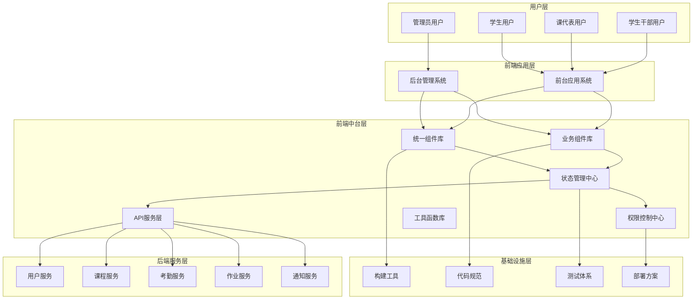
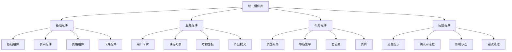
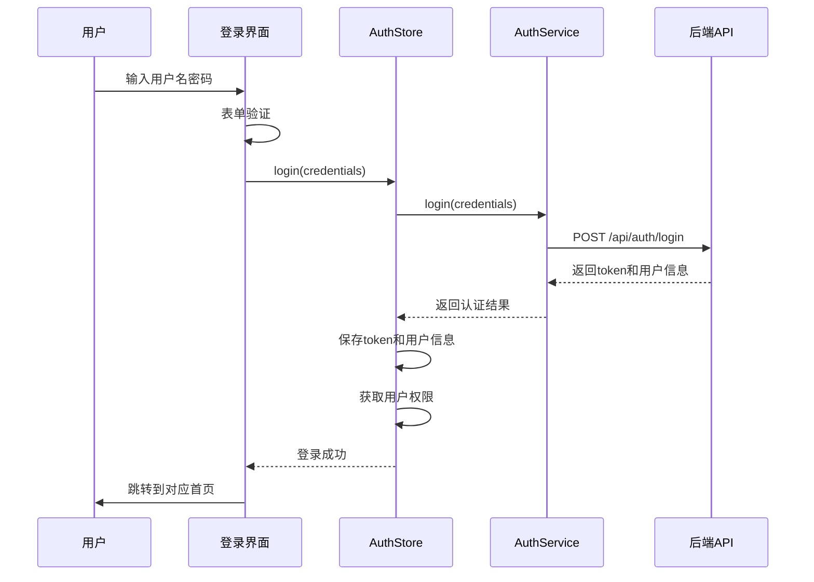
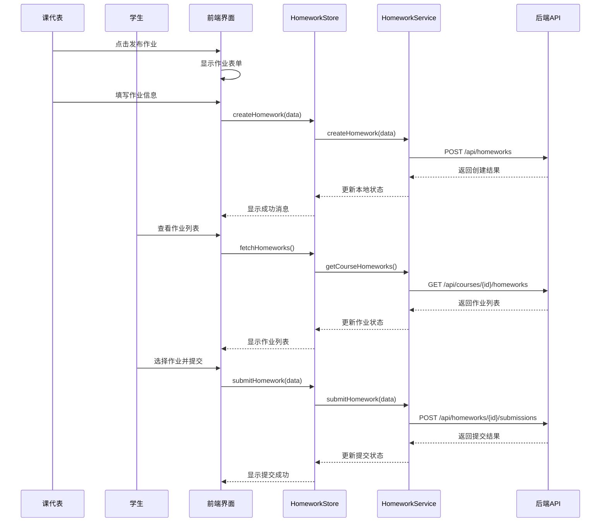

# frontend-admin 前端中台设计文档

## 1. 文档概述

### 1.1 文档目的

本文档详细阐述了 CSISP 的前端中台架构设计，包括中台的核心功能、技术栈选择、业务流程、组件体系、状态管理、权限控制等各个方面。前端中台作为连接用户界面与后端服务的桥梁，承担着统一业务能力、提升开发效率、保证系统一致性的重要职责。

### 1.3 设计目标

- **统一业务能力**：将核心业务逻辑抽象为可复用的中台能力
- **提升开发效率**：通过标准化组件和工具链，加速前端开发
- **保证系统一致性**：统一的设计规范、交互模式和数据管理
- **支持多角色场景**：灵活适配不同用户角色的功能需求
- **高性能与可扩展**：支持系统规模增长和功能扩展

---

## 2. 架构设计

### 2.1 整体架构



### 2.2 中台分层架构

| 层级       | 主要职责               | 核心组件                       |
| ---------- | ---------------------- | ------------------------------ |
| **展示层** | 用户界面渲染、交互响应 | 页面组件、业务组件、通用组件   |
| **业务层** | 业务逻辑处理、数据转换 | 状态管理、业务服务、权限控制   |
| **服务层** | API调用、数据请求管理  | HTTP客户端、请求拦截、响应处理 |
| **工具层** | 通用功能封装、工具函数 | 日期处理、表单验证、数据格式化 |
| **基础层** | 构建配置、开发工具     | Vite配置、ESLint规则、测试框架 |

---

## 3. 技术栈选型与规范

### 3.1 核心技术栈

| 技术类别       | 技术选型          | 版本   | 选型理由                              |
| -------------- | ----------------- | ------ | ------------------------------------- |
| **前端框架**   | Vue 3             | 3.4.x  | 响应式系统、Composition API、性能优异 |
| **构建工具**   | Vite              | 5.0.x  | 快速构建、热更新、TypeScript原生支持  |
| **编程语言**   | TypeScript        | 5.2.x  | 类型安全、代码可维护性、IDE支持       |
| **UI组件库**   | Naive-UI          | 2.38.x | 现代化设计、完整组件、Vue 3生态       |
| **状态管理**   | Pinia             | 2.1.x  | Vue官方推荐、TypeScript友好、轻量级   |
| **路由管理**   | Vue Router        | 4.3.x  | Vue生态官方路由、支持History模式      |
| **HTTP客户端** | Axios             | 1.6.x  | 功能完善、拦截器支持、浏览器兼容性好  |
| **样式方案**   | Sass + Tailwind   | 最新   | 预处理能力强、原子化CSS、响应式设计   |
| **图表库**     | ECharts           | 5.5.x  | 功能强大、配置灵活、数据可视化能力    |
| **图标库**     | @vicons/ionicons5 | 最新   | Vue友好、与Naive-UI `NIcon`配合良好   |

### 3.2 代码规范与标准

#### 3.2.1 文件命名规范

- **页面组件文件**：使用PascalCase，如 `UserManagement/index.vue`
- **通用组件文件**：使用PascalCase，如 `DataTable.vue`
- **工具函数**：使用camelCase，如 `dateFormat.ts`
- **常量定义**：使用UPPER_SNAKE_CASE，如 `API_ENDPOINTS.ts`
- **类型定义**：使用PascalCase，如 `UserInterfaces.ts`
- **页面目录结构**：采用目录+index.vue模式，如 `src/pages/UserManagement/index.vue`

#### 3.2.2 组件开发规范

```typescript
// 组件结构示例
<script setup lang="ts">
import { ref, computed, onMounted } from 'vue'
import type { User } from '@/types'

// Props定义
interface Props {
  userId: number
  editable?: boolean
}
const props = withDefaults(defineProps<Props>(), {
  editable: false
})

// Emits定义
interface Emits {
  (e: 'update:user', user: User): void
  (e: 'delete:user', userId: number): void
}
const emit = defineEmits<Emits>()

// 响应式状态
const user = ref<User | null>(null)
const loading = ref(false)

// 计算属性
const userName = computed(() => user.value?.realName || '')

// 生命周期
onMounted(async () => {
  await fetchUserDetail()
})

// 方法定义
async function fetchUserDetail() {
  loading.value = true
  try {
    user.value = await userService.getUserById(props.userId)
  } catch (error) {
    console.error('Failed to fetch user:', error)
  } finally {
    loading.value = false
  }
}
</script>

<template>
  <div class="user-detail">
    <n-card>
      <template #header>
        <div class="user-header">
          <span>{{ userName }}</span>
          <n-button v-if="editable" @click="handleEdit">编辑</n-button>
        </div>
      </template>
      <!-- 内容区域 -->
    </n-card>
  </div>
</template>

<style scoped lang="scss">
.user-detail {
  @apply p-4;
}

.user-header {
  @apply flex justify-between items-center;
}
</style>
```

---

## 4. 核心功能模块设计

### 4.1 统一组件库设计

#### 4.1.1 通用组件分类



#### 4.1.2 核心通用组件示例

**统一表格组件**

```typescript
// components/Common/DataTable.vue
<script setup lang="ts">
import type { TableColumn } from '@/types'

interface Props<T = any> {
  data: T[]
  columns: TableColumn<T>[]
  loading?: boolean
  pagination?: boolean
  rowKey?: string | ((row: T) => string)
  onRowClick?: (row: T, index: number) => void
}

const props = withDefaults(defineProps<Props>(), {
  loading: false,
  pagination: true,
  rowKey: 'id'
})

// 表格逻辑实现
</script>

<template>
  <n-data-table
    :columns="columns"
    :data="data"
    :loading="loading"
    :pagination="pagination"
    :row-key="rowKey"
    @update:checked-row-keys="handleSelectionChange"
  />
</template>
```

**统一表单组件**

```typescript
// components/Common/FormBuilder.vue
<script setup lang="ts">
import type { FormSchema } from '@/types'

interface Props {
  schema: FormSchema
  model: Record<string, any>
  loading?: boolean
  labelWidth?: string | number
  labelPlacement?: 'left' | 'top'
}

const props = withDefaults(defineProps<Props>(), {
  loading: false,
  labelWidth: 'auto',
  labelPlacement: 'top'
})

const emit = defineEmits<{
  submit: [data: Record<string, any>]
  cancel: []
}>()

// 动态表单生成逻辑
</script>
```

### 4.2 业务组件库设计

#### 4.2.1 用户管理组件

```typescript
// src/pages/UserManagement/index.vue
// components/User/UserCard.vue
// components/User/UserForm.vue
// components/User/UserSelector.vue
// components/User/RoleAssignment.vue
```

#### 4.2.2 课程管理组件

```typescript
// src/pages/CourseManagement/index.vue
// src/pages/course/ClassManagement/index.vue
// src/pages/course/ScheduleManagement/index.vue
// src/pages/course/TeacherManagement/index.vue
// components/Course/CourseCard.vue
// components/Course/CourseSchedule.vue
// components/Course/ClassManagement.vue
// components/Course/TeacherAssignment.vue
```

#### 4.2.3 考勤管理组件

```typescript
// src/pages/AttendanceManagement/index.vue
// components/Attendance/AttendancePanel.vue
// components/Attendance/CheckInButton.vue
// components/Attendance/AttendanceStats.vue
// components/Attendance/AttendanceRecord.vue
```

#### 4.2.4 作业管理组件

```typescript
// src/pages/HomeworkManagement/index.vue
// src/pages/NotificationManagement/index.vue
// components/Homework/HomeworkCard.vue
// components/Homework/HomeworkSubmission.vue
// components/Homework/HomeworkGrading.vue
// components/Homework/SubmissionStatus.vue
```

### 4.3 状态管理中心设计

#### 4.3.1 Pinia Store架构

```typescript
// stores/index.ts
import { createPinia } from 'pinia';
import { useUserStore } from './modules/user';
import { useCourseStore } from './modules/course';
import { useAttendanceStore } from './modules/attendance';
import { useHomeworkStore } from './modules/homework';
import { useNotificationStore } from './modules/notification';
import { useAuthStore } from './modules/auth';
import { useAppStore } from './modules/app';

export const pinia = createPinia();

export {
  useUserStore,
  useCourseStore,
  useAttendanceStore,
  useHomeworkStore,
  useNotificationStore,
  useAuthStore,
  useAppStore,
};
```

#### 4.3.2 用户状态管理

```typescript
// stores/modules/user.ts
import { defineStore } from 'pinia';
import { ref, computed } from 'vue';
import type { User, UserQueryParams } from '@/types';
import { userService } from '@/services';

export const useUserStore = defineStore('user', () => {
  // 状态定义
  const users = ref<User[]>([]);
  const currentUser = ref<User | null>(null);
  const loading = ref(false);
  const totalCount = ref(0);

  // 计算属性
  const userList = computed(() => users.value);
  const isLoading = computed(() => loading.value);

  // 方法定义
  async function fetchUsers(params: UserQueryParams) {
    loading.value = true;
    try {
      const response = await userService.getUserList(params);
      users.value = response.data;
      totalCount.value = response.pagination.total;
    } catch (error) {
      console.error('Failed to fetch users:', error);
      throw error;
    } finally {
      loading.value = false;
    }
  }

  async function fetchUserById(id: number) {
    try {
      const user = await userService.getUserById(id);
      currentUser.value = user;
      return user;
    } catch (error) {
      console.error('Failed to fetch user:', error);
      throw error;
    }
  }

  async function createUser(userData: CreateUserDto) {
    try {
      const newUser = await userService.createUser(userData);
      users.value.unshift(newUser);
      totalCount.value++;
      return newUser;
    } catch (error) {
      console.error('Failed to create user:', error);
      throw error;
    }
  }

  async function updateUser(id: number, userData: UpdateUserDto) {
    try {
      const updatedUser = await userService.updateUser(id, userData);
      const index = users.value.findIndex(user => user.id === id);
      if (index !== -1) {
        users.value[index] = updatedUser;
      }
      if (currentUser.value?.id === id) {
        currentUser.value = updatedUser;
      }
      return updatedUser;
    } catch (error) {
      console.error('Failed to update user:', error);
      throw error;
    }
  }

  async function deleteUser(id: number) {
    try {
      await userService.deleteUser(id);
      const index = users.value.findIndex(user => user.id === id);
      if (index !== -1) {
        users.value.splice(index, 1);
        totalCount.value--;
      }
      if (currentUser.value?.id === id) {
        currentUser.value = null;
      }
    } catch (error) {
      console.error('Failed to delete user:', error);
      throw error;
    }
  }

  // 重置状态
  function resetState() {
    users.value = [];
    currentUser.value = null;
    loading.value = false;
    totalCount.value = 0;
  }

  return {
    // 状态
    users,
    currentUser,
    loading,
    totalCount,

    // 计算属性
    userList,
    isLoading,

    // 方法
    fetchUsers,
    fetchUserById,
    createUser,
    updateUser,
    deleteUser,
    resetState,
  };
});
```

### 4.4 API服务层设计

#### 4.4.1 HTTP客户端封装

```typescript
// services/http.ts
import axios, { type AxiosInstance, type AxiosRequestConfig, type AxiosResponse } from 'axios';
import { useAuthStore } from '@/stores';
import { message } from '@/utils';

class HttpService {
  private instance: AxiosInstance;

  constructor() {
    this.instance = axios.create({
      baseURL: import.meta.env.VITE_API_BASE_URL,
      timeout: 30000,
      headers: {
        'Content-Type': 'application/json',
      },
    });

    this.setupInterceptors();
  }

  private setupInterceptors() {
    // 请求拦截器
    this.instance.interceptors.request.use(
      config => {
        const authStore = useAuthStore();
        const token = authStore.token;

        if (token) {
          config.headers.Authorization = `Bearer ${token}`;
        }

        return config;
      },
      error => {
        return Promise.reject(error);
      }
    );

    // 响应拦截器
    this.instance.interceptors.response.use(
      (response: AxiosResponse) => {
        const { data } = response;

        if (data.code === 200) {
          return data.data;
        } else {
          message.error(data.message || '请求失败');
          return Promise.reject(new Error(data.message || '请求失败'));
        }
      },
      error => {
        const { response } = error;

        if (response) {
          const { status, data } = response;

          switch (status) {
            case 401:
              // 未授权，跳转到登录页
              const authStore = useAuthStore();
              authStore.logout();
              message.error('登录已过期，请重新登录');
              break;
            case 403:
              message.error('没有权限访问该资源');
              break;
            case 404:
              message.error('请求的资源不存在');
              break;
            case 500:
              message.error('服务器内部错误');
              break;
            default:
              message.error(data?.message || '请求失败');
          }
        } else {
          message.error('网络连接失败');
        }

        return Promise.reject(error);
      }
    );
  }

  // GET请求
  get<T = any>(url: string, config?: AxiosRequestConfig): Promise<T> {
    return this.instance.get(url, config);
  }

  // POST请求
  post<T = any>(url: string, data?: any, config?: AxiosRequestConfig): Promise<T> {
    return this.instance.post(url, data, config);
  }

  // PUT请求
  put<T = any>(url: string, data?: any, config?: AxiosRequestConfig): Promise<T> {
    return this.instance.put(url, data, config);
  }

  // DELETE请求
  delete<T = any>(url: string, config?: AxiosRequestConfig): Promise<T> {
    return this.instance.delete(url, config);
  }

  // 上传文件
  upload<T = any>(url: string, file: File, data?: any): Promise<T> {
    const formData = new FormData();
    formData.append('file', file);

    if (data) {
      Object.keys(data).forEach(key => {
        formData.append(key, data[key]);
      });
    }

    return this.instance.post(url, formData, {
      headers: {
        'Content-Type': 'multipart/form-data',
      },
    });
  }
}

export const httpService = new HttpService();
```

#### 4.4.2 业务服务封装

```typescript
// services/user.ts
import { httpService } from './http';
import type { User, UserQueryParams, PaginatedResponse } from '@/types';

export const userService = {
  // 获取用户列表
  async getUserList(params: UserQueryParams): Promise<PaginatedResponse<User>> {
    return httpService.get('/api/users', { params });
  },

  // 获取用户详情
  async getUserById(id: number): Promise<User> {
    return httpService.get(`/api/users/${id}`);
  },

  // 创建用户
  async createUser(data: CreateUserDto): Promise<User> {
    return httpService.post('/api/users', data);
  },

  // 更新用户
  async updateUser(id: number, data: UpdateUserDto): Promise<User> {
    return httpService.put(`/api/users/${id}`, data);
  },

  // 删除用户
  async deleteUser(id: number): Promise<void> {
    return httpService.delete(`/api/users/${id}`);
  },

  // 分配角色
  async assignRole(userId: number, roleId: number): Promise<void> {
    return httpService.post(`/api/users/${userId}/roles`, { roleId });
  },

  // 移除角色
  async removeRole(userId: number, roleId: number): Promise<void> {
    return httpService.delete(`/api/users/${userId}/roles/${roleId}`);
  },
};
```

---

## 5. 权限控制体系设计

### 5.1 基于角色的权限控制(RBAC)

```typescript
// composables/usePermission.ts
import { computed } from 'vue';
import { useAuthStore } from '@/stores';
import type { Permission } from '@/types';

export function usePermission() {
  const authStore = useAuthStore();

  // 检查是否有特定权限
  const hasPermission = (permission: Permission): boolean => {
    return authStore.permissions.includes(permission);
  };

  // 检查是否有任一权限
  const hasAnyPermission = (permissions: Permission[]): boolean => {
    return permissions.some(permission => authStore.permissions.includes(permission));
  };

  // 检查是否拥有所有权限
  const hasAllPermissions = (permissions: Permission[]): boolean => {
    return permissions.every(permission => authStore.permissions.includes(permission));
  };

  // 检查是否有特定角色
  const hasRole = (role: string): boolean => {
    return authStore.roles.includes(role);
  };

  // 检查是否有任一角色
  const hasAnyRole = (roles: string[]): boolean => {
    return roles.some(role => authStore.roles.includes(role));
  };

  return {
    hasPermission,
    hasAnyPermission,
    hasAllPermissions,
    hasRole,
    hasAnyRole,
    // 计算属性
    isAdmin: computed(() => hasRole('admin')),
    isStudent: computed(() => hasRole('student')),
    isCourseRep: computed(() => hasRole('course_rep')),
    isStudentCadre: computed(() => hasRole('student_cadre')),
  };
}
```

### 5.2 权限指令封装

```typescript
// directives/permission.ts
import type { App, Directive } from 'vue';
import { usePermission } from '@/composables';

const permissionDirective: Directive = {
  mounted(el, binding) {
    const { hasPermission, hasRole } = usePermission();
    const { value, arg } = binding;

    let hasAccess = false;

    if (arg === 'permission') {
      hasAccess = hasPermission(value);
    } else if (arg === 'role') {
      hasAccess = hasRole(value);
    } else if (arg === 'any-permission') {
      hasAccess = hasAnyPermission(value);
    } else if (arg === 'any-role') {
      hasAccess = hasAnyRole(value);
    }

    if (!hasAccess) {
      el.style.display = 'none';
    }
  },

  updated(el, binding) {
    const { hasPermission, hasRole, hasAnyPermission, hasAnyRole } = usePermission();
    const { value, arg } = binding;

    let hasAccess = false;

    if (arg === 'permission') {
      hasAccess = hasPermission(value);
    } else if (arg === 'role') {
      hasAccess = hasRole(value);
    } else if (arg === 'any-permission') {
      hasAccess = hasAnyPermission(value);
    } else if (arg === 'any-role') {
      hasAccess = hasAnyRole(value);
    }

    el.style.display = hasAccess ? '' : 'none';
  },
};

export function setupPermissionDirective(app: App) {
  app.directive('permission', permissionDirective);
}
```

### 5.3 路由权限控制

```typescript
// router/guards.ts
import type { Router } from 'vue-router';
import { useAuthStore } from '@/stores';
import { usePermission } from '@/composables';

export function setupRouterGuards(router: Router) {
  // 全局前置守卫
  router.beforeEach(async (to, from, next) => {
    const authStore = useAuthStore();
    const { hasRole } = usePermission();

    // 检查是否需要认证
    if (to.meta?.requiresAuth) {
      if (!authStore.isAuthenticated) {
        next('/login');
        return;
      }
    }

    // 检查角色权限
    if (to.meta?.requiredRoles) {
      const requiredRoles = to.meta.requiredRoles as string[];
      const hasRequiredRole = requiredRoles.some(role => hasRole(role));

      if (!hasRequiredRole) {
        next('/403');
        return;
      }
    }

    // 检查具体权限
    if (to.meta?.requiredPermissions) {
      const requiredPermissions = to.meta.requiredPermissions as string[];
      const { hasAnyPermission } = usePermission();

      if (!hasAnyPermission(requiredPermissions)) {
        next('/403');
        return;
      }
    }

    next();
  });

  // 全局后置守卫
  router.afterEach(to => {
    // 设置页面标题
    document.title = to.meta?.title ? `${to.meta.title} - CSISP` : 'CSISP';
  });
}
```

---

## 6. 业务流程与交互设计

### 6.1 核心业务流程

#### 6.1.1 用户登录流程



#### 6.1.2 作业发布与提交流程



### 6.2 交互设计原则

#### 6.2.1 一致性原则

- **视觉一致性**：统一的颜色、字体、间距规范
- **交互一致性**：统一的操作反馈、加载状态、错误处理
- **文案一致性**：统一的术语、提示信息、操作说明

#### 6.2.2 可用性原则

- **操作反馈**：每个用户操作都应有明确的反馈
- **错误处理**：友好的错误提示和恢复建议
- **加载状态**：合理的加载动画和状态提示
- **表单验证**：实时的表单验证和错误提示

#### 6.2.3 性能优化原则

- **懒加载**：路由和组件的懒加载
- **防抖节流**：高频操作的性能优化
- **缓存策略**：合理的数据缓存和更新策略
- **虚拟滚动**：大数据列表的虚拟滚动

---

## 7. 性能优化策略

### 7.1 构建优化

#### 7.1.1 Vite配置优化

```typescript
// vite.config.ts
import { defineConfig } from 'vite';
import vue from '@vitejs/plugin-vue';
import { resolve } from 'path';

export default defineConfig({
  plugins: [
    vue({
      template: {
        compilerOptions: {
          // 编译优化
        },
      },
    }),
  ],

  resolve: {
    alias: {
      '@': resolve(__dirname, 'src'),
      '#': resolve(__dirname, 'types'),
    },
  },

  build: {
    target: 'es2015',
    minify: 'terser',
    terserOptions: {
      compress: {
        drop_console: true,
        drop_debugger: true,
      },
    },
    rollupOptions: {
      output: {
        manualChunks: {
          'vue-vendor': ['vue', 'vue-router', 'pinia'],
          'ui-vendor': ['naive-ui'],
          'utils-vendor': ['axios', 'dayjs'],
        },
      },
    },
  },

  optimizeDeps: {
    include: ['vue', 'vue-router', 'pinia', 'naive-ui', 'axios'],
  },
});
```

### 7.2 运行时优化

#### 7.2.1 组件懒加载

```typescript
// router/index.ts
import { createRouter, createWebHistory } from 'vue-router';

const routes = [
  {
    path: '/admin/users',
    name: 'UserManagement',
    component: () => import('@/views/admin/UserManagement.vue'),
  },
  {
    path: '/admin/courses',
    name: 'CourseManagement',
    component: () => import('@/views/admin/CourseManagement.vue'),
  },
  {
    path: '/attendance',
    name: 'Attendance',
    component: () => import('@/views/attendance/AttendanceIndex.vue'),
  },
];
```

#### 7.2.2 虚拟滚动实现

```typescript
// composables/useVirtualScroll.ts
import { ref, computed, onMounted, onUnmounted } from 'vue';

export function useVirtualScroll(items: any[], itemHeight: number, containerHeight: number) {
  const scrollTop = ref(0);
  const containerRef = ref<HTMLElement>();

  const startIndex = computed(() => Math.floor(scrollTop.value / itemHeight));
  const endIndex = computed(() =>
    Math.min(startIndex.value + Math.ceil(containerHeight / itemHeight) + 1, items.length)
  );

  const visibleItems = computed(() => items.slice(startIndex.value, endIndex.value));

  const offsetY = computed(() => startIndex.value * itemHeight);

  function handleScroll(event: Event) {
    scrollTop.value = (event.target as HTMLElement).scrollTop;
  }

  onMounted(() => {
    if (containerRef.value) {
      containerRef.value.addEventListener('scroll', handleScroll);
    }
  });

  onUnmounted(() => {
    if (containerRef.value) {
      containerRef.value.removeEventListener('scroll', handleScroll);
    }
  });

  return {
    containerRef,
    visibleItems,
    offsetY,
    totalHeight: items.length * itemHeight,
  };
}
```

### 7.3 数据缓存策略

#### 7.3.1 Pinia持久化插件

```typescript
// stores/plugins/persist.ts
import type { PiniaPluginContext } from 'pinia';

export function persistPlugin(context: PiniaPluginContext) {
  const { store } = context;

  // 从localStorage恢复状态
  const storedState = localStorage.getItem(`pinia-${store.$id}`);
  if (storedState) {
    store.$patch(JSON.parse(storedState));
  }

  // 监听状态变化并持久化
  store.$subscribe(
    (mutation, state) => {
      localStorage.setItem(`pinia-${store.$id}`, JSON.stringify(state));
    },
    { detached: true }
  );
}
```

#### 7.3.2 请求缓存

```typescript
// services/cache.ts
class RequestCache {
  private cache = new Map<string, { data: any; timestamp: number; ttl: number }>();

  set(key: string, data: any, ttl: number = 5 * 60 * 1000) {
    this.cache.set(key, {
      data,
      timestamp: Date.now(),
      ttl,
    });
  }

  get(key: string): any | null {
    const cached = this.cache.get(key);

    if (!cached) return null;

    const now = Date.now();
    if (now - cached.timestamp > cached.ttl) {
      this.cache.delete(key);
      return null;
    }

    return cached.data;
  }

  clear() {
    this.cache.clear();
  }

  clearExpired() {
    const now = Date.now();
    for (const [key, cached] of this.cache.entries()) {
      if (now - cached.timestamp > cached.ttl) {
        this.cache.delete(key);
      }
    }
  }
}

export const requestCache = new RequestCache();
```

---

## 8. 部署与运维

本节仅覆盖与当前仓库实际使用方式一致的部署与运维流程，其余推演性内容不再赘述。

### 8.1 本地开发与联调

- 依赖环境：
  - Node.js：遵循仓库根目录 `.nvmrc`（22.x），使用 `pnpm` 管理依赖
  - 后端：`apps/backend-integrated` + `apps/bff`（建议按 README 顺序启动）
  - 数据库：通过 `infra/database/docker-compose.db.yml` 启动 PostgreSQL 15 与 Redis

- 典型开发顺序（示例）：
  1. 在项目根目录初始化环境变量：
     - `cp .env.example .env`，根据本地环境修改数据库与端口
  2. 启动数据库基础设施：
     - `bash infra/database/scripts/init_mac.sh`（或对应 OS 脚本）
  3. 初始化数据库结构与种子数据：
     - `pnpm -F @csisp/db-schema run migrate`
     - `pnpm -F @csisp/db-schema run seed`
  4. 启动 backend-integrated 与 BFF：
     - `pnpm -F @csisp/backend-integrated dev`
     - `pnpm -F @csisp/bff dev`
  5. 启动前端中台（以后台管理端为例）：
     - `pnpm -F @csisp/frontend-admin dev`

- API 访问路径：
  - 前端统一通过 BFF 暴露的 `/api` 前缀访问后端能力
  - `VITE_API_BASE_URL` 指向 BFF 地址，例如 `http://localhost:3001/api`（以实际端口为准）

### 8.2 构建与产物

以 `apps/frontend-admin` 为例，构建流程与其他前端子项目保持一致：

- 安装依赖（已在根目录执行过则可跳过）：
  - `pnpm i`
- 构建指定子项目：
  - `pnpm -F @csisp/frontend-admin build`
- 产物位置：
  - 对应子项目下的 `dist/` 目录，为纯静态文件，可部署到任意静态资源服务（Nginx、静态托管平台等）。

前端中台文档中提到的打包优化（代码分割、压缩等）均通过各子项目的 `vite.config.ts` 与默认构建脚本生效，无需额外手工步骤。

### 8.3 部署建议

- 环境划分：
  - 与后端保持一致的环境：开发 / 测试 / 生产
  - 每个环境分别配置 `.env.[env]` 中的 `VITE_API_BASE_URL` 指向对应 BFF 域名

- 典型部署方式（示意）：
  - 使用 CI（如 GitHub Actions）在仓库根或前端子项目内执行：
    - `pnpm i`
    - `pnpm -F @csisp/frontend-admin build`
  - 将 `dist/` 上传到静态资源服务器（Nginx、云存储 + CDN 等）
  - Nginx 仅负责前端静态资源与基础路由回退（`try_files`），业务接口仍由 BFF/后端提供。

### 8.4 运维要点

- 配置变更：
  - 所有与 API 相关的地址通过环境变量控制，不应在代码中硬编码域名
- 版本回滚：
  - 建议通过构建产物目录加版本号或时间戳的方式归档，支持快速切换回旧版本静态资源
- 监控与日志：
  - 前端主要依赖浏览器控制台与后端日志定位问题，复杂错误监控可按需要引入专用前端监控平台，在项目真正接入后再补充到文档中。
